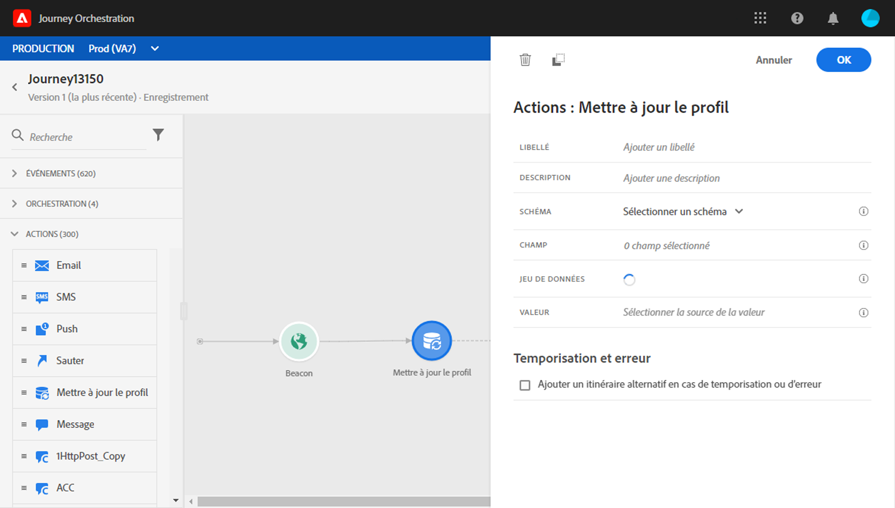
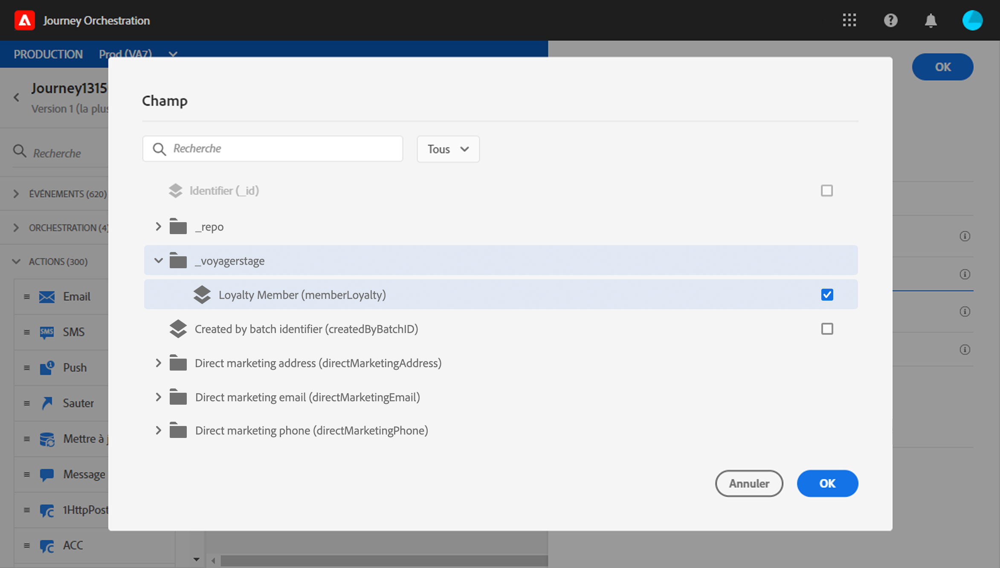
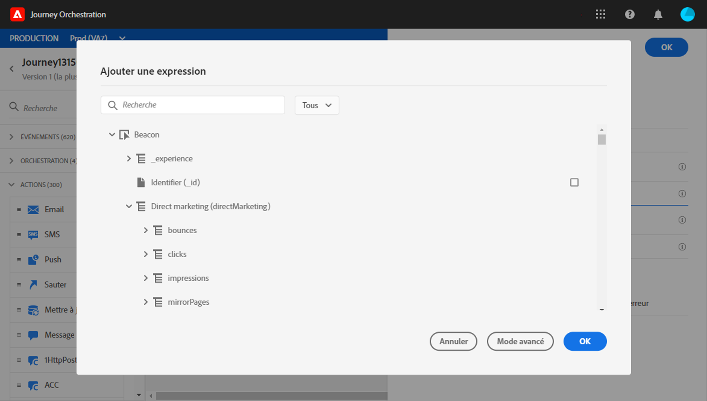
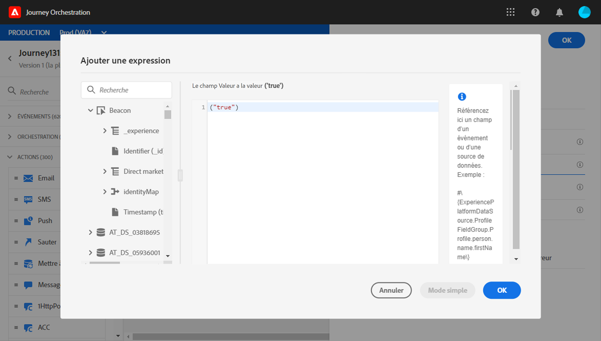
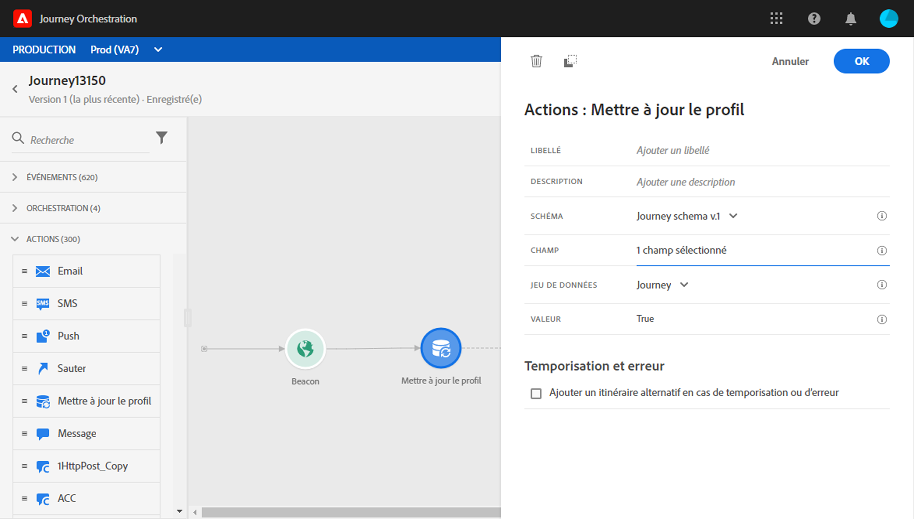

# Mettre à jour le profil {#update-profile}

L&#39;activité d&#39;action **[!UICONTROL Mettre à jour le profil]** vous permet de mettre à jour un profil Adobe Experience Platform existant avec des informations provenant du événement, d&#39;une source de données ou d&#39;une valeur spécifique.

## Remarques importantes        

* L&#39;action **Mettre à jour le profil** ne peut être utilisée que dans les parcours commençant par un événement qui possède un espace de nommage.
* L’action ne met à jour que les champs existants, elle ne crée pas de nouveaux champs de profil.
* Vous ne pouvez pas utiliser l&#39;action **Mettre à jour le profil** pour générer des événements d&#39;expérience, par exemple un achat.
* Comme toute autre action, vous pouvez définir un autre chemin en cas d’erreur ou d’expiration et vous ne pouvez pas placer deux actions en parallèle.
* La demande de mise à jour envoyée à Platform sera rapide mais pas immédiate/en une seconde. Cela prendra normalement quelques secondes mais parfois plus sans aucune garantie. Par conséquent, par exemple, si une action utilise &quot;champ 1&quot; mis à jour par une action Mettre à jour le Profil positionnée juste avant, vous ne devriez pas vous attendre à ce que &quot;champ 1&quot; soit mis à jour dans l’action.
* Les sources de données ont une notion de durée du cache, au niveau du groupe de champs. Si vous prévoyez d’exploiter, dans un parcours, un champ de profil récemment mis à jour, veillez à définir une durée de cache très courte.

## Utilisation du mode de test {#using-the-test-mode}

En mode test, la mise à jour du profil ne sera pas simulée. La mise à jour sera effectuée le profil du test.

Seuls les profils de test peuvent entrer dans un parcours en mode test. Vous pouvez soit créer un nouveau profil de test, soit transformer un profil existant en profil de test. Dans Adobe Experience Platorm, vous pouvez mettre à jour les attributs de profil par le biais d’appels d’API, mais il n’est pas possible de les exécuter via l’interface. Pour ce faire, la méthode la plus simple consiste à utiliser une activité d&#39;action **Mettre à jour le profil** et à passer le champ booléen du profil de test de false à true.

Pour plus d&#39;informations sur le mode test, consultez cette [section](../building-journeys/testing-the-journey.md).

## Utilisation de la mise à jour du profil

1. Concevez votre parcours en commençant par un événement. Consultez cette [section](../building-journeys/journey.md).

1. Dans la section **Action** de la palette, déposez l&#39;activité **Mettre à jour le profil** dans le canevas.

   

1. Sélectionnez un schéma dans la liste.

1. Cliquez sur **Champs** pour sélectionner le champ à mettre à jour. Un seul champ peut être sélectionné.

   

1. Sélectionnez un jeu de données dans la liste. La sélection des jeux de données détermine où la nouvelle valeur du champ de profil sera stockée.

1. Cliquez sur le champ **Valeur** pour définir la valeur à utiliser :

   * L’éditeur d’expressions simple vous permet de sélectionner un champ à partir d’une source de données ou du événement entrant.

      

   * Si vous souhaitez définir une valeur spécifique ou utiliser des fonctions avancées, cliquez sur **Mode avancé**.

      

Le **profil de mise à jour** est maintenant configuré.

