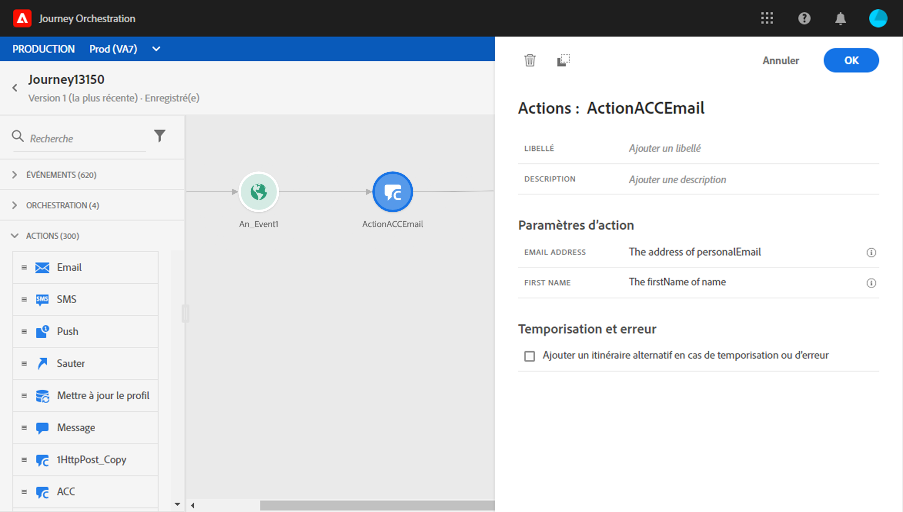

# Utilisation de Adobe Campaign Classic {#using_campaign_classic}

Une intégration est disponible si vous disposez de Adobe Campaign Classic. Il vous permettra d’envoyer des emails, des notifications push et des SMS à l’aide des fonctionnalités de messagerie transactionnelle Adobe Campaign Classic.

La connexion entre les instances Journey Orchestration et Campaign Classic est configurée par Adobe au moment de l’approvisionnement. Contactez l’Adobe.

Pour que cela fonctionne, vous devez configurer une action dédiée. Reportez-vous à cette [section](../action/acc-action.md).

Un cas pratique de bout en bout est présenté dans cette [section](../usecase/campaign-classic-use-case.md).

1. Concevez votre parcours en commençant par un événement. Consultez cette [section](../building-journeys/journey.md).
1. Dans la section **Action** de la palette, sélectionnez une action Campaign Classic et ajoutez-la à votre parcours.
1. Dans les **paramètres d’action**, tous les champs attendus dans la payload du message s’affichent. Vous devez faire correspondre chacun de ces champs avec celui que vous souhaitez utiliser, et ce, depuis l’événement ou la source de données. Cette opération est similaire aux actions personnalisées. Reportez-vous à cette [section](../building-journeys/using-custom-actions.md).

