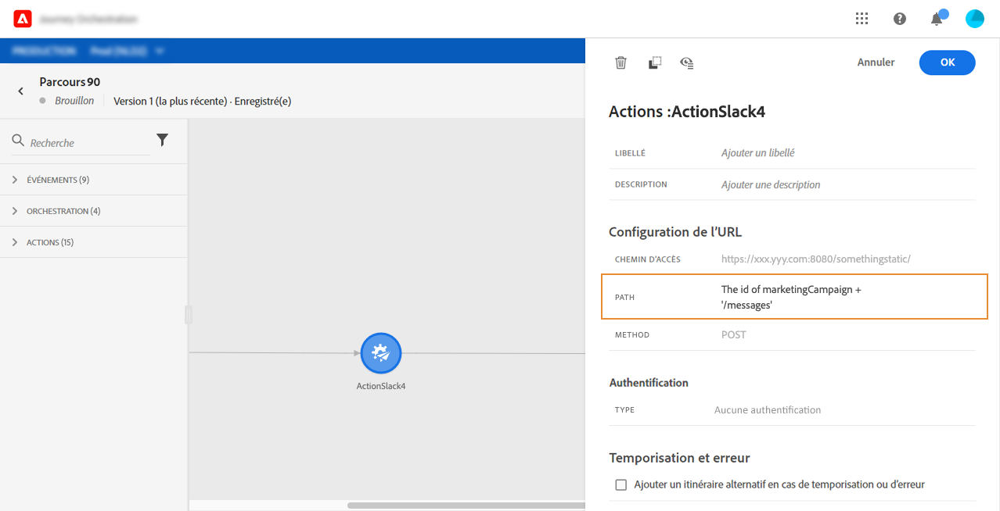
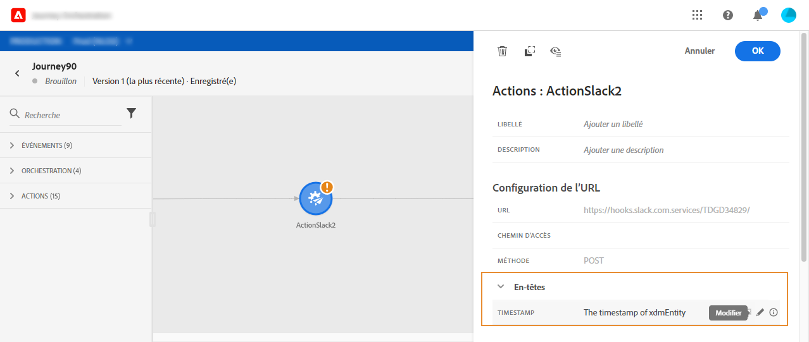

# Utilisation d’actions personnalisées {#section_f2c_hbg_nhb}

>[!CAUTION]
>
>**Vous recherchez Adobe Journey Optimizer** ? Cliquez [ici](https://experienceleague.adobe.com/fr/docs/journey-optimizer/using/ajo-home){target="_blank"} pour consulter la documentation de Journey Optimizer.
>
>
>_Cette documentation se rapporte aux anciens contenus de Journey Orchestration qui ont été remplacés par Journey Optimizer. Pour toute question concernant votre accès à Journey Orchestration ou Journey Optimizer, contactez votre équipe en charge des comptes._

Le volet de configuration des activités affiche les paramètres de configuration de l’URL et les paramètres d’authentification configurés pour l’action personnalisée. [En savoir plus](../action/about-custom-action-configuration.md).

## Configuration d’URL

### Chemin dynamique

Si l’URL contient un chemin dynamique, spécifiez le chemin dans le champ **[!UICONTROL Chemin]**.

>[!NOTE]
>
>Vous ne pouvez pas configurer la partie statique de l’URL dans le parcours, mais dans la configuration globale de l’action personnalisée. [En savoir plus](../action/about-custom-action-configuration.md).

Pour concaténer des champs et des chaînes de texte brut, utilisez les fonctions String ou le signe plus (+) dans l’éditeur d’expression avancé. Placez les chaînes de texte brut entre guillemets simples (’) ou entre guillemets doubles (&quot;). [En savoir plus](../expression/expressionadvanced.md).

Ce tableau présente un exemple de configuration :

| Champ | Valeur |
| --- | --- |
| URL | `https://xxx.yyy.com:8080/somethingstatic/` |
| Chemin | `The id of marketingCampaign + '/messages'` |

L’URL concaténée se présente comme suit :

`https://xxx.yyy.com:8080/somethingstatic/`\&lt;Identifiant de campagne\>`/messages`

### En-têtes

La section **[!UICONTROL Configuration de l’URL]** affiche les champs d’en-tête dynamiques, mais pas les champs d’en-tête constants. Les champs d’en-tête dynamique sont des champs d’en-tête HTTP dont la valeur est configurée comme variable. [En savoir plus](../action/about-custom-action-configuration.md).

Si nécessaire, spécifiez la valeur des champs d’en-tête dynamique :

1. Sélectionnez l’action personnalisée dans le parcours.
1. Dans le volet de configuration, cliquez sur l’icône en forme de crayon en regard du champ d’en-tête de la section **[!UICONTROL Configuration de l’URL]**.

   

1. Sélectionnez un champ et cliquez sur **[!UICONTROL OK]**.

## Paramètres d’action

Dans la section **[!UICONTROL Paramètres d’action]**, vous verrez les paramètres de message définis comme _« Variable »_. Pour ces paramètres, vous pouvez définir où obtenir ces informations (événements, sources de données, par exemple), transmettre des valeurs manuellement ou utiliser l’éditeur d’expression avancé pour des cas d’utilisation avancés. Les cas d’utilisation avancés peuvent être la manipulation de données et d’autres utilisations de la fonction. [En savoir plus](../expression/expressionadvanced.md).

**Rubriques connexes**

[Configurer une action](../action/about-custom-action-configuration.md)
