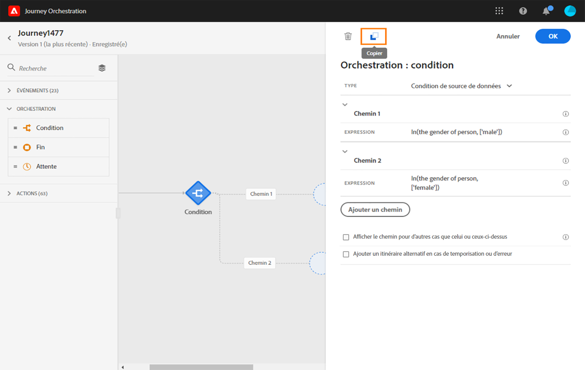

# Utilisation du concepteur de parcours {#concept_m1g_5qt_52b}

Le menu Accueil du parcours vous permet de consulter la **liste des parcours**. Créez un parcours ou cliquez sur un parcours existant pour ouvrir l’**interface du concepteur de parcours**. Le concepteur est composé de trois zones : la palette, la zone de travail et le volet de configuration des activités.

## Liste des parcours {#journey_list}

La liste des **parcours** vous permet de visualiser tous vos parcours en même temps, de consulter leur statut et d’effectuer des actions de base. Vous pouvez dupliquer, arrêter ou supprimer vos parcours. En fonction du parcours, il se peut que certaines actions ne soient pas disponibles. Par exemple, vous ne pouvez pas supprimer ni redémarrer un parcours fermé. Vous pouvez en créer une nouvelle version, le dupliquer ou l’arrêter. Vous pouvez également utiliser la barre de recherche pour rechercher un parcours.

Pour accéder aux **[!UICONTROL filtres]**, cliquez sur l’icône en forme de filtre en haut à gauche de la liste. Le menu Filtres vous permet de filtrer les parcours affichés selon différents critères (statut, parcours que vous avez créés, parcours modifiés au cours des 30 derniers jours, versions les plus récentes uniquement, etc.). Vous pouvez également choisir d’afficher uniquement les parcours qui utilisent un événement, un groupe de champs ou une action spécifique. Les colonnes affichées dans la liste peuvent être configurées. Tous les filtres et colonnes sont enregistrés par utilisateur.

Toutes les versions de vos parcours apparaissent dans la liste, accompagnées d’un numéro. Voir [cette page](../building-journeys/journey-versions.md).

>[!NOTE]
>
>Pour ouvrir la zone de travail d’un parcours dans un autre onglet du navigateur, maintenez la touche **Ctrl** ou **Commande** enfoncée, puis cliquez sur le parcours en question.

## Palette {#palette}

La **palette** se situe sur la partie gauche de l’écran. Toutes les activités disponibles sont classées dans plusieurs catégories : **[!UICONTROL Événements]**, **[!UICONTROL Orchestration]** et **[!UICONTROL Actions]**. Vous pouvez développer/réduire les différentes catégories en cliquant sur leur nom. Pour utiliser une activité dans votre parcours, faites-la glisser de la palette vers la zone de travail. Vous pouvez également double-cliquer sur une activité de la palette pour l’ajouter dans la zone de travail à la prochaine étape disponible. Vous devez configurer chaque activité ajoutée à partir de la palette avant de publier le parcours. Si vous placez une activité dans la zone de travail sans en terminer la configuration, elle y reste, mais un avertissement rouge indique que la configuration n’est pas terminée pour cette activité.

>[!NOTE]
>
>Notez qu’il existe certaines règles en matière de configuration d’un parcours. Une configuration non autorisée est ignorée. Ainsi, vous ne pouvez pas placer des actions en parallèle, lier une activité à une étape précédente pour créer une boucle, démarrer un parcours avec un élément autre qu’un événement, etc.

L&#39;icône **[!UICONTROL Filtrer les éléments]** dans le coin supérieur gauche vous permet d&#39;afficher les filtres suivants :

* **Afficher uniquement les éléments** disponibles : masquez ou affichez les éléments indisponibles dans la palette, par exemple les événements qui utilisent un espace de nommage différent de celui utilisé dans votre parcours. Par défaut, les éléments non disponibles sont masqués. Si vous choisissez de les afficher, ils apparaîtront grisés.

* **Afficher uniquement les éléments** récents : ce filtre vous permet d&#39;afficher uniquement les cinq derniers événements et actions utilisés, en plus de ceux prêts à l&#39;emploi. Il est spécifique à chaque utilisateur. Par défaut, tous les éléments sont affichés.

Vous pouvez également utiliser le champ **[!UICONTROL Rechercher]**.

## Zone de travail {#canvas}

La **zone de travail** est la zone centrale du concepteur de parcours. C’est là que vous pouvez déposer vos activités et les configurer. Cliquez sur une activité de la zone de travail pour la configurer. Le volet de configuration de l’activité s’ouvre alors sur le côté droit. Vous pouvez effectuer un zoom avant ou arrière à l’aide des boutons « + » et « - » situés en haut à droite. Dans la zone de travail, toutes les activités vous permettent d’ajouter une étape suivante, à l’exception des activités **[!UICONTROL Fin]** (voir [cette page](../building-journeys/end-activity.md)).

## Volet de configuration des activités {#configuration_pane}

Le **volet de configuration des activités** s’affiche lorsque vous cliquez sur une activité dans la palette. Renseignez les champs obligatoires. Cliquez sur l’icône **[!UICONTROL Supprimer]** pour supprimer l’activité. Cliquez sur **[!UICONTROL Annuler]** pour annuler les modifications ou sur **[!UICONTROL OK]** pour les confirmer. Vous pouvez également supprimer des activités en les sélectionnant, puis en appuyant sur la touche Retour arrière. Appuyez sur la touche d’échappement pour fermer le volet de configuration des activités.

Dans la zone de travail, vos activités d’action et d’événement sont représentées par une icône sous laquelle est affiché le nom de l’événement ou de l’action. Dans le volet de configuration des activités, vous pouvez utiliser le champ **[!UICONTROL Libellé]** pour ajouter un suffixe au nom de l’activité. Ces libellés vous aident à replacer l’utilisation des événements et des actions dans son contexte, en particulier lorsque vous utilisez plusieurs fois le même événement ou la même action dans votre parcours. Les libellés que vous avez ajoutés sont également affichés dans le cadre du reporting de [!DNL Journey Orchestration] Vous pouvez également définir des libellés pour vos activités de condition.

## Actions de la barre supérieure {#top_actions}

Selon le statut du parcours, vous pouvez effectuer différentes actions à l’aide des boutons disponibles dans le coin supérieur droit : **[!UICONTROL Publier]**, **[!UICONTROL Dupliquer]**, **[!UICONTROL Supprimer]**, afficher les **[!UICONTROL Propriétés du parcours]** et effectuer un **[!UICONTROL Test]**. Ces boutons s’affichent lorsqu’aucune activité n’est sélectionnée. Certains boutons s’affichent en fonction du contexte. Ainsi, le bouton de journal du mode test s’affiche lorsque le mode test est activé (voir [cette page](../building-journeys/testing-the-journey.md)). Le bouton de reporting s’affiche dans le cas d’un parcours actif, arrêté ou fermé.

## Utilisation des chemins dans la zone de travail {#paths}

Plusieurs activités (**[!UICONTROL Condition]**, **[!UICONTROL Action]**, etc.) vous permettent de définir une action de remplacement en cas d’erreur ou de temporisation. Dans le volet de configuration des activités, cochez la case **[!UICONTROL Ajouter un itinéraire alternatif en cas de temporisation ou d’erreur]**. Un autre chemin est alors ajouté après l’activité. La temporisation est définie dans les propriétés du parcours (voir [cette page](../building-journeys/changing-properties.md) par un utilisateur administrateur. Par exemple, si l’envoi d’un email prend trop de temps ou génère une erreur, vous pouvez décider d’envoyer un SMS.

Différentes activités (événement, action, attente) peuvent être suivies de plusieurs chemins. Pour ce faire, placez votre curseur sur l’activité en question et cliquez ensuite sur le symbole « + ». Seules les activités d’événement et d’attente peuvent être définies en parallèle. Si plusieurs événements sont définis en parallèle, le chemin choisi est celui du premier événement qui se produit.

Lorsque vous écoutez un événement, nous vous recommandons de ne pas attendre indéfiniment qu’il se produise. Notez qu’il s’agit d’une bonne pratique et que cela n’est, en aucun cas, obligatoire. Si vous souhaitez limiter l’écoute d’un ou de plusieurs événements à une période bien définie, vous devez placer en parallèle un ou plusieurs événements et une activité d’attente. Reportez-vous à [cette section](../building-journeys/event-activities.md#section_vxv_h25_pgb).

Pour supprimer le chemin d’accès, placez votre curseur sur celui-ci et cliquez sur l’icône **[!UICONTROL Supprimer la flèche]**.

Dans la zone de travail, un avertissement s’affiche lorsque deux activités sont déconnectées. Placez le curseur sur l’icône d’avertissement pour afficher le message d’erreur. Pour résoudre le problème, il suffit de déplacer l’activité déconnectée et de la relier à l’activité précédente.

## Opérations de copier/coller d’activités {#copy-paste}

Vous pouvez copier une ou plusieurs activités d’un parcours et les coller soit dans le même parcours, soit dans un autre. C’est un gain de temps si vous souhaitez réutiliser de nombreuses activités déjà configurées lors d’un parcours précédent.

**Remarques importantes**

* Vous pouvez effectuer une opération copier/coller dans différents onglets et navigateurs. Vous ne pouvez copier/coller des activités que dans la même instance.
* Vous ne pouvez pas copier/coller un événement si le parcours de destination comporte un événement utilisant un autre espace de noms.
* Les activités collées peuvent référencer des données qui n’existent pas dans le parcours de destination, par exemple si vous copiez/collez des données dans différents environnements Sandbox. Recherchez toujours des erreurs et effectuez les ajustements nécessaires.
* Notez que vous ne pouvez pas annuler une action. Pour supprimer des activités collées, vous devez les sélectionner et les supprimer. Vous devez donc veiller, avant de les copier, à ne sélectionner que les activités dont vous avez besoin.
* Vous pouvez copier des activités issues de n’importe quel parcours, même celles qui sont en lecture seule.
* Vous pouvez sélectionner n’importe quelle activité, même celles qui ne sont pas liées. Les activités liées resteront liées après avoir été collées.

Pour copier/coller des activités, procédez comme suit :

1. Ouvrez un parcours.
1. Sélectionnez les activités à copier en déplaçant la souris tout en cliquant dessus. Vous pouvez également cliquer sur chaque activité tout en appuyant sur la touche **Ctrl/Commande**. Utilisez **Ctrl/Commande + A** pour sélectionner toutes les activités.
   
1. Appuyez sur **Ctrl/Commande + C**.
Si vous ne souhaitez copier qu’une seule activité, vous pouvez cliquer dessus et utiliser l’icône **Copier** en haut à gauche du volet de configuration de l’activité.
   
1. Dans un parcours quelconque, appuyez sur **Ctrl/Commande + V** pour coller les activités sans les lier à un nœud existant. Les activités collées sont placées dans le même ordre. Une fois collées, les activités restent sélectionnées pour que vous puissiez facilement les déplacer. Vous pouvez également placer le curseur sur un espace réservé vide et cliquer sur **Ctrl/Commande + V**. Les activités collées seront liées au nœud.
   

