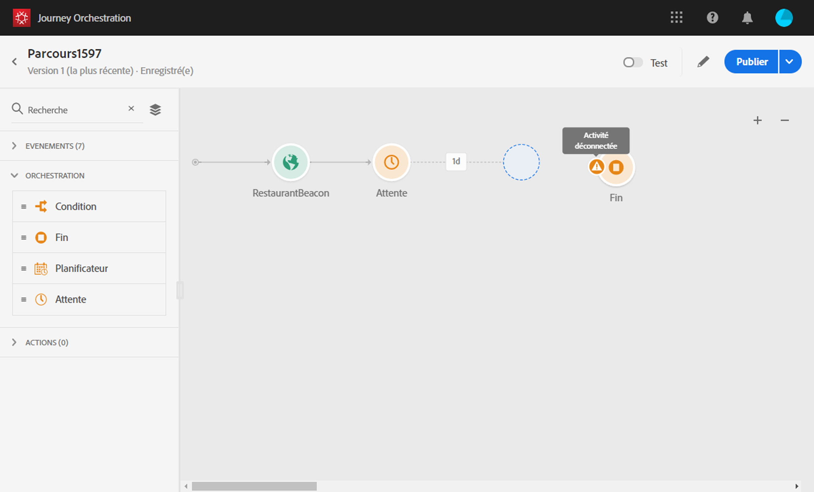

# Utilisation du concepteur de parcours {#concept_m1g_5qt_52b}

Le menu Accueil du parcours vous permet de consulter la **liste des parcours**. Créez un parcours ou cliquez sur un parcours existant pour ouvrir l’**interface du concepteur de parcours**. Le concepteur est composé de trois zones : la palette, le canevas et le volet de configuration des activités.

## Liste des parcours {#journey_list}

La liste des **parcours** vous permet de visualiser tous vos parcours en même temps, de consulter leur statut et d’effectuer des actions de base. Vous pouvez dupliquer, arrêter ou supprimer vos parcours. En fonction du parcours, il se peut que certaines actions ne soient pas disponibles. Par exemple, vous ne pouvez pas arrêter ou supprimer un voyage terminé. Vous pouvez également utiliser la barre de recherche pour rechercher un parcours.

The **[!UICONTROL Filters]** can be accessed by clicking on the filter icon on the top left of the list. Le menu Filtres vous permet de filtrer les parcours affichés selon différents critères (statut, parcours que vous avez créés, parcours modifiés au cours des 30 derniers jours, versions les plus récentes uniquement, etc.). Vous pouvez également choisir d’afficher uniquement les parcours qui utilisent un événement, un groupe de champs ou une action spécifique. Les colonnes affichées dans la liste peuvent être configurées. Tous les filtres et colonnes sont enregistrés par utilisateur.

Toutes les versions de vos parcours apparaissent dans la liste, accompagnées d’un numéro. Voir .

>[!NOTE]
>
>Pour ouvrir le canevas d’un parcours dans un autre onglet du navigateur, maintenez la touche **Ctrl** ou **Commande** enfoncée, puis cliquez sur le parcours en question.

## Palette {#palette}

La **palette** se situe sur la partie gauche de l’écran. All available activities are sorted into several categories: **[!UICONTROL Events]**, **[!UICONTROL Orchestration]** and **[!UICONTROL Actions]**. Vous pouvez développer/réduire les différentes catégories en cliquant sur leur nom. Pour utiliser une activité dans votre parcours, faites-la glisser de la palette vers le canevas. Vous pouvez également double-cliquer sur une activité de la palette pour l’ajouter dans le canevas à la prochaine étape disponible. Vous devez configurer chaque activité ajoutée à partir de la palette avant de publier le parcours. Si vous placez une activité dans le canevas sans en terminer la configuration, elle y reste, mais un avertissement rouge indique que la configuration n’est pas terminée pour cette activité.

>[!NOTE]
>
>Notez qu’il existe certaines règles en matière de configuration d’un parcours. Une configuration non autorisée est ignorée. Ainsi, vous ne pouvez pas placer des actions en parallèle, lier une activité à une étape précédente pour créer une boucle, démarrer un parcours avec un élément autre qu’un événement, etc.

L’icône **Afficher les éléments** désactivés dans le coin supérieur gauche vous permet de masquer ou d’afficher les éléments indisponibles dans la palette, par exemple les événements qui utilisent un espace de noms différent de ceux utilisés dans votre voyage. Par défaut, les éléments non disponibles sont masqués. Si vous choisissez de les afficher, elles apparaîtront grisées.

Lors de l’utilisation du champ **Rechercher** , le nombre de résultats s’affiche pour chaque catégorie d’activité de canevas.

## Canevas {#canvas}

Le **canevas** est la zone centrale du concepteur de parcours. C’est là que vous pouvez déposer vos activités et les configurer. Cliquez sur une activité du canevas pour la configurer. Le volet de configuration de l’activité s’ouvre alors sur le côté droit. Vous pouvez effectuer un zoom avant ou arrière à l’aide des boutons « + » et « - » situés en haut à droite. In the canvas, all activities allow you to add a next step after them, except **[!UICONTROL End]** activities (see ).

## Volet de configuration des activités {#configuration_pane}

Le **volet de configuration des activités** s’affiche lorsque vous cliquez sur une activité dans la palette. Renseignez les champs obligatoires. Click on the **[!UICONTROL Delete]** icon to delete the activity. Click on **[!UICONTROL Cancel]** to cancel the modifications or **[!UICONTROL Ok]** to confirm. Vous pouvez également supprimer des activités en les sélectionnant, puis en appuyant sur la touche Retour arrière. Appuyez sur la touche d’échappement pour fermer le volet de configuration des activités.

Dans le canevas, vos activités d’action et d’événement sont représentées par une icône sous laquelle est affiché le nom de l’événement ou de l’action. In the activity configuration pane, you can use the **[!UICONTROL Label]** field to add a suffix to the activity name. Ces libellés vous aident à replacer l’utilisation des événements et des actions dans son contexte, en particulier lorsque vous utilisez plusieurs fois le même événement ou la même action dans votre parcours. Les libellés que vous avez ajoutés sont également affichés dans le cadre du reporting de Journey Orchestration.

## Actions de la barre supérieure {#top_actions}

Depending on the journey&#39;s status, you can perform different actions on your journey using the buttons available in the top right corner: **[!UICONTROL Publish]**, **[!UICONTROL Duplicate]**, **[!UICONTROL Delete]**, **[!UICONTROL Journey properties]**, **[!UICONTROL Test]**. Ces boutons s’affichent lorsqu’aucune activité n’est sélectionnée. Certains boutons s’affichent en fonction du contexte. Ainsi, le bouton de journal du mode test s’affiche lorsque le mode test est activé (voir ). Le bouton de reporting s’affiche dans le cas d’un parcours actif, arrêté ou terminé.

## Utilisation des chemins dans le canevas {#paths}

Several activities (**[!UICONTROL Condition]**, **[!UICONTROL Action]** activities) allow you to define a fallback action in case of an error or timeout. Dans le volet de configuration de l’activité, cochez la case : **[!UICONTROL Add an alternative path in case of a timeout or an error]**. Un autre chemin est alors ajouté après l’activité. Le délai d’expiration est défini dans les propriétés du parcours (voir ) par un utilisateur administrateur. Par exemple, si l’envoi d’un email prend trop de temps ou génère une erreur, vous pouvez décider d’envoyer un SMS.

Différentes activités (événement, action, attente) peuvent être suivies de plusieurs chemins. Pour ce faire, placez votre curseur sur l’activité en question et cliquez ensuite sur le symbole « + ». Seules les activités d’événement et d’attente peuvent être définies en parallèle. Si plusieurs événements sont définis en parallèle, le chemin choisi est celui du premier événement qui se produit.

Lorsque vous écoutez un événement, nous vous recommandons de ne pas attendre indéfiniment qu’il se produise. Notez qu’il s’agit d’une bonne pratique et que cela n’est, en aucun cas, obligatoire. Si vous souhaitez limiter l’écoute d’un ou de plusieurs événements à une période bien définie, vous devez placer en parallèle un ou plusieurs événements et une activité d’attente. Voir .

To delete the path, place your cursor on it and click the **[!UICONTROL Delete arrow]** icon.

Dans la trame, lorsque deux activités sont déconnectées, un avertissement s’affiche. Placez votre curseur sur l’icône d’avertissement pour afficher le message d’erreur. Pour résoudre le problème, déplacez simplement l’activité déconnectée et connectez-la à l’activité précédente.

