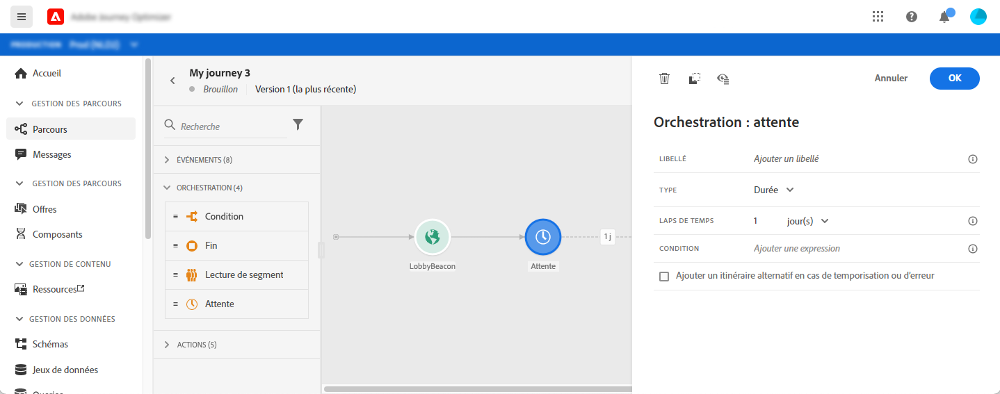
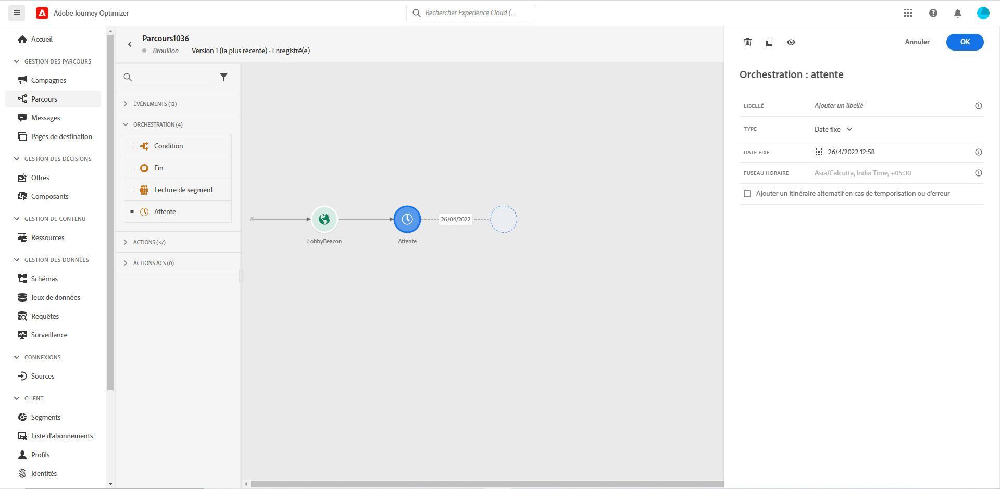
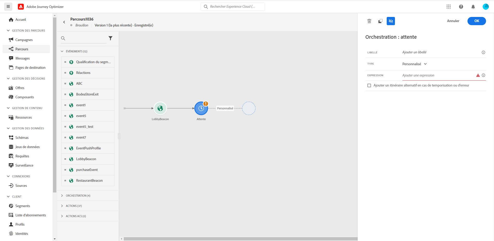
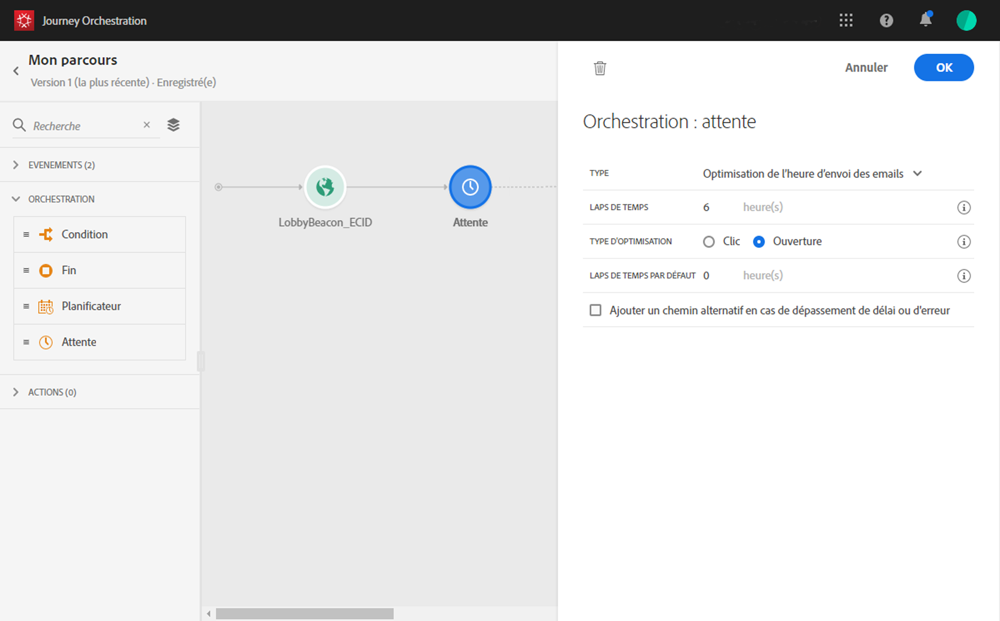

# Activité d’attente{#section_rlm_nft_dgb}

Si vous souhaitez observer un temps d’attente avant d’exécuter l’activité suivante dans le chemin, vous pouvez utiliser une activité **[!UICONTROL Attente]**. Cela vous permet de définir le moment d’exécution de l’activité suivante. Quatre options sont disponibles :

* [Durée](#duration)
* [Date fixe](#fixed_date)
* [Personnalisé](#custom)

<!--* [Email send time optimization](#email_send_time_optimization)-->

## À propos de l’activité d’attente{#about_wait}

Voici comment les attentes sont classées par priorité lorsque vous en utilisez plusieurs en parallèle. Si les attentes présentent la même configuration temporelle et une condition différente, mais superposée, celle qui est placée au-dessus est prioritaire. Supposons, par exemple, que la condition de la première attente soit « être une femme » et que la condition de la deuxième attente en parallèle est « être une VIP ». La première activité d’attente sera donc prioritaire.

Notez également que si deux attentes différentes s’exécutent en parallèle, celle qui se produit en premier est prioritaire, quelle que soit sa position verticale. Par exemple, si une attente d’une heure est placée au-dessus et une attente de 30 minutes en dessous, cette dernière est traitée après 30 minutes.

Vous pouvez définir une condition afin de limiter l’attente à une certaine population.

>[!NOTE]
>
>La durée d’attente maximale est de 30 jours.
>
>En mode test, le paramètre **[!UICONTROL Temps d’attente en test]** vous permet de définir la durée de chaque activité d’attente. La durée par défaut est de 10 secondes. Vous obtiendrez ainsi rapidement les résultats du test. Voir [cette page](../building-journeys/testing-the-journey.md)

## Durée de l’attente{#duration}

Sélectionnez la durée d’attente avant l’exécution de l’activité suivante.



## Attente à date fixe{#fixed_date}

Sélectionnez la date d’exécution de l’activité suivante.



## Attente personnalisée{#custom}

Cette option vous permet de définir une date personnalisée (le 12 juillet 2020 à 17 heures, par exemple) à l’aide d’une expression avancée basée sur un champ provenant d’un événement ou d’une source de données. Elle ne vous permet pas de définir une durée personnalisée ; 7 jours, par exemple. L’expression figurant dans l’éditeur d’expression doit fournir un format dateTimeOnly. Voir [cette page](../expression/expressionadvanced.md). Pour plus d’informations sur le format dateTimeOnly, voir [cette page](../expression/data-types.md).

>[!NOTE]
>
>Vous pouvez tirer parti d’une expression dateTimeOnly ou utiliser une fonction pour effectuer une conversion dans ce format. Par exemple : ```toDateTimeOnly(@{Event.offerOpened.activity.endTime})```, le champ de l’événement se présentant sous la forme 2016-08-12T09:46:06Z.
>
>La définition du **fuseau horaire** est attendue dans les propriétés de votre parcours. Par conséquent, il n’est pas possible actuellement de pointer directement, à partir de l’interface, vers un horodatage ISO-8601 complet associant l’heure et le décalage dû au fuseau horaire, tel que 2016-08-12T09:46:06.982-05. Voir [cette page](../building-journeys/timezone-management.md).



<!--## Email send time optimization{#email_send_time_optimization}

>[!CAUTION]
>
>The email send time optimization capability is only available to customers who use the [Adobe Experience Platform Data Connector](https://docs.adobe.com/content/help/en/campaign-standard/using/developing/mapping-campaign-and-aep-data/aep-about-data-connector.html).

This type of wait uses a score calculated in the Adobe Experience Platform. The score calculates the propensity to click or open an email in the future based on past behavior. Note that the algorithm calculating the score needs a certain amount of data to work. As a result, when it does not have enough data, the default wait time will apply. At publication time, you’ll be notified that the default time applies.

>[!NOTE]
>
>The first event of your journey must have a namespace.
>
>This capability is only available after an **[!UICONTROL Email]** activity. You need to have Adobe Campaign Standard.

1. In the **[!UICONTROL Amount of time]** field, define the number of hours to consider to optimize email sending.
1. In the **[!UICONTROL Optimization type]** field, choose if the optimization should increase clicks or opens.
1. In the **[!UICONTROL Default time]** field, define the default time to wait if the predictive send time score is not available.

    >[!NOTE]
    >
    >Note that the send time score can be unavailable because there is not enough data to perform the calculation. In this case, you will be informed, at publication time, that the default time applies.

-->
