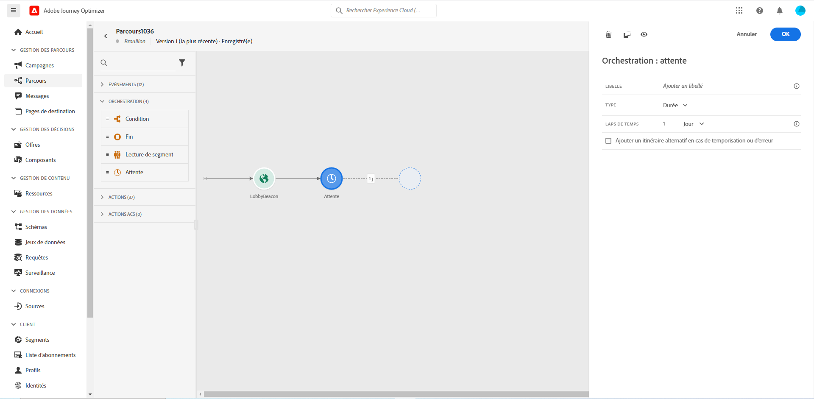

# Activité d’attente{#section_rlm_nft_dgb}

Si vous souhaitez attendre avant d’exécuter l’activité suivante dans le chemin, vous pouvez utiliser une activité **[!UICONTROL Attente]**. Il vous permet de définir le moment d’exécution de l’activité suivante. Quatre options sont disponibles :

* [Durée](#duration)
* [Date fixe](#fixed_date)
* [Personnalisé](#custom)
* [Optimisation du temps d&#39;envoi par courriel](#email_send_time_optimization)

## A propos de l’activité d’attente{#about_wait}

Voici comment les attentes sont prioritaires lorsque vous utilisez plusieurs attentes en parallèle. S’ils ont la même configuration de temps et une condition différente mais qui se superpose, l’attente positionnée ci-dessus sera celle qui est prioritaire. Par exemple, la condition de la première attente est &quot;être une femme&quot; et la condition de la seconde attente en parallèle est &quot;être une VIP&quot;. La première activité d’attente sera prioritaire.

Notez également que si deux attentes différentes sont en parallèle, celle qui se produit en premier sera hiérarchisée, quelle que soit sa position verticale. Par exemple, si une attente d’une heure est supérieure et une attente de 30 minutes inférieure, après 30 minutes, l’attente de 30 minutes est traitée.

Vous pouvez définir une condition si vous souhaitez limiter l’attente à une certaine population.

>[!NOTE]
>
>La durée d’attente maximale est de 30 jours.
>
>En mode test, toutes les activités d’attente sont automatiquement configurées pour durer 5 secondes. Vous pouvez ainsi accéder rapidement aux résultats du test.

## Attente de durée{#duration}

Sélectionnez la durée d’attente avant l’exécution de l’activité suivante.

## Attente à date fixe{#fixed_date}

Sélectionnez la date d’exécution de l’activité suivante. Lorsque vous définissez une date fixe, vous devez spécifier un fuseau horaire. Voir la section .

## Attente personnalisée{#custom}

Cette option vous permet de définir une date personnalisée, par exemple le 12 juillet 2020 à 17 heures, à l’aide d’une expression avancée basée sur un champ provenant d’un événement ou d’une source de données. Il ne vous permet pas de définir une durée personnalisée, par exemple, 7 jours. L’expression dans l’éditeur d’expression doit fournir un format dateTimeOnly. Voir la section . Pour plus d’informations sur le format dateTimeOnly, voir 

>[!NOTE]
>
>Vous pouvez exploiter une expression dateTimeOnly ou utiliser une fonction pour effectuer une conversion en dateTimeOnly. Par exemple : toDateTimeOnly(@{Event.offerOpened.activity.endTime}), le champ de l’événement se présentant sous la forme 2016-08-12T09:46:06.
>
>Le fuseau **horaire** est attendu à un autre endroit du volet de configuration d’attente personnalisé. Par conséquent, il n&#39;est pas possible aujourd&#39;hui, à partir de l&#39;interface, de pointer directement à un décalage complet de l&#39;heure de mélange ISO-8601 et du fuseau horaire comme 2016-08-12T09:46:06.982-05. Voir la section .

## Email send time optimization{#email_send_time_optimization}

>[!CAUTION]
>
>La fonctionnalité d’optimisation du temps d’envoi par courrier électronique n’est disponible que pour les clients qui utilisent la fonctionnalité Service de données Adobe Campaign Standard.

Ce type d’attente utilise un score calculé dans la plateforme. Le score calcule la propension à cliquer ou à ouvrir un courrier électronique dans le futur en fonction du comportement passé. Notez que l’algorithme qui calcule le score nécessite une certaine quantité de données pour fonctionner. Par conséquent, lorsque les données sont insuffisantes, le temps d’attente par défaut s’applique. Au moment de la publication, vous serez averti que l’heure par défaut s’applique.

>[!NOTE]
>
>Le premier événement de votre voyage doit avoir un espace de noms.
>
>Cette fonctionnalité n’est disponible qu’après une activité de **[!UICONTROL courrier électronique]**. Vous devez disposer d’Adobe Campaign Standard.

1. Dans le champ **[!UICONTROL Durée]**, définissez le nombre d’heures à prendre en compte pour optimiser l’envoi des courriers électroniques.
1. Dans le champ **[!UICONTROL Optimisation type]**, choisissez si l’optimisation doit augmenter les clics ou s’ouvrir.
1. Dans le champ Heure **par** défaut, définissez la durée d’attente par défaut si le score de temps d’envoi prédictif n’est pas disponible.

   >[!NOTE]
   >
   >Notez que le score de temps d’envoi peut être indisponible car il n’y a pas assez de données pour effectuer le calcul. Dans ce cas, vous serez informé, au moment de la publication, que l’heure par défaut s’applique.

