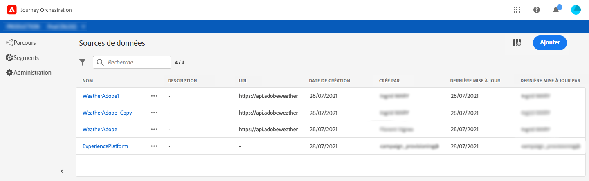

# À propos des sources de données {#concept_s1s_dqt_52b}

>[!CONTEXTUALHELP]
>id="jo_datasources"
>title="À propos des sources de données"
>abstract="La configuration d’une source de données est toujours effectuée par un utilisateur technique. Elle vous permet de définir une connexion à un système afin de récupérer des informations supplémentaires qui seront utilisées dans vos parcours. Par exemple : définition de conditions, données de paramètres et de personnalisation dans les actions, définition d’attente personnalisée, définition de fuseau horaire."

Elle vous permet de définir une connexion à un système afin de récupérer des informations supplémentaires qui seront utilisées dans vos parcours. Par exemple :

* [Définition d’une condition](../building-journeys/condition-activity.md)
* Données de paramètre et de personnalisation dans les [actions](../action/action.md)
* [Définition d’une attente personnalisée](../building-journeys/wait-activity.md#custom)
* [Définition d’un fuseau horaire](../building-journeys/timezone-management.md)

Cette configuration n’est pas requise si vos parcours utilisent uniquement les données locales provenant d’une payload d’événement. Par exemple, si votre parcours comprend un événement suivi d’une activité d’email qui utilise uniquement les données de l’événement, il n’est pas nécessaire de configurer une source de données.

Il existe deux types de sources de données :

* Source de données Adobe Experience Platform préconfigurée qui définit la connexion au service de Profil client en temps réel. Il s’agit d’une source de données intégrée. Voir .
* Les sources de données externes qui vous permettent de définir une connexion à des systèmes externes. Il s’agit des sources de données que vous pouvez créer. Voir .

Pour chaque source de données, vous définissez les informations à récupérer à l’aide de groupes de champs. Les groupes de champs sont des ensembles de champs qui peuvent être récupérés à partir d’une source de données. Voir .

For more information on how to configure an Adobe Experience Platform Data Source and an external data source and how to find and use data in a journey, watch this [tutorial video](https://docs.adobe.com/content/help/en/platform-learn/tutorials/journey-orchestration/configure-data-sources.html).

Les principales étapes de configuration d’une source de données sont les suivantes :

>[!NOTE]
>
>La configuration d’une source de données est toujours effectuée par un **utilisateur technique**.

1. Dans le menu supérieur, cliquez sur l’onglet **[!UICONTROL Sources de données]**.

   La liste des sources de données s’affiche. Pour plus d’informations sur l’interface, voir .

   

1. Ensuite, vous pouvez soit ajouter des groupes de champs à la source de données intégrée (voir ), soit créer une source de données externe (voir ) et les groupes de champs associés (voir ).

   

1. Cliquez sur **[!UICONTROL Enregistrer]**.

   La source de données est maintenant configurée et prête à être utilisée dans vos parcours.
