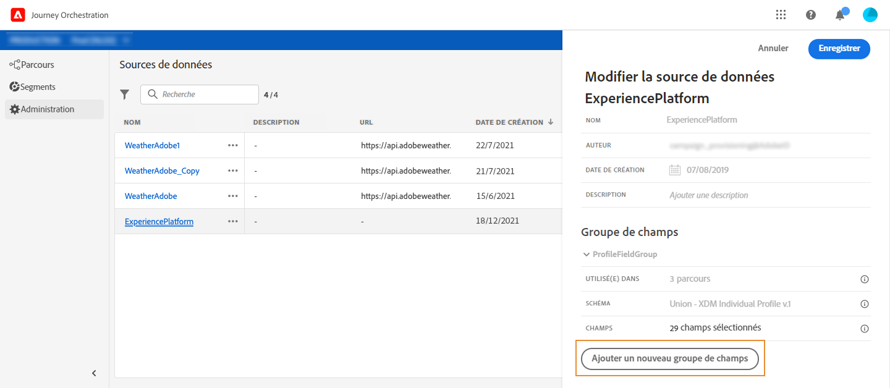

# Adobe Experience Platform data source {#concept_zrb_nqt_52b}

La source de données de la plateforme d’expérience définit la connexion au service de profil client en temps réel. Cette source de données est intégrée et préconfigurée. Il ne peut pas être supprimé. Cette source de données est conçue pour récupérer et utiliser les données du service de profil du client en temps réel (par exemple, vérifier si la personne qui est entrée dans un voyage est une femme). Il vous permet d’utiliser les données de profil et les données d’événements d’expérience. Pour plus d’informations sur le service de profil client en temps réel, consultez cette [page](https://www.adobe.io/apis/cloudplatform/dataservices/profile-identity-segmentation/profile-identity-segmentation-services.html#!api-specification/markdown/narrative/technical_overview/unified_profile_architectural_overview/unified_profile_architectural_overview.md).

>[!NOTE]
>
>Vous pouvez récupérer les 1 000 derniers événements d’expérience créés il y a moins d’un an.

Pour permettre la connexion au service de profil client en temps réel, nous devons utiliser une clé pour identifier une personne et un espace de noms qui contextualise la clé. Par conséquent, vous ne pouvez utiliser cette source de données que si vos voyages commencent par un événement contenant une clé et un espace de noms. Voir la section .

Vous pouvez modifier le groupe de champs préconfiguré nommé &quot;ProfileFieldGroup&quot;, en ajouter de nouveaux et supprimer ceux qui ne sont pas utilisés dans les brouillons ou les voyages en direct. Voir la section .

Voici les étapes principales pour ajouter des groupes de champs à la source de données intégrée.

1. Dans la liste des sources de données, sélectionnez la source de données de plateforme d’expérience intégrée.

   Le volet de configuration de la source de données s’ouvre alors sur le côté droit de l’écran.

   

1. Cliquez sur **[!UICONTROL Ajouter un nouveau groupe]**de champs pour définir une nouvelle série de champs à récupérer. Voir la section.

   

1. Sélectionnez un schéma dans la liste déroulante **[!UICONTROL Schéma]**. Ce champ répertorie les schémas des événements de profil et d’expérience disponibles dans la plateforme. La création du schéma n’est pas effectuée dans l’orchestration du parcours. Il est exécuté dans la plateforme de données.
1. Sélectionnez les champs à utiliser.
1. Définissez la durée du cache.
1. Cliquez sur **[!UICONTROL Enregistrer]**.

Lorsque vous placez le curseur sur le nom d’un groupe de champs, deux icônes s’affichent à droite. Ils vous permettent de supprimer et de dupliquer le groupe de champs. Notez que l’icône **[!UICONTROL Supprimer]**n’est disponible que si le groupe de champs n’est utilisé dans aucun voyage en direct ou préliminaire (informations affichées dans le champ**[!UICONTROL  Utilisé dans]** ).
