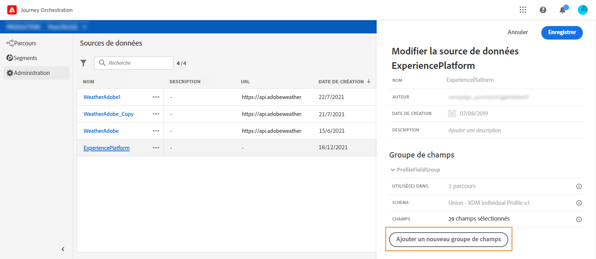

# Source de données Adobe Experience Platform {#concept_zrb_nqt_52b}

>[!CAUTION]
>
>**Vous recherchez Adobe Journey Optimizer** ? Cliquez [ici](https://experienceleague.adobe.com/fr/docs/journey-optimizer/using/ajo-home){target="_blank"} pour consulter la documentation de Journey Optimizer.
>
>
>_Cette documentation se rapporte aux anciens contenus de Journey Orchestration qui ont été remplacés par Journey Optimizer. Pour toute question concernant votre accès à Journey Orchestration ou Journey Optimizer, contactez votre équipe en charge des comptes._

La source de données Adobe Experience Platform définit la connexion au service de profil client en temps réel. Il s’agit d’une source de données intégrée et préconfigurée. Elle ne peut pas être supprimée. Cette source de données a été conçue pour récupérer et utiliser des données du service de profil client en temps réel (par exemple, vérifier si la personne qui a rejoint un parcours est de sexe féminin). Elle vous permet d’utiliser les données de profil et les données des événements d’expérience. Pour plus d’informations sur le service de profil client en temps réel, consultez cette [page](https://experienceleague.adobe.com/docs/experience-platform/profile/home.html?lang=fr).

>[!NOTE]
>
>Vous pouvez récupérer les 1 000 derniers événements d’expérience créés il y a moins d’un an.

Pour autoriser la connexion au service de profil client en temps réel, nous devons utiliser une clé afin d’identifier une personne, ainsi qu’un espace de noms qui contextualise la clé. Par conséquent, vous ne pouvez utiliser cette source de données que si vos parcours commencent par un événement contenant une clé et un espace de noms. Consultez [cette page](../building-journeys/journey.md).

Vous pouvez modifier le groupe de champs préconfiguré nommé « ProfileFieldGroup », en ajouter de nouveaux et supprimer ceux qui ne sont pas utilisés dans les parcours actifs ou dans un état de brouillon. Consultez [cette page](../datasource/field-groups.md).

Les principales étapes nécessaires pour ajouter des groupes de champs à la source de données intégrée sont les suivantes :

1. Dans la liste des sources de données, sélectionnez la source de données Adobe Experience Platform intégrée.

   Le volet de configuration de la source de données s’ouvre alors dans la partie droite de l’écran.

   

1. Cliquez sur **[!UICONTROL Ajouter un nouveau groupe de champs]** pour définir une nouvelle série de champs à récupérer. Consultez [cette page](../datasource/field-groups.md).

   

1. Sélectionnez un schéma dans la liste déroulante **[!UICONTROL Schéma]**. Ce champ répertorie les schémas de profil et d’événements d’expérience disponibles dans Adobe Experience Platform. La création du schéma n’est pas effectuée dans [!DNL Journey Orchestration], mais elle l’est dans Adobe Experience Platform.
1. Sélectionnez les champs que vous souhaitez utiliser.
1. Cliquez sur **[!UICONTROL Enregistrer]**.

Lorsque vous placez le curseur sur le nom d’un groupe de champs, deux icônes s’affichent à droite. Elles vous permettent de supprimer et de dupliquer le groupe de champs. Notez que l’icône **[!UICONTROL Supprimer]** n’est disponible que si le groupe de champs n’est utilisé dans aucun parcours actif ou dans un état de brouillon (cette information est affichée dans le champ **[!UICONTROL Utilisé(e) dans]**).
