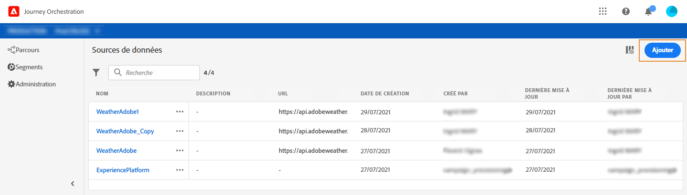
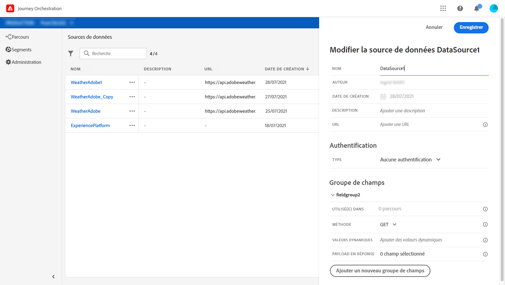
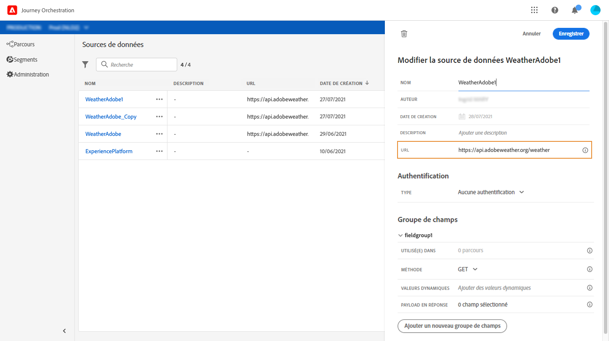
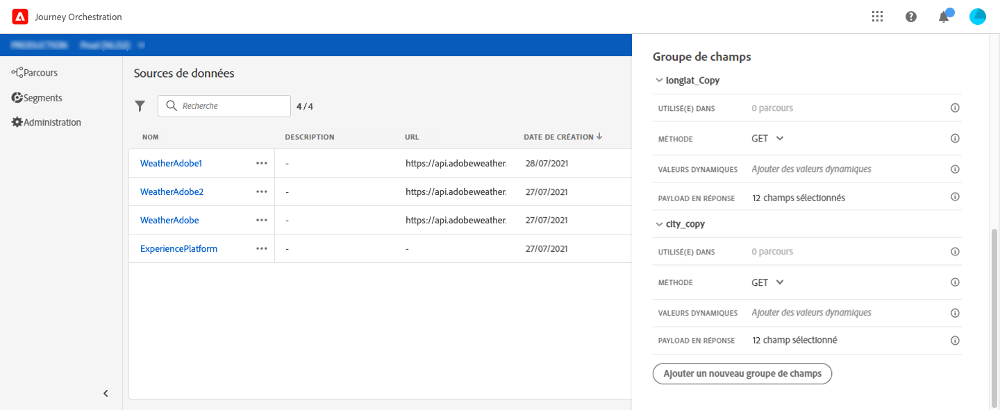
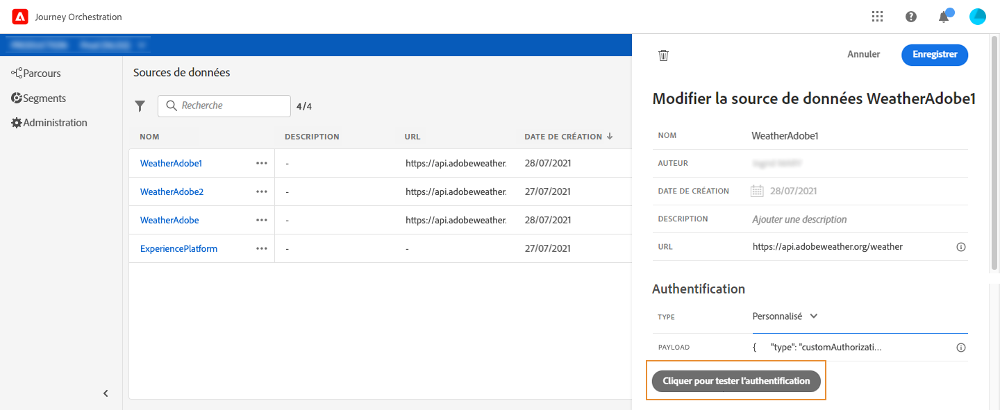
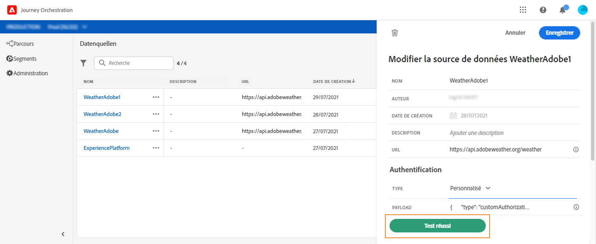

# Sources de données externes {#concept_t2s_kqt_52b}

Les sources de données externes vous permettent de définir une connexion à des systèmes tiers ; par exemple, si vous utilisez un système de réservation d’hôtels pour vérifier si la personne a réservé une chambre. Contrairement à la source de données Experience Platform intégrée, vous pouvez créer autant de sources de données externes que nécessaire.

Les API REST utilisant POST ou GET et renvoyant JSON sont prises en charge. Les modes d’authentification simple, personnalisé et par clé API sont pris en charge.

Prenons l’exemple d’un service API météorologique que je souhaite utiliser pour personnaliser les comportements de mon parcours en fonction des données météorologiques en temps réel.

Voici deux exemples de l’appel API :

* _https://api.adobeweather.org/weather?city=London,uk&amp;appid=1234_
* _https://api.adobeweather.org/weather?lat=35&amp;lon=139&amp;appid=1234_

L’appel est composé d’une URL principale (_https://api.adobeweather.org/weather_), de deux jeux de paramètres (« city » pour la ville et « lat/long » pour la latitude et la longitude) et de la clé API (appid).

Les principales étapes nécessaires pour créer et configurer une source de données externe sont les suivantes :

1. From the list of data sources, Click **[!UICONTROL Add]** to create a new external data source.

   

   Le volet de configuration de la source de données s’ouvre alors dans la partie droite de l’écran.

   

1. Attribuez un nom à votre source de données.

   >[!NOTE]
   >
   >N’utilisez ni espaces ni caractères spéciaux. Utilisez 30 caractères au maximum.

1. Ajoutez une description à la source de données. Cette étape est facultative.
1. Ajoutez l’URL du service externe. Dans notre exemple : _https://api.adobeweather.org/weather_.

   >[!CAUTION]
   >
   >Nous vous recommandons vivement d’utiliser le protocole HTTPS pour des raisons de sécurité. Notez également que l’utilisation des adresses Adobe qui ne sont pas publiques et des adresses IP n’est pas autorisée.

   

1. Configurez l’authentification en fonction de la configuration du service externe : **[!UICONTROL No authentication]**, **[!UICONTROL Basic]**, **[!UICONTROL Custom]** ou **[!UICONTROL API key]**. Pour plus d’informations sur le mode d’authentification personnalisé, voir [](../datasource/external-data-sources.md#section_wjp_nl5_nhb). Dans cet exemple, nous allons effectuer les choix suivants :


   * **[!UICONTROL Type]**: &quot;Clé API&quot;
   * **[!UICONTROL Value]**: &quot;1234&quot; (valeur de la clé d’API)
   * **[!UICONTROL Name]**: &quot;appid&quot; (il s’agit du nom du paramètre de clé d’API)
   * **[!UICONTROL Location]**: &quot;Paramètre &quot; (la clé API se trouve dans l’URL)
   

1. Ajouter un nouveau groupe de champs pour chaque jeu de paramètres d’API en cliquant sur **[!UICONTROL Add a New Field Group]**. N’utilisez ni espaces ni caractères spéciaux dans le nom du groupe de champs. Dans cet exemple, nous devons créer deux groupes de champs, un pour chaque jeu de paramètres (city et long/lat).

Pour le jeu de paramètres « long/lat », nous créons un groupe de champs avec les informations suivantes :

* **[!UICONTROL Used in]**: affiche le nombre de voyages qui utilisent un groupe de champs. You can click the **[!UICONTROL View journeys]** icon to display the list of journeys using this field group.
* **[!UICONTROL Method]**: sélectionnez la méthode POST ou GET. Dans notre exemple, nous choisissons la méthode GET.
* **[!UICONTROL Cache duration]**: dans notre cas, nous voulons que la météo soit mise en cache pendant 10 minutes.
* **[!UICONTROL Response Payload]**: cliquez dans le **[!UICONTROL Payload]** champ et collez un exemple de charge utile renvoyée par l’appel. Dans cet exemple, nous avons utilisé une payload trouvée sur un site web d’API météo. Vérifiez que les types de champs sont corrects. À chaque appel de l’API, le système récupère tous les champs contenus dans l’exemple de payload. Note that you can click on **[!UICONTROL Paste a new payload]** if you want to change the payload currently passed.
* **[!UICONTROL Dynamic Values]**: entrez les différents paramètres séparés par une virgule, &quot;long,lat&quot; dans notre exemple. Étant donné que les valeurs des paramètres dépendent du contexte d’exécution, elles sont définies dans les parcours. Voir [](../expression/expressionadvanced.md).
* **[!UICONTROL Sent Payload]**: ce champ n&#39; apparaît pas dans notre exemple. Il n’est disponible que si vous sélectionnez la méthode POST. Collez la payload qui sera envoyée au système tiers.

In case of a GET call requiring parameter(s), you enter the parameter(s) in the **[!UICONTROL Parameters]** field and they are automatically added at the end of the call. Dans le cas d’un appel POST, vous devez :

* list the parameters to be passed at call time in the **[!UICONTROL Parameter]** field (in the example below: “identifier”).
* spécifier les paramètres avec la même syntaxe dans le corps de la payload envoyée. Pour ce faire, vous devez ajouter : &quot;param&quot;: &quot;nom de votre paramètre&quot; (&quot;identifier&quot; dans l’exemple ci-dessous). Respectez la syntaxe ci-dessous :

   ```
   {"id":{"param":"identifier"}}
   ```



Clics **[!UICONTROL Save]**.

La source de données est maintenant configurée et prête à être utilisée dans vos parcours ; par exemple, dans vos conditions ou pour personnaliser un email. Si la température est supérieure à 30° C, vous pouvez choisir d’envoyer une communication spécifique.

## Mode d’authentification personnalisé {#section_wjp_nl5_nhb}

>[!CONTEXTUALHELP]
>id=&quot;jo_authentication_payload&quot;
>title=&quot;A propos de l’authentification personnalisée&quot;
>abstract=&quot;Le mode d’authentification personnalisé est utilisé pour l’authentification complexe afin d’appeler les protocoles d’encapsulage d’API tels que OAuth2. L’exécution de l’action est un processus en deux étapes. Tout d’abord, un appel au point de fin est effectué pour générer le  du. Ensuite, le  est injecté dans la requête HTTP de l’action.&quot;

Ce mode d’authentification est utilisé pour une authentification complexe. Il est fréquemment utilisé pour appeler les protocoles d’encapsulage d’API, comme OAuth2, afin de récupérer un jeton d’accès à injecter dans la requête HTTP réelle pour l’action.

Lorsque vous configurez l’authentification personnalisée, vous pouvez cliquer sur le bouton ci-dessous pour vérifier si la payload d’authentification personnalisée est correctement configurée.



Si le test réussit, le bouton devient vert.



Avec cette authentification, l’exécution de l’action est un processus en deux étapes :

1. Appelez le point d’entrée pour générer le jeton d’accès.
1. Appelez l’API REST en injectant correctement le jeton d’accès.

Cette authentification se compose de deux parties.

La définition du point d’entrée à appeler pour générer le jeton d’accès :

* endpoint : URL à utiliser pour générer le point d’entrée
* méthode de la requête HTTP sur le point d’entrée (GET ou POST)
* headers : paires clé/valeur à injecter en tant qu’en-têtes dans cet appel, le cas échéant
* body : décrit le corps de l’appel en cas d’utilisation de la méthode POST. Nous prenons en charge une structure de corps limitée, définie dans bodyParams (paires clé/valeur). bodyType décrit le format et le codage du corps dans l’appel :
   * &#39;form&#39; : signifie que le type de contenu sera application/x-www-form-urlencoded (jeu de caractères UTF-8) et que les paires clé/valeur seront sérialisées comme suit : key1=value1&amp;key2=value2&amp;…
   * &#39;json&#39; : signifie que le type de contenu sera application/json (jeu de caractères UTF-8) et que les paires clé/valeur seront sérialisées sous la forme d’un objet json, tel quel : _{ &quot;key1&quot;: &quot;value1&quot;, &quot;key2&quot;: &quot;value2&quot;, ...}_

La définition de la méthode d’injection du jeton d’accès dans la requête HTTP de l’action :

* authorizationType : définit la manière dont le jeton d’accès généré doit être injecté dans l’appel HTTP pour l’action. Les valeurs possibles sont les suivantes :

   * bearer : indique que le jeton d’accès doit être injecté dans l’en-tête Authorization ; par exemple, _Authorization: Bearer &lt;jeton d’accès>_
   * header : indique que le jeton d’accès doit être injecté en tant qu’en-tête ; nom d’en-tête défini par la propriété tokenTarget. Par exemple, si la propriété tokenTarget est myHeader, le jeton d’accès est injecté sous la forme d’un en-tête : _myHeader: &lt;jeton d’accès>_.
   * queryParam : indique que le jeton d’accès doit être injecté en tant que queryParam, le nom du paramètre de requête défini par la propriété tokenTarget. Par exemple, si le paramètre tokenTarget est myQueryParam, l’URL de l’appel d’action est _&lt;url>?myQueryParam=&lt;jeton d’accès>_

* tokenInResponse : indique comment extraire le jeton d’accès de l’appel d’authentification. Cette propriété peut être :
   * &#39;response&#39; : indique que la réponse HTTP est le jeton d’accès.
   * Un sélecteur dans un fichier json (en supposant que la réponse soit au format JSON ; les autres formats, comme XML, ne sont pas pris en charge). Le format de ce sélecteur est _json://&lt;chemin d’accès à la propriété du jeton d’accès>_. Par exemple, si la réponse de l’appel est _{ &quot;access_token&quot;: &quot;theToken&quot;, &quot;timestamp&quot;: 12323445656 }_, tokenInResponse sera _json: //access_token_.

Le format de cette authentification est le suivant :

```
{
    "type": "customAuthorization",
    "authorizationType": "<value in 'bearer', 'header' or 'queryParam'>",
    (optional, mandatory if authorizationType is 'header' or 'queryParam') "tokenTarget": "<name of the header or queryParam if the authorizationType is 'header' or 'queryParam'>",
    "endpoint": "<URL of the authentication endpoint>",
    "method": "<HTTP method to call the authentication endpoint, in 'GET' or 'POST'>",
    (optional) "headers": {
        "<header name>": "<header value>",
        ...
    },
    (optional, mandatory if method is 'POST') "body": {
        "bodyType": "<'form'or 'json'>,
        "bodyParams": {
            "param1": value1,
            ...

        }
    },
    "tokenInResponse": "<'response' or json selector in format 'json://<field path to access token>'"
}
```
