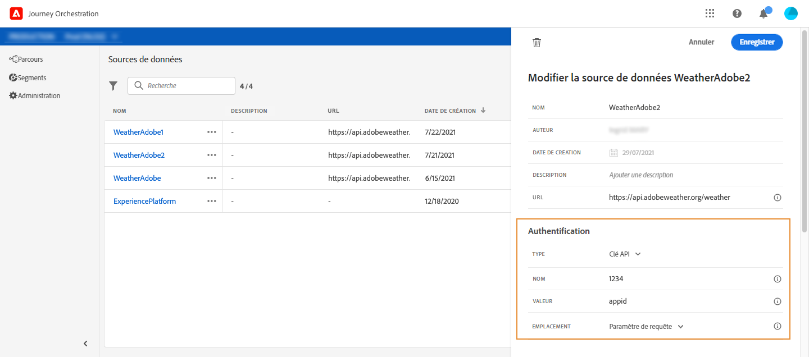

# Sources de données externes {#concept_t2s_kqt_52b}

Les sources de données externes vous permettent de définir une connexion à des systèmes tiers ; par exemple, si vous utilisez un système de réservation d’hôtels pour vérifier si la personne a réservé une chambre. Contrairement à la source de données Adobe Experience Platform intégrée, vous pouvez créer autant de sources de données externes que nécessaire.

Les API REST utilisant POST ou GET et renvoyant JSON sont prises en charge. Les modes d’authentification par clé API, de base et personnalisée sont pris en charge.

Prenons l’exemple d’un service API météorologique que je souhaite utiliser pour personnaliser les comportements de mon parcours en fonction des données météorologiques en temps réel.

Voici deux exemples d’appel API :

* _https://api.adobeweather.org/weather?city=London,uk&amp;appid=1234_
* _https://api.adobeweather.org/weather?lat=35&amp;lon=139&amp;appid=1234_

L’appel est composé d’une URL principale (_https://api.adobeweather.org/weather_), de deux jeux de paramètres (« city » pour la ville et « lat/long » pour la latitude et la longitude) et la clé API (appid).

Les principales étapes de création et de configuration d’une source de données externe sont les suivantes :

1. Dans la liste des sources de données, cliquez sur **[!UICONTROL Créer une source de données]** pour créer une source de données externe.

   

   Le volet de configuration de la source de données s’ouvre alors dans la partie droite de l’écran.

   

1. Saisissez un nom pour votre source de données.

   >[!NOTE]
   >
   >N&#39;utilisez ni espaces ni caractères spéciaux. Utilisez 30 caractères au maximum.

1. Ajoutez une description à votre source de données. Cette étape est facultative.
1. Ajoutez l&#39;URL du service externe. Dans notre exemple : _https://api.adobeweather.org/weather_.

   >[!CAUTION]
   >
   >Nous vous recommandons vivement d&#39;utiliser le protocole HTTPS pour des raisons de sécurité. Notez également que l’utilisation des adresses Adobe qui ne sont pas publiquement disponibles et des adresses IP n’est pas autorisée.

   

1. Configurez l’authentification en fonction de la configuration du service externe : **[!UICONTROL Aucune authentification]**, **[!UICONTROL Simple]**, **[!UICONTROL Personnalisé]** ou **[!UICONTROL Clé API]**. Pour plus d’informations sur le mode d’authentification personnalisée, reportez-vous à [cette section](../datasource/external-data-sources.md#section_wjp_nl5_nhb). Dans cet exemple, nous allons effectuer les choix suivants :


   * **[!UICONTROL Type]** : « clé API »
   * **[!UICONTROL Valeur]** : « 1234 » (valeur de la clé API)
   * **[!UICONTROL Nom]** : « appid » (il s’agit du nom du paramètre de la clé API)
   * **[!UICONTROL Emplacement]** : « Paramètre de requête » (la clé API se trouve dans l’URL).

   

1. Ajoutez un nouveau groupe de champs pour chaque jeu de paramètres API en cliquant sur **[!UICONTROL Ajouter un nouveau groupe de champs]**. N’utilisez ni espaces ni caractères spéciaux dans le nom du groupe de champs. Dans notre exemple, nous devons créer deux groupes de champs, un pour chaque jeu de paramètres (city et long/lat).

Pour le jeu de paramètres « long/lat », nous créons un groupe de champs avec les informations suivantes :

* **[!UICONTROL Utilisé dans]** : affiche le nombre de parcours qui utilisent un groupe de champs. Vous pouvez cliquer sur l’icône **[!UICONTROL Afficher les parcours]** pour afficher la liste des parcours utilisant ce groupe de champs.
* **[!UICONTROL Méthode]** : sélectionnez la méthode POST ou GET. Dans notre cas, nous sélectionnons la méthode GET.
* **[!UICONTROL Payload de réponse]** : cliquez dans le champ **[!UICONTROL Payload]** et collez un exemple du payload renvoyé par l’appel. Dans notre exemple, nous avons utilisé un payload trouvé sur un site web d’API météorologique. Vérifiez que les types de champ sont corrects. À chaque appel de l’API, le système récupère tous les champs contenus dans l’exemple de payload. Notez que vous pouvez cliquer sur **[!UICONTROL Coller un nouveau payload]** si vous souhaitez modifier le payload actuellement transmis.
* **[!UICONTROL Valeurs dynamiques]** : saisissez les différents paramètres séparés par une virgule, « long,lat » dans notre exemple. Les valeurs des paramètres dépendant du contexte d’exécution, elles seront définies dans les parcours. Voir [cette page](../expression/expressionadvanced.md).
* **[!UICONTROL Payload envoyé]** : ce champ n’apparaît pas dans notre exemple. Il n’est disponible que si vous sélectionnez la méthode POST. Collez le payload qui sera envoyé au système tiers.

Dans le cas d’une méthode GET nécessitant un ou plusieurs paramètres, vous saisissez le ou les paramètres dans le champ **[!UICONTROL Valeurs dynamiques]** et ils sont automatiquement ajoutés à la fin de l’appel. Dans le cas d’un appel POST, vous devez procéder comme suit :

* répertorier les paramètres à transmettre au moment de l’appel dans le champ **[!UICONTROL Valeurs dynamiques]** (« identifiant » dans l’exemple ci-dessous) ;
* spécifier les paramètres avec la même syntaxe dans le corps de la payload envoyée. Pour ce faire, vous devez ajouter : &quot;param&quot;: &quot;nom de votre paramètre&quot; (&quot;identifier&quot; dans l’exemple ci-dessous). Suivez la syntaxe ci-dessous :

  ```
  {"id":{"param":"identifier"}}
  ```


Cliquez sur **[!UICONTROL Enregistrer]**.

La source de données est maintenant configurée et prête à être utilisée dans vos parcours, par exemple dans vos conditions ou pour personnaliser un e-mail. Si la température est supérieure à 30 °C, vous pouvez choisir d’envoyer une communication spécifique.

## Mode d’authentification personnalisé {#section_wjp_nl5_nhb}

>[!CONTEXTUALHELP]
>id="jo_authentication_payload"
>title="À propos de l’authentification personnalisée"
>abstract="Le mode d’authentification personnalisée est utilisé pour l’authentification complexe afin d’appeler les protocoles d’encapsulage d’API tels qu’OAuth2. L’exécution de l’action est un processus en deux étapes. Tout d’abord, un appel au point d’entrée est effectué pour générer le jeton d’accès. Ensuite, le jeton d’accès est injecté dans la requête HTTP de l’action."

Ce mode d’authentification est utilisé pour une authentification complexe, fréquemment utilisée pour appeler les protocoles d’encapsulage d’API tels qu’OAuth2, afin de récupérer un jeton d’accès à injecter dans la requête HTTP réelle de l’action.

Lorsque vous configurez l’authentification personnalisée, vous pouvez cliquer sur le bouton ci-dessous pour vérifier si le payload de l’authentification personnalisée est correctement configuré.


Si le test est réussi, le bouton devient vert.


Avec cette authentification, l’exécution de l’action est un processus en deux étapes :

1. Appelez le point d’entrée pour générer le jeton d’accès.
1. Appelez l’API REST en injectant correctement le jeton d’accès.

Cette authentification se compose de deux parties.

La définition du point d’entrée à appeler pour générer le jeton d’accès :

* endpoint : URL à utiliser pour générer le point d’entrée
* Méthode de la requête HTTP sur le point d’entrée (GET ou POST)
* headers : paires clé/valeur à injecter en tant qu’en-têtes dans cet appel, le cas échéant
* body : décrit le corps de lʼappel en cas dʼutilisation de la méthode POST. Nous prenons en charge une structure de corps limitée, définie dans bodyParams (paires clé/valeur). bodyType décrit le format et le codage du corps dans lʼappel :
   * &#39;form&#39; : signifie que le type de contenu sera application/x-www-form-urlencoded (jeu de caractères UTF-8) et que les paires clé/valeur seront sérialisées comme suit : key1=value1&amp;key2=value2&amp;…
   * &#39;json&#39; : signifie que le type de contenu sera application/json (jeu de caractères UTF-8) et que les paires clé/valeur seront sérialisées sous la forme d’un objet json, tel quel : _{ &quot;key1&quot;: &quot;value1&quot;, &quot;key2&quot;: &quot;value2&quot;, ...}_

La définition de la méthode d’injection du jeton d’accès dans la requête HTTP de l’action :

* authorizationType : définit la manière dont le jeton d’accès généré doit être injecté dans l’appel HTTP pour l’action. Les valeurs possibles sont les suivantes :

   * bearer : indique que le jeton d’accès doit être injecté dans l’en-tête Authorization, par exemple : _Autorization: Bearer &lt;access token>_
   * header : indique que le jeton d’accès doit être injecté en tant qu’en-tête, le nom de l’en-tête étant défini par la propriété tokenTarget. Par exemple, si tokenTarget est myHeader, le jeton d’accès est injecté sous la forme d’un en-tête : _myHeader: &lt;access token>_
   * queryParam : indique que le jeton d’accès doit être injecté en tant que queryParam, le nom du paramètre de requête étant défini par la propriété tokenTarget. Par exemple, si tokenTarget est myQueryParam, l’URL de l’appel d’action est : _&lt;url>?myQueryParam=&lt;access token>_

* tokenInResponse : indique comment extraire le jeton d’accès de l’appel d’authentification. Cette propriété peut être l’un des éléments suivants :
   * &#39;response&#39; : indique que la réponse HTTP est le jeton d’accès ;
   * un sélecteur dans un fichier JSON (en supposant que la réponse soit un fichier JSON, nous ne prenons pas en charge d’autres formats, tels que XML). Le format de ce sélecteur est _json://&lt;path to the access token property>_. Par exemple, si la réponse de l’appel est : _{ &quot;access_token&quot;: &quot;theToken&quot;, &quot;timestamp&quot;: 12323445656 }_, tokenInResponse sera : _json: //access_token_.

Le format de cette authentification est le suivant :

```
{
    "type": "customAuthorization",
    "authorizationType": "<value in 'bearer', 'header' or 'queryParam'>",
    (optional, mandatory if authorizationType is 'header' or 'queryParam') "tokenTarget": "<name of the header or queryParam if the authorizationType is 'header' or 'queryParam'>",
    "endpoint": "<URL of the authentication endpoint>",
    "method": "<HTTP method to call the authentication endpoint, in 'GET' or 'POST'>",
    (optional) "headers": {
        "<header name>": "<header value>",
        ...
    },
    (optional, mandatory if method is 'POST') "body": {
        "bodyType": "<'form'or 'json'>,
        "bodyParams": {
            "param1": value1,
            ...

        }
    },
    "tokenInResponse": "<'response' or json selector in format 'json://<field path to access token>'"
}
```

Vous pouvez modifier la durée de mise en cache du jeton pour une source de données d’authentification personnalisée. Vous trouverez ci-dessous un exemple de payload d’authentification personnalisé. La durée de mise en cache est définie dans le paramètre « cacheDuration ». Il spécifie la durée de conservation du jeton généré dans le cache. L’unité peut être la milliseconde, la seconde, la minute, l’heure, le jour, le mois, ou l’année.

```
"authentication": {
    "type":"customAuthorization",
    "authorizationType":"Bearer",
    "endpoint":"http://localhost:${port}/epsilon/oauth2/access_token",
    "method":"POST",
    "headers": {
        "Authorization":"Basic EncodeBase64(${epsilonClientId}:${epsilonClientSecret})"
        },
    "body": {
        "bodyType":"form",
        "bodyParams": {
             "scope":"cn mail givenname uid employeeNumber",
             "grant_type":"password",
             "username":"${epsilonUserName}",
             "password":"${epsilonUserPassword}"
             }
        },
    "tokenInResponse":"json://access_token",
    "cacheDuration":
             { "duration":5, "timeUnit":"seconds" }
    }
```

>[!NOTE]
>
>La durée de mise en cache permet d’éviter un trop grand nombre d’appels aux points d’entrée d’authentification. La rétention des jetons d’authentification est mise en cache dans les services, il n’y a aucune persistance. Si un service est redémarré, il commence par un cache propre. Par défaut, la durée de mise en cache est de 1 heure. Dans la payload de l’authentification personnalisée, elle peut être adaptée en spécifiant une autre durée de rétention.
