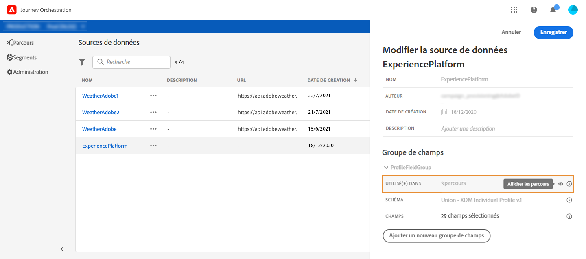

# Field groups {#concept_ntl_ypt_52b}

## Définition de groupes de champs {#section_dsz_kjd_fjb}

Pour chaque source de données, vous pouvez définir plusieurs groupes de champs, chacun avec une durée de cache spécifique. Ils vous permettent de choisir les champs à récupérer de la source de données à utiliser dans vos voyages.

Par exemple, vous pouvez créer un groupe de champs avec le numéro de téléphone, le courriel, le prénom et l’adresse du profil. Vous pourrez alors utiliser ces données dans votre parcours pour créer des conditions. Par exemple, vous pouvez décider d’envoyer un SMS uniquement si le numéro de téléphone du profil n’est pas vide. S’il est vide, vous pouvez envoyer un courrier électronique.

Bien qu’un nom par défaut soit automatiquement ajouté, nous vous recommandons de donner un nom à votre groupe de champs. En effet, le nom du groupe de champs sera visible par d’autres utilisateurs de l’orchestration de Journey. Donner un nom pertinent aux groupes de champs est une bonne pratique.

Lorsqu’un champ de source de données est utilisé dans un voyage, le système récupère tous les champs définis pour ce groupe de champs. Par conséquent, il est recommandé de ne sélectionner que les champs dont vous avez besoin pour vos voyages. Cela réduira la latence des demandes dans vos voyages, augmentant ainsi les performances. Notez que vous pourrez facilement ajouter d’autres champs dans les groupes de champs ultérieurement.

**[!UICONTROL La durée]**du cache est également importante car elle vous aidera à optimiser les performances. La durée du cache signifie que dans un voyage, si les données d’un groupe de champs sont récupérées une fois, le système les met temporairement en cache. Si les mêmes données sont requises plus tard dans le même parcours, le système n’effectue aucune autre requête à la source de données. La configuration de la durée du cache doit être adaptée à chaque cas d&#39;utilisation. Si vous devez récupérer des données en temps réel, telles que le statut de réservation d’hôtel, les informations météorologiques ou le nombre de points de fidélité, vous associerez le groupe de champs contenant ces champs à une courte durée de cache (1 seconde, par exemple). Pour les champs mis à jour moins fréquemment (nom, sexe), vous allez créer un second groupe de champs avec une durée de cache plus longue (5 jours, par exemple).

Le nombre de voyages qui utilisent un groupe de champs s’affiche dans le champ **[!UICONTROL Utilisé dans]**. Vous pouvez cliquer sur le bouton**[!UICONTROL  Afficher les voyages]** pour afficher la liste des voyages utilisant ce groupe de champs.

>[!NOTE]
>
>Notez que si un groupe de champs n’a pas de champ, il ne s’affichera pas dans l’éditeur d’expression.

## Cycle de vie du groupe de champs {#section_abk_njd_fjb}

Vous pouvez ajouter ou supprimer des champs d’un groupe de champs qui n’est utilisé dans aucun brouillon ou parcours en direct.

Vous pouvez ajouter, mais vous ne pouvez pas supprimer, un champ d’un groupe de champs utilisé dans un ou plusieurs brouillons ou voyages en direct. Cela évitera de rompre les trajets.

Pour supprimer un champ d’un groupe de champs utilisé dans un ou plusieurs voyages, procédez comme suit. Prenons l’exemple d’un groupe de champs nommé &quot;Groupe de champs A&quot;.

1. Dans la liste des groupes de champs, placez le curseur sur &quot;Groupe de champs A&quot; et cliquez sur l’icône **[!UICONTROL Dupliquer]**située à droite. Nommez le groupe de champs dupliqué &quot;Groupe de champs B&quot;, par exemple.
1. Dans &quot;Groupe de champs B&quot;, supprimez les champs dont vous ne souhaitez plus.
1. Dans &quot;Groupe de champs A&quot;, vérifiez où ce groupe de champs est utilisé. Ces informations s’affichent dans le champ **[!UICONTROL Utilisé dans]**.
1. Ouvre tous les voyages qui utilisent &quot;Field Group A&quot;.
1. Créez de nouvelles versions de chacun de ces voyages. Modifiez toutes les activités à l’aide du &quot;Groupe de champs A&quot; et sélectionnez &quot;Groupe de champs B&quot;.
1. Arrêtez les anciennes versions des voyages qui utilisent le &quot;Groupe de campagne A&quot;. Vous ne devriez donc pas voyager en utilisant le &quot;Groupe de campagne A&quot;.
1. Supprimez &quot;Groupe de champs A&quot;, car il n’est plus utilisé.
