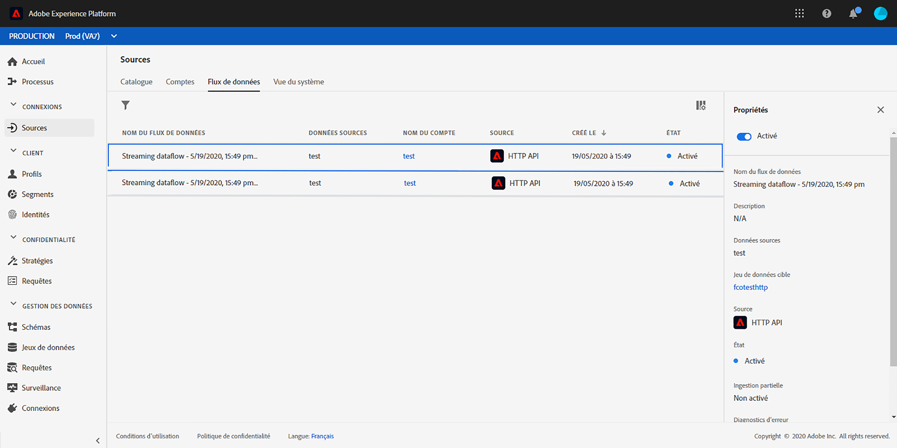

# Utilisation des données Adobe Analytics{#analytics-data}

>[!CAUTION]
>
>**Vous recherchez Adobe Journey Optimizer** ? Cliquez [ici](https://experienceleague.adobe.com/fr/docs/journey-optimizer/using/ajo-home){target="_blank"} pour consulter la documentation de Journey Optimizer.
>
>
>_Cette documentation se rapporte aux anciens contenus de Journey Orchestration qui ont été remplacés par Journey Optimizer. Pour toute question concernant votre accès à Journey Orchestration ou Journey Optimizer, contactez votre équipe en charge des comptes._

>[!NOTE]
>
>Cette section s&#39;applique uniquement aux événements basés sur des règles et aux clients qui doivent utiliser des données Adobe Analytics.

Vous pouvez exploiter toutes les données d&#39;événement comportemental Adobe Analytics que vous capturez déjà et diffusez en continu dans Platform afin de déclencher des parcours et d&#39;automatiser les expériences de vos clients.

Pour que cela fonctionne, vous devez activer, dans Adobe Experience Platform, la suite de rapports que vous souhaitez utiliser :

1. Dans Adobe Experience Platform, sélectionnez **[!UICONTROL Sources]**, puis **[!UICONTROL Ajouter des données]** dans la section Adobe Analytics. La liste des suites de rapports Adobe Analytics disponibles s’affiche.

1. Sélectionnez la suite de rapports à activer, cliquez sur **[!UICONTROL Suivant]** et sur **[!UICONTROL Terminer]**.

1. Partagez l’ID de données source avec votre point de contact de programme Alpha.

Cela active le connecteur source Analytics pour cette suite de rapports. Chaque fois que des données entrent, elles sont transformées en événement d’expérience et envoyées dans Adobe Experience Platform.

Pour plus d’informations sur le connecteur source Adobe Analytics, consultez la [documentation](https://experienceleague.adobe.com/docs/experience-platform/sources/connectors/adobe-applications/analytics.html?lang=fr) et le [tutoriel](https://experienceleague.adobe.com/docs/experience-platform/sources/ui-tutorials/create/adobe-applications/analytics.html?lang=fr).
