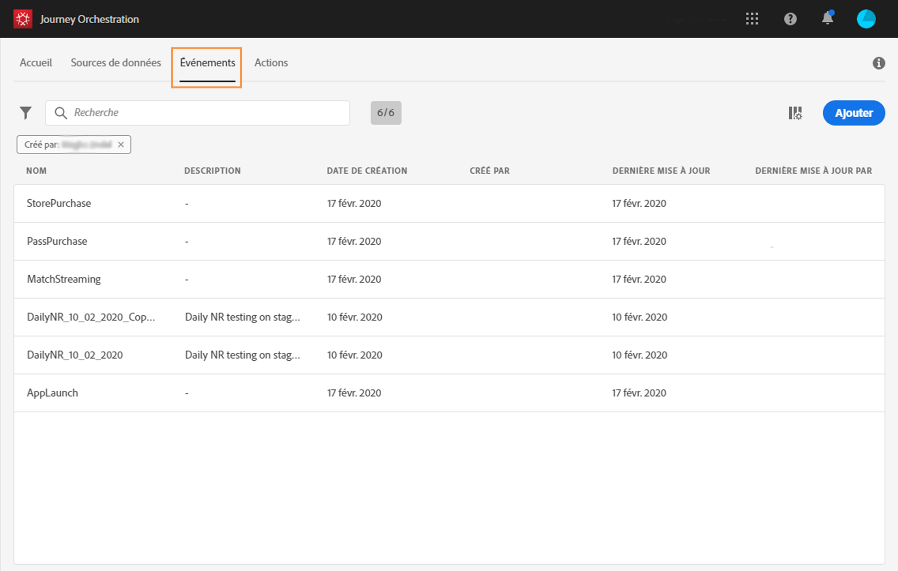
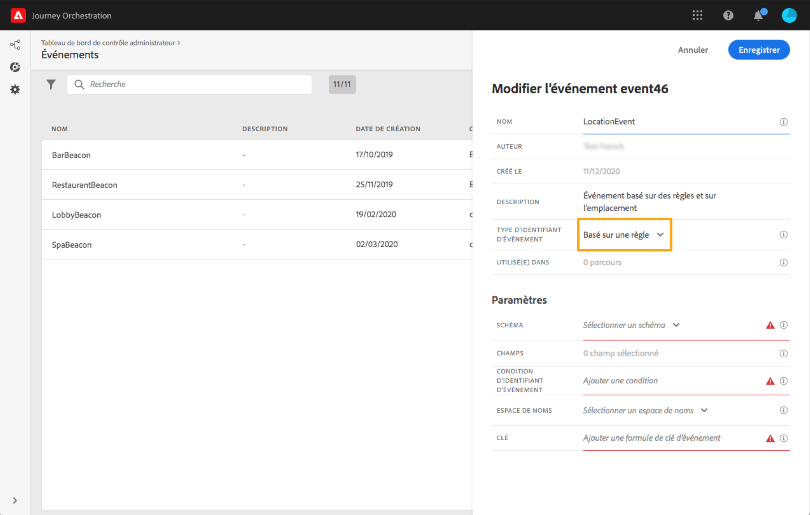

# Création d’un événement {#section_tbk_5qt_pgb}

Les principales étapes nécessaires pour configurer un nouvel événement sont les suivantes :

1. Dans le menu supérieur, cliquez sur l’onglet **[!UICONTROL Événements]**. La liste des événements s&#39;affiche. Pour plus d’informations sur l’interface, consultez [cette page](../about/user-interface.md).

   

1. Cliquez sur **[!UICONTROL Ajouter]** pour créer un événement. Le volet de configuration d&#39;événement s&#39;ouvre dans la partie droite de l&#39;écran. Saisissez le nom de votre événement. Vous pouvez également ajouter une description.

   

   >[!NOTE]
   >
   >N&#39;utilisez ni espaces ni caractères spéciaux. Utilisez 30 caractères au maximum.

1. Dans le champ **[!UICONTROL Type d’identifiant d’événement]**, sélectionnez le type d’événement à utiliser.

   

   * **Événements** basés sur des règles : ce type d’événement ne génère pas d’eventID. Dans le champ **Condition d’identifiant d’événement**, vous définissez simplement une règle qui sera utilisée par le système pour identifier les événements pertinents qui déclencheront vos parcours. Cette règle peut être basée sur n’importe quel champ disponible dans la payload de l’événement, par exemple l’emplacement du profil ou le nombre d’éléments ajoutés au panier du profil.

   * **Événements** générés par le système : ce type nécessite un eventID. Ce champ eventID est généré automatiquement lors de la création de l’événement et ajouté à la prévisualisation de la payload. Le système à l’origine de l’envoi de l’événement ne doit pas générer d’identifiant, mais plutôt transmettre celui indiqué dans la prévisualisation de la payload. Consultez [cette section](../event/previewing-the-payload.md).

   >[!NOTE]
   >
   >Pour en savoir plus sur les types d’événements, reportez-vous à [cette section](../event/about-events.md).
1. Le nombre de parcours qui font appel à cet événement apparaît dans le champ **[!UICONTROL Utilisé(e) dans]**. Vous pouvez cliquer sur l&#39;icône **[!UICONTROL Afficher les parcours]** pour faire apparaître la liste des parcours utilisant cet événement.
1. Définissez les champs de payload et de schéma : c’est dans ces champs que vous sélectionnez les informations d’événement (désignées généralement sous le nom de payload) que [!DNL Journey Orchestration] s’attend à recevoir. Vous pourrez alors utiliser ces informations dans votre parcours. Voir [cette page](../event/defining-the-payload-fields.md).
   >[!NOTE]
   >
   >Lorsque vous sélectionnez le type **[!UICONTROL Généré par le système]**, seuls les schémas dont le mixin est de type eventID sont disponibles. Lorsque vous sélectionnez le type **[!UICONTROL Basé sur des règles]**, tous les schémas Événement d&#39;expérience sont disponibles.

1. Pour les événements basés sur des règles, cliquez dans le champ **[!UICONTROL condition d&#39;identifiant d&#39;événement]**. À l&#39;aide de l&#39;éditeur d&#39;expression simple, définissez la condition qui sera utilisée par le système pour identifier les événements qui déclencheront votre parcours.
   

   Dans notre exemple, nous avons écrit une condition basée sur la ville du profil. Cela signifie que chaque fois que le système reçoit un événement qui correspond à cette condition (champ **[!UICONTROL Ville]** et valeur **[!UICONTROL Paris]**), il le transmet à Journey Orchestration.

   >[!NOTE]
   >
   >L&#39;éditeur d&#39;expression avancé n&#39;est pas disponible lors de la définition de la **[!UICONTROL condition d&#39;identifiant d&#39;événement]**. Dans l&#39;éditeur d&#39;expression simple, tous les opérateurs ne sont pas disponibles ; ils dépendent du type de données. Par exemple, pour un type de chaîne de champ, vous pouvez utiliser « contient » ou « égal à ».

1. Ajoutez un espace de noms. Cette étape est facultative, mais recommandée. En effet, l&#39;ajout d&#39;un espace de noms permet d&#39;exploiter les informations stockées dans le service de profil client en temps réel. Il définit le type de clé dont dispose l&#39;événement. Voir [cette page](../event/selecting-the-namespace.md).
1. Définissez la clé : effectuez votre choix parmi vos champs de payload ou définissez une formule pour identifier la personne associée à l&#39;événement. Cette clé est configurée automatiquement (mais peut toujours être modifiée) si vous sélectionnez un espace de noms. En effet, [!DNL Journey Orchestration] sélectionne la clé qui doit correspondre à l’espace de noms ; par exemple, si vous sélectionnez un espace de noms d’email, la clé d’email est sélectionnée. Voir [cette page](../event/defining-the-event-key.md).
1. Cliquez sur **[!UICONTROL Enregistrer]**.

   

   L&#39;événement est maintenant configuré et prêt à être déposé dans un parcours. Des étapes de configuration supplémentaires sont requises pour la réception d&#39;événements. Voir [cette page](../event/additional-steps-to-send-events-to-journey-orchestration.md).
