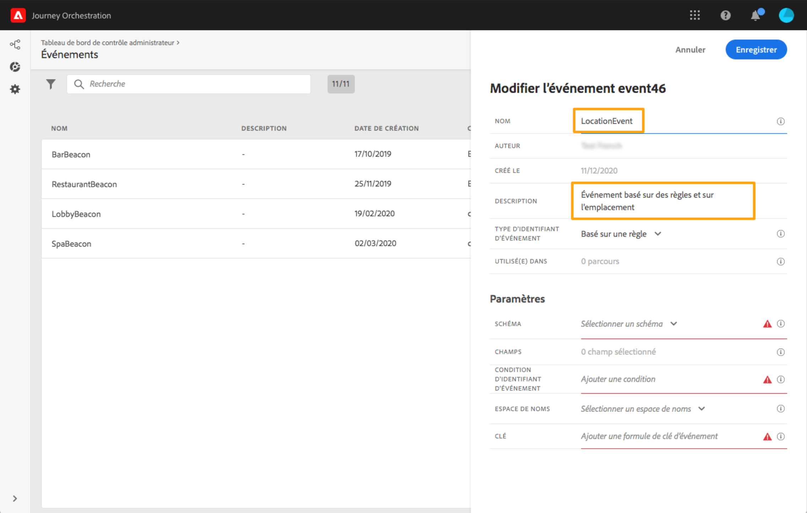

# À propos des événements {#concept_gfj_fqt_52b}

>[!CONTEXTUALHELP]
>id="jo_events"
>title="À propos des événements"
>abstract="Un événement est associé à une personne. Il décrit son comportement (par exemple, cette personne a acheté un produit, a visité un magasin, a quitté un site web, etc.) ou un événement qui s’est produit en rapport avec cette personne (par exemple, elle a accumulé 10 000 points de fidélité). This is what [!DNL Journey Orchestration] will listen to in journeys to orchestrate the best next actions."

Un événement est associé à une personne. Il décrit son comportement (par exemple, cette personne a acheté un produit, a visité un magasin, a quitté un site web, etc.) ou un événement qui s’est produit en rapport avec cette personne (par exemple, elle a accumulé 10 000 points de fidélité). This is what [!DNL Journey Orchestration] will listen to in journeys to orchestrate the best next actions.

Cette configuration est **obligatoire**[!DNL Journey Orchestration], dans la mesure où est conçu pour « écouter » les événements. Elle est toujours effectuée par un **utilisateur technique**.

The event configuration allows you to define the information [!DNL Journey Orchestration] will receive as events. Vous pouvez utiliser plusieurs événements (à différentes étapes d’un parcours) et plusieurs parcours peuvent utiliser un même événement.

Si vous modifiez un événement utilisé dans un parcours actif ou dans un état de brouillon, vous pouvez uniquement en modifier le nom ou la description, ou ajouter des champs de payload. La modification des parcours actifs ou dans un état de brouillon est strictement limitée pour éviter de les interrompre.

## Principe général {#section_r1f_xqt_pgb}

Les événements sont des appels d’API POST. Ils sont envoyés à Adobe Experience Cloud Data Platform par le biais des API d’ingestion en flux continu. L’URL de destination des événements envoyés via les API de messagerie transactionnelle est appelée « inlet ». La payload des événements respecte la mise en forme XDM.

The payload contains information required by Streaming Ingestion APIs to work (in the header) and the information required by [!DNL Journey Orchestration] to work (the event ID, part of the payload body) and information to be used in journeys (in the body, for example, the amount of an abandoned cart). Il existe deux modes d’ingestion en flux continu : authentifié et non authentifié. Pour plus d’informations sur les API d’ingestion en flux continu, cliquez sur [ce lien](https://docs.adobe.com/content/help/fr-FR/experience-platform/xdm/api/getting-started.html).

Après avoir transité par les API d’ingestion en flux continu, les événements se propagent dans un service interne appelé Pipeline, puis dans Data Platform. Si l’indicateur du service de profil client en temps réel est activé pour le schéma d’événement et que ce dernier comprend également un identifiant de jeu de données avec l’indicateur de profil client en temps réel, le schéma est propagé dans ce service.

The Pipeline filters events which have a payload containing [!DNL Journey Orchestration] eventIDs (see the event creation process below) provided by [!DNL Journey Orchestration] and contained in event payload. These events are listened by [!DNL Journey Orchestration] and the corresponding journey is triggered.

## Création d’un événement {#section_tbk_5qt_pgb}

Les principales étapes nécessaires pour configurer un nouvel événement sont les suivantes :

1. Dans le menu supérieur, cliquez sur l’onglet **[!UICONTROL Événements]**. La liste des événements s’affiche. Pour plus d’informations sur l’interface, voir .

   

1. Cliquez sur le bouton **[!UICONTROL Ajouter]** pour créer un événement. Le volet de configuration d’événement s’ouvre dans la partie droite de l’écran.

   

1. Saisissez le nom de votre événement.

   >[!NOTE]
   >
   >N’utilisez ni espaces ni caractères spéciaux. Utilisez 30 caractères au maximum.

1. Ajoutez une description à l’événement. Cette étape est facultative.
1. Define the schema and payload fields: this is where you select the event information (usually called a payload) [!DNL Journey Orchestration] expects to receive. Vous pourrez alors utiliser ces informations dans votre parcours. Voir .
1. Le nombre de parcours qui font appel à cet événement apparaît dans le champ **[!UICONTROL Utilisé(e) dans]**. Vous pouvez cliquer sur l’icône **[!UICONTROL Afficher les parcours]** pour faire apparaître la liste des parcours utilisant cet événement.
1. Ajoutez un namespace. Cette étape est facultative, mais recommandée. En effet, l’ajout d’un namespace permet d’exploiter les informations stockées dans le service de profil client en temps réel. Il définit le type de clé dont dispose l’événement. Voir .
1. Définissez la clé : effectuez votre choix parmi vos champs de payload ou définissez une formule pour identifier la personne associée à l’événement. Cette clé est configurée automatiquement (mais peut toujours être modifiée) si vous sélectionnez un namespace. Indeed, [!DNL Journey Orchestration] picks the key that should correspond to the namespace (for example, if you select an email namespace, the email key will be selected). Voir .
1. Ajoutez une condition. Cette étape est facultative. Elle permet au système de traiter uniquement les événements qui répondent à la condition. Cette condition ne peut être basée que sur les informations contenues dans l’événement. Voir .
1. Cliquez sur **[!UICONTROL Enregistrer]**.

   

   L’événement est maintenant configuré et prêt à être déposé dans un parcours. Des étapes de configuration supplémentaires sont requises pour la réception d’événements. Voir .
