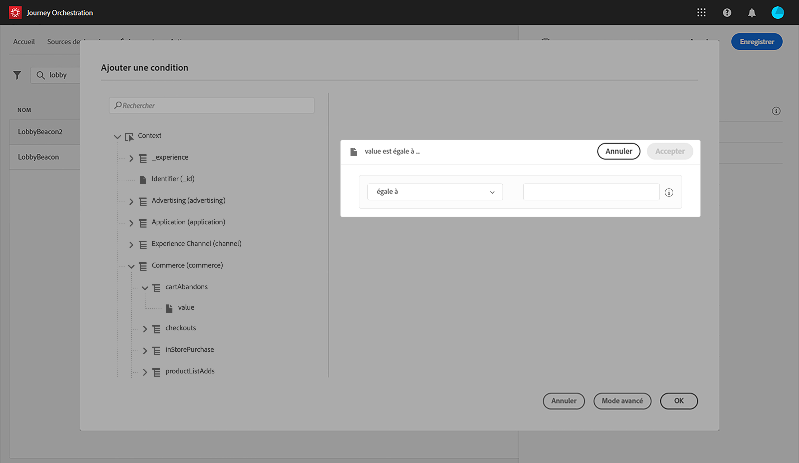

# Ajout d’une condition {#concept_rbg_gqt_52b}

Pour les événements générés par le système, vous pouvez définir une condition d’événement qui permet au système de filtrer le traitement des événements. Si la condition est vraie, l’événement est traité. Dans le cas contraire, il est ignoré.

La condition relative aux événements ne peut être basée que sur les données transmises dans la payload d’événement. La condition définie au niveau de l’événement ne peut pas être modifiée par un marketeur dans la zone de travail. L’objectif est de rendre cette condition plus stricte lorsque cet événement est utilisé. Par exemple, si vous ne souhaitez pas que les marketeurs utilisent des événements d’abandon de panier si la valeur du panier est trop faible, vous pouvez créer une condition sur le champ d’événement « valeur du panier » et imposer une valeur supérieure à 100 euros.

Vous pouvez utiliser l’éditeur d’expression simple ou avancé pour configurer des conditions sur les événements. Voir [cette page](../expression/expressionadvanced.md).

Vous pouvez, par exemple, définir une condition pour ne traiter que les événements d’un type spécifique et ignorer les autres. Si votre événement est un abandon de panier et que la payload comprend le champ de valeur de panier, vous pouvez définir une condition d’événement afin de ne traiter les événements que si la valeur du panier est supérieure à 100 euros.

