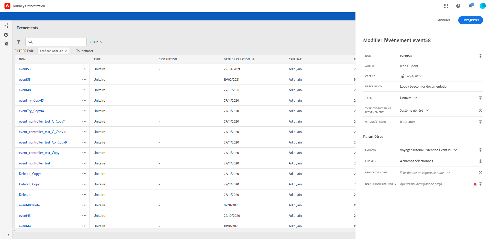
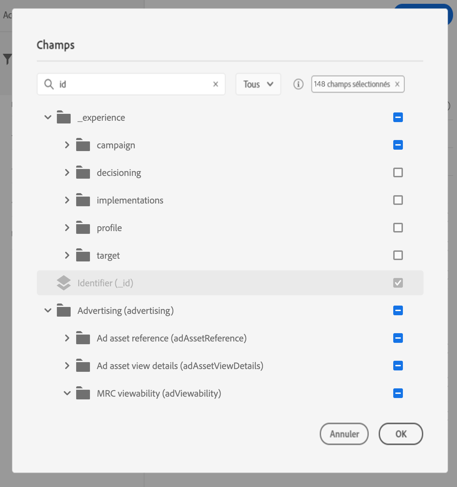

# Définition de la clé d’événement {#concept_ond_hqt_52b}

La clé correspond au champ ou à la combinaison de champs faisant partie des données de payload de l’événement et permettant au système d’identifier la personne associée à l’événement. Il peut s’agir de l’Experience Cloud ID, d’un ID CRM ou encore d’une adresse email.

Si vous prévoyez d’exploiter les données stockées dans la base de données de profils clients en temps réel, vous devez sélectionner, comme clé d’événement, les informations que vous avez définies en tant qu’identité d’un profil dans le [service de profil client en temps réel](https://docs.adobe.com/content/help/fr-FR/experience-platform/profile/home.html).

Le système pourra ainsi effectuer la réconciliation entre l’événement et le profil de l’individu. Si vous sélectionnez un schéma doté d’une identité principale, les champs **[!UICONTROL Clé]** et **[!UICONTROL Espace de noms]** sont déjà renseignés. Si aucune identité n’est définie, _identityMap > id_ est sélectionné comme clé principale. Vous devez ensuite sélectionner un espace de noms et la clé sera préremplie (sous le champ **[!UICONTROL Espace de noms]**) à l’aide de _identityMap > id_.

Lors de la sélection de champs, les champs d’identité principale sont marqués.

Si vous devez utiliser une autre clé, telle qu’un ID CRM ou une adresse email, vous devez l’ajouter manuellement :

1. Cliquez dans le champ **[!UICONTROL Clé]** ou sur l’icône représentant un crayon.

   

1. Sélectionnez le champ choisi comme clé dans la liste des champs de payload. Vous pouvez également basculer vers l’éditeur d’expression avancé pour créer des clés plus complexes (une concaténation de deux champs des événements, par exemple). Voir ci-dessous.

   

Lorsque l’événement est reçu, la valeur de la clé permet au système d’identifier la personne qui y est associée. Associée à un espace de noms (voir ), la clé peut être utilisée pour exécuter des requêtes sur Adobe Experience Platform. Voir .
La clé sert également à vérifier qu’une personne se trouve dans un parcours. En effet, une personne ne peut pas se trouver à deux endroits différents dans le même parcours. Par conséquent, le système n’autorise pas qu’une même clé (CRMID=3224, par exemple) se trouve à des endroits différents dans un même parcours.

Vous avez également accès aux fonctions d’expression avancées (**[!UICONTROL Mode avancé]**) si vous souhaitez effectuer des manipulations supplémentaires. Ces fonctions vous permettent de manipuler les valeurs utilisées pour exécuter des requêtes spécifiques, comme modifier des formats, exécuter des concaténations de champs, prendre uniquement en compte une partie d’un champ (les 10 premiers caractères, par exemple), etc. Voir .
