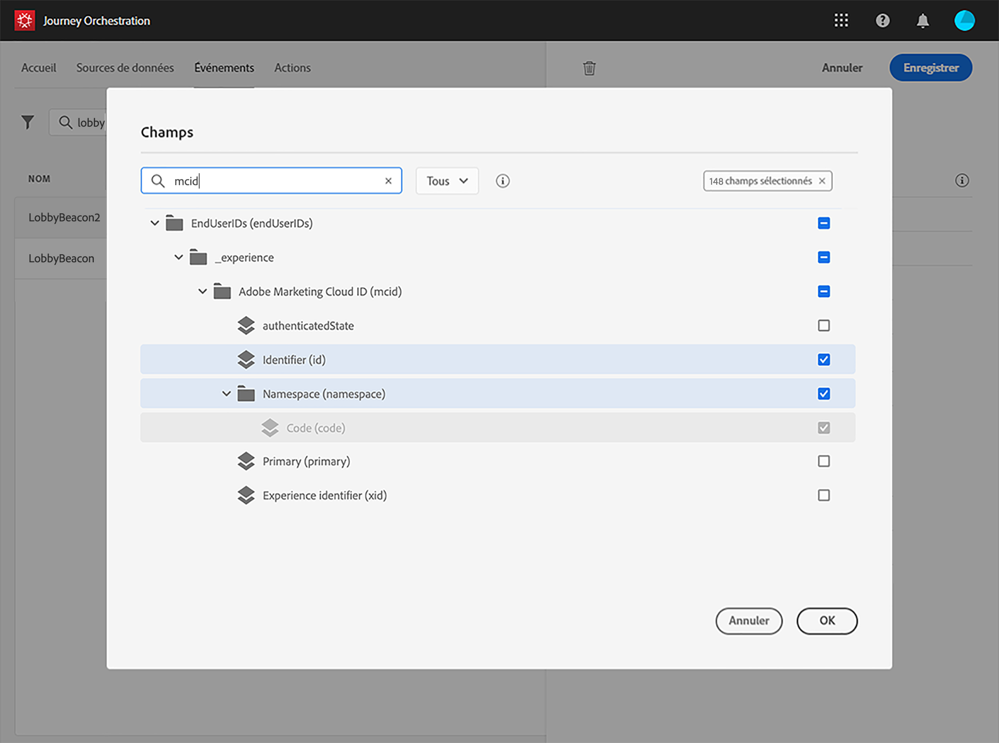

# Définition des champs de payload {#concept_yrw_3qt_52b}

La définition de la payload vous permet de choisir les informations que le système s’attend à recevoir de l’événement dans votre parcours, ainsi que la clé permettant d’identifier la personne associée à l’événement. La payload est basée sur la définition de champ XDM d’Experience Cloud. Pour plus d’informations sur XDM, consultez cette [page](https://docs.adobe.com/content/help/fr-FR/experience-platform/xdm/home.html).

1. Sélectionnez un schéma XDM dans la liste et cliquez ensuite sur le champ **[!UICONTROL Payload]** ou sur l’icône **[!UICONTROL Modifier]**.

   

   Tous les champs définis dans le schéma sont affichés. La liste des champs varie d’un schéma à l’autre. Vous pouvez rechercher un champ spécifique, ou utiliser les filtres pour afficher l’ensemble des nœuds et des champs ou uniquement les champs sélectionnés. En fonction de la définition du schéma, certains champs peuvent être obligatoires et présélectionnés. Vous ne pouvez pas les désélectionner.

   >[!NOTE]
   >
   >Vérifiez que vous avez bien ajouté le mixin « orchestration » au schéma XDM. Vous aurez ainsi la garantie que votre schéma contient toutes les informations requises pour fonctionner avec [!DNL Journey Orchestration].

   

1. Sélectionnez les champs que vous prévoyez de recevoir de l’événement. Il s’agit des champs que l’utilisateur chargé de la conception de parcours exploitera dans le parcours. Ils doivent également inclure la clé qui sera utilisée pour identifier la personne associée à l’événement (voir ).

   

   >[!NOTE]
   >
   >Le champ **[!UICONTROL eventID]** est automatiquement ajouté à la liste des champs sélectionnés afin que [!DNL Journey Orchestration] puisse identifier l’événement. Le système à l’origine de l’envoi de l’événement ne doit pas générer d’identifiant, mais plutôt utiliser celui indiqué dans l’aperçu de la payload. Voir .

1. Une fois la sélection des champs nécessaires terminée, cliquez sur **[!UICONTROL Enregistrer]** ou appuyez sur la touche **[!UICONTROL Entrée]**.

   

   Le nombre de champs sélectionnés s’affiche dans le champ **[!UICONTROL Payload]**.

   
