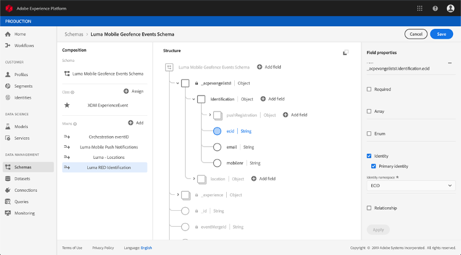

# À propos des schémas ExperienceEvent pour les événements [!DNL Journey Orchestration]

Les événements [!DNL Journey Orchestration] sont des événements d’expérience XDM envoyés à Adobe Experience Platform par l’intermédiaire de l’ingestion en flux continu.

As such, an important prerequisite for setting up events for [!DNL Journey Orchestration] is that you are familiar with the Adobe Experience Platform’s Experience Data Model (or XDM) and how to compose XDM Experience Event schemas, as well as how to stream XDM-formatted data to the Adobe Experience Platform.

## Schéma requis pour les événements [!DNL Journey Orchestration]

The first step in setting up an event for [!DNL Journey Orchestration] is to ensure that you have an XDM schema defined to represent the event, and a dataset created to record instances of the event on the Adobe Experience Platform. Il n’est pas absolument nécessaire de disposer d’un jeu de données pour vos événements, mais envoyer les événements à un jeu de données spécifique permettra de conserver l’historique des événements des utilisateurs pour une consultation et une analyse ultérieures, ce qui est judicieux. Si vous ne disposez pas déjà d&#39;un schéma et d&#39;un jeu de données appropriés pour votre événement, ces deux tâches peuvent être effectuées dans l&#39;interface Web de Adobe Experience Platform.

Un schéma XDM destiné aux événements [!DNL Journey Orchestration] doit répondre aux exigences suivantes :

* Le schéma doit appartenir à la classe XDM ExperienceEvent.

* Le schéma doit contenir le mixin Orchestration eventID. [!DNL Journey Orchestration] emploie ce champ pour identifier les événements utilisés dans les parcours.

* Vous devez déclarer un champ d’identité pour identifier le sujet de l’événement. Si aucune identité n’est spécifiée, un mapping d’identité peut être utilisée. Cette solution n’est pas recommandée.

* Si vous souhaitez que ces données soient disponibles pour une recherche ultérieure dans un parcours, marquez le schéma et le jeu de données pour le profil.

* N’hésitez pas à inclure des champs de données pour recueillir toutes les autres données contextuelles que vous souhaitez incorporer à l’événement, telles que des informations relatives à l’utilisateur, l’appareil à partir duquel l’événement a été généré, l’emplacement ou toute autre circonstance significative liée à l’événement.

