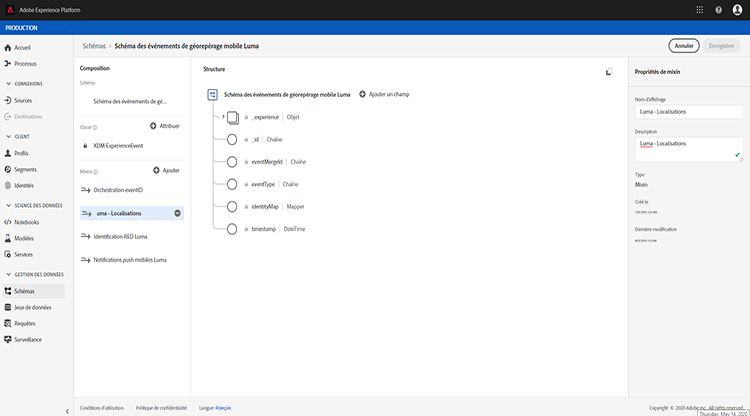

# A propos des Schémas ExperienceEvent pour les Événements d’orchestration du parcours

Les événements d’orchestration du parcours sont des Événements d’expérience XDM qui sont envoyés à la plate-forme Adobe Experience Platform par l’intermédiaire de la gestion en flux continu.

En tant que tel, une condition préalable importante à la configuration de événements pour l’orchestration du voyage est que vous connaissez le modèle de données d’expérience (ou XDM) de la plate-forme et comment composer des schémas de Événement d’expérience XDM, ainsi que comment diffuser des données au format XDM sur la plate-forme.

## Schéma requis pour les Événements d&#39;orchestration de parcours

La première étape de la configuration d&#39;un événement pour l&#39;orchestration de Journey consiste à s&#39;assurer qu&#39;un schéma XDM est défini pour représenter le événement et qu&#39;un jeu de données est créé pour enregistrer les instances du événement sur la plateforme. Avoir un jeu de données pour vos événements n&#39;est pas strictement nécessaire, mais envoyer les événements à un jeu de données spécifique vous permettra de conserver l&#39;historique des événements des utilisateurs pour référence et analyse future, c&#39;est donc toujours une bonne idée. Si vous ne disposez pas déjà d&#39;un schéma et d&#39;un jeu de données appropriés pour votre événement, ces deux tâches peuvent être réalisées dans l&#39;interface Web de la Plateforme.

Tout schéma XDM qui sera utilisé pour les événements d&#39;orchestration de parcours doit répondre aux exigences suivantes :

* Le schéma doit être de la classe XDM ExperienceEvent.

* Le schéma doit inclure le mixin Orchestration eventID. L&#39;orchestration du voyage utilise ce champ pour identifier les événements utilisés dans les voyages.

* Déclarer un champ d&#39;identité pour identifier le sujet du événement. Si aucune identité n&#39;est spécifiée, une carte d&#39;identité peut être utilisée. Ceci n’est pas recommandé.

* Si vous souhaitez que ces données soient disponibles pour la recherche plus tard dans un voyage, marquez le schéma et le jeu de données pour le profil.

* N’hésitez pas à inclure des champs de données pour capturer toutes les autres données contextuelles que vous souhaitez inclure au événement, telles que des informations sur l’utilisateur, le périphérique à partir duquel le événement a été généré, l’emplacement ou toute autre circonstance significative liée au événement.

