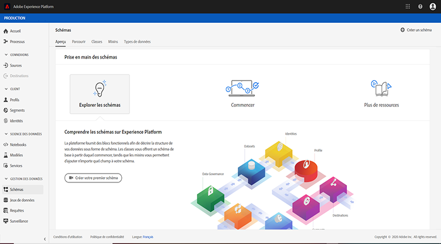
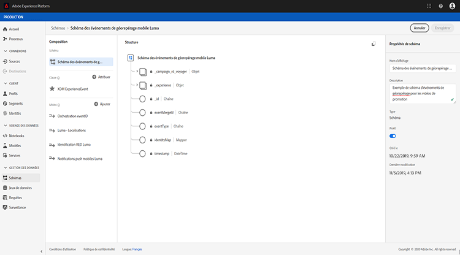
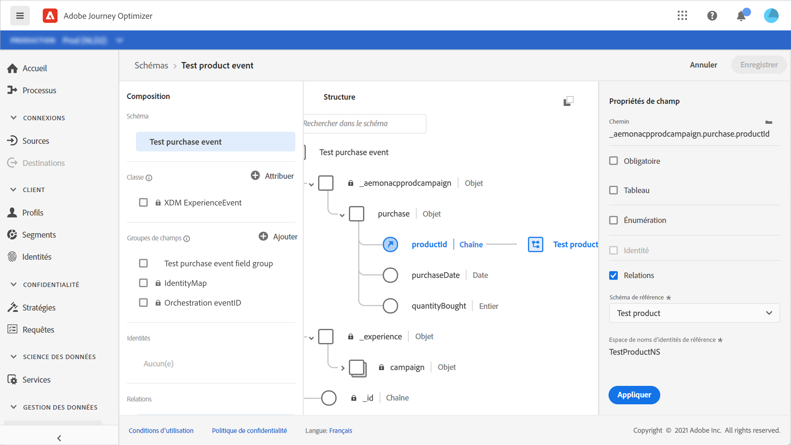

# À propos des schémas ExperienceEvent pour les événements [!DNL Journey Orchestration]

Les événements [!DNL Journey Orchestration] sont des événements d’expérience XDM envoyés à Adobe Experience Platform par l’intermédiaire de l’ingestion en flux continu.

À ce titre, un prérequis important pour la configuration des événements dans [!DNL Journey Orchestration] est de maîtriser le modèle de données d’expérience (ou XDM) d’Adobe Experience Platform et de savoir composer des schémas d’événements d’expérience XDM et diffuser des données au format XDM vers Adobe Experience Platform.

## Schéma requis pour les événements [!DNL Journey Orchestration]

La première étape de la configuration d’un événement pour [!DNL Journey Orchestration] consiste à définir un schéma XDM pour représenter l’événement et à créer un jeu de données pour enregistrer les instances de l’événement dans Adobe Experience Platform. Il n’est pas absolument nécessaire de disposer d’un jeu de données pour vos événements, mais envoyer les événements à un jeu de données spécifique permettra de conserver l’historique des événements des utilisateurs pour une consultation et une analyse ultérieures, ce qui est judicieux. Si vous ne disposez pas déjà d’un schéma et d’un jeu de données appropriés pour votre événement, il est possible de réaliser ces deux tâches dans l’interface web d’Adobe Experience Platform.

Tout schéma XDM utilisé pour les événements [!DNL Journey Orchestration] doit répondre aux exigences suivantes :

* Ce schéma doit être de la classe XDM ExperienceEvent.

  

* Pour les événements générés par le système, le schéma doit inclure le mixin eventID Orchestration. [!DNL Journey Orchestration] emploie ce champ pour identifier les événements utilisés dans les parcours.

  

* Vous devez déclarer un champ d’identité pour identifier le thème de l’événement. Si aucune identité n’est spécifiée, un mappage d’identités peut être utilisé. Cela n’est pas recommandé.

  

* Pour que ces données soient disponibles pour une recherche ultérieure dans un parcours, marquez le schéma et le jeu de données du profil.

  

  

* N’hésitez pas à inclure des champs de données pour capturer toutes les autres données contextuelles à inclure à l’événement, telles que des informations sur la personne, l’appareil à partir duquel l’événement a été généré, l’emplacement ou toute autre circonstance significative liée à l’événement.

  

  

## Utilisation des relations de schéma{#leverage_schema_relationships}

Adobe Experience Platform vous permet de définir des relations entre les schémas afin d&#39;utiliser un jeu de données comme table de choix pour un autre.

Supposons que votre modèle de données de marque dispose d&#39;un schéma qui capture les achats. Vous possédez également un schéma pour le catalogue de produits. Vous pouvez capturer l&#39;identifiant de produit dans le schéma d&#39;achat et utiliser une relation pour rechercher des détails de produit plus complets dans le catalogue de produits. Vous pouvez ainsi créer un segment pour tous les clients qui ont acheté un ordinateur portable, par exemple, sans avoir à répertorier explicitement tous les identifiants d&#39;ordinateur portable ou à capturer tous les détails de produit dans les systèmes transactionnels.

Pour définir une relation, vous devez disposer d&#39;un champ dédié dans le schéma source, dans ce cas le champ d&#39;identifiant de produit dans le schéma d&#39;achat. Ce champ doit référencer le champ Identifiant du produit dans le schéma de destination. Les tables source et de destination doivent être activées pour les profils et le champ commun du schéma de destination doit être défini comme identité principale.

Voici le schéma de catalogue de produits activé pour le profil avec l&#39;identifiant de produit défini comme identité principale.

Voici le schéma d&#39;achat avec la relation définie dans le champ Identifiant du produit.

>[!NOTE]
>
>Pour en savoir plus sur les relations de schéma, consultez la [documentation Experience Platform](https://experienceleague.adobe.com/docs/platform-learn/tutorials/schemas/configure-relationships-between-schemas.html?lang=fr).

Dans Journey Orchestration, vous pouvez ensuite exploiter tous les champs des tables liées :

* lors de la configuration d&#39;un événement unitaire, [En savoir plus](../event/experience-event-schema.md#unitary_event_configuration)
* lors de l&#39;utilisation de conditions dans un parcours, [En savoir plus](../event/experience-event-schema.md#journey_conditions_using_event_context)
* dans la personnalisation d&#39;action personnalisée, [En savoir plus](../event/experience-event-schema.md#custom_action_personalization_with_journey_event_context)

### Configuration d&#39;événements unitaires{#unitary_event_configuration}

Les champs de schéma liés sont disponibles dans la configuration d&#39;événements unitaires :

* lorsque vous parcourez les champs de schéma d&#39;événement dans l&#39;écran de configuration des événements ;
* lors de la définition d&#39;une condition pour les événements générés par le système.

Les champs liés ne sont pas disponibles :

* dans la formule de clé d&#39;événement ;
* dans la condition d&#39;identifiant d&#39;événement (événements basés sur des règles).

Pour savoir comment configurer un événement unitaire, consultez cette [page](../event/about-creating.md).

### Conditions de parcours utilisant le contexte d&#39;événement{#journey_conditions_using_event_context}

Vous pouvez utiliser les données d&#39;une table de choix liée à un événement utilisé dans un parcours pour la création de conditions (éditeur d&#39;expression).

Ajoutez une condition dans un parcours, modifiez l&#39;expression et développez le nœud d&#39;événement dans l&#39;éditeur d&#39;expression.

Pour savoir comment définir des conditions de parcours, consultez cette [page](../building-journeys/condition-activity.md).

### Personnalisation des actions avec le contexte d&#39;événement de parcours{#custom_action_personalization_with_journey_event_context}

Les champs liés sont disponibles lors de la configuration des paramètres d&#39;action d&#39;une activité d&#39;action de parcours.

Pour savoir comment utiliser des actions personnalisées, consultez cette [page](../building-journeys/using-custom-actions.md).

