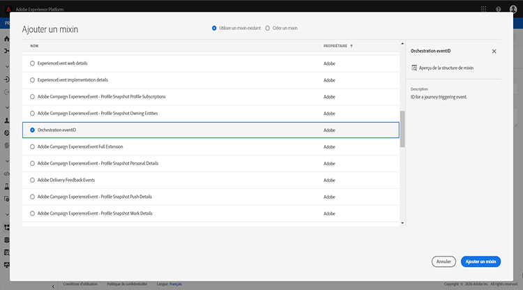
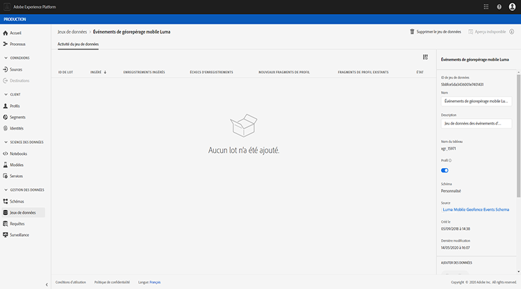
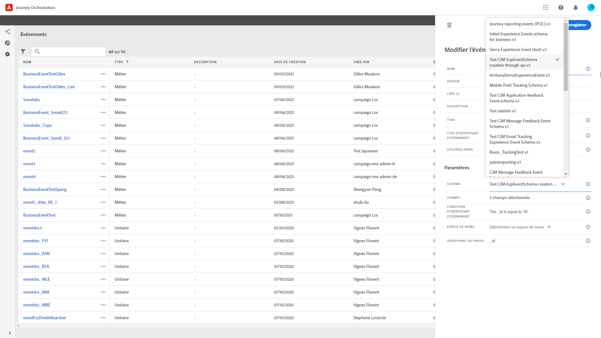

# À propos des schémas ExperienceEvent pour les événements [!DNL Journey Orchestration]

Les événements [!DNL Journey Orchestration] sont des événements d’expérience XDM envoyés à Adobe Experience Platform par l’intermédiaire de l’ingestion en flux continu.

À ce titre, un prérequis important pour la configuration des événements dans [!DNL Journey Orchestration] est de maîtriser le modèle de données d’expérience (ou XDM) d’Adobe Experience Platform et de savoir composer des schémas d’événements d’expérience XDM et diffuser des données au format XDM vers Adobe Experience Platform.

## Schéma requis pour les événements [!DNL Journey Orchestration]

La première étape de la configuration d’un événement pour [!DNL Journey Orchestration] consiste à définir un schéma XDM pour représenter l’événement et à créer un jeu de données pour enregistrer les instances de l’événement dans Adobe Experience Platform. Il n’est pas absolument nécessaire de disposer d’un jeu de données pour vos événements, mais envoyer les événements à un jeu de données spécifique permettra de conserver l’historique des événements des utilisateurs pour une consultation et une analyse ultérieures, ce qui est judicieux. Si vous ne disposez pas déjà d’un schéma et d’un jeu de données appropriés pour votre événement, il est possible de réaliser ces deux tâches dans l’interface web d’Adobe Experience Platform.

Un schéma XDM destiné aux événements [!DNL Journey Orchestration] doit répondre aux exigences suivantes :

* Le schéma doit appartenir à la classe XDM ExperienceEvent.

   

* Pour les événements générés par le système, le schéma doit inclure le mixin eventID Orchestration. [!DNL Journey Orchestration] emploie ce champ pour identifier les événements utilisés dans les parcours.

   

* Vous devez déclarer un champ d’identité pour identifier le sujet de l’événement. Si aucune identité n’est spécifiée, un mapping d’identité peut être utilisée. Cette solution n’est pas recommandée.

   

* Si vous souhaitez que ces données soient disponibles pour une recherche ultérieure dans un parcours, marquez le schéma et le jeu de données pour le profil.

   

   

* N’hésitez pas à inclure des champs de données pour recueillir toutes les autres données contextuelles que vous souhaitez incorporer à l’événement, telles que des informations relatives à l’utilisateur, l’appareil à partir duquel l’événement a été généré, l’emplacement ou toute autre circonstance significative liée à l’événement.

   

   