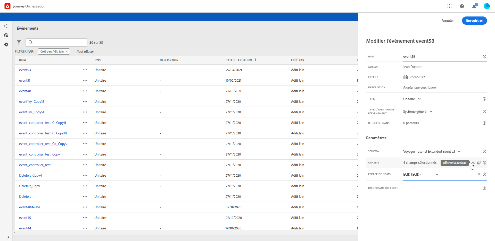
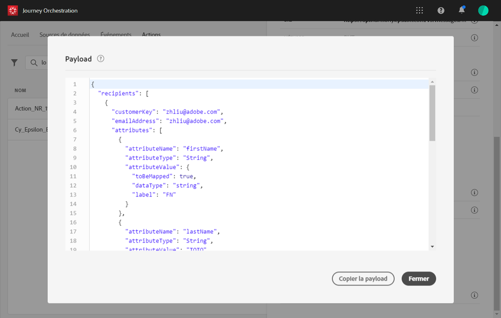

# Aperçu de la payload {#concept_jgf_4yk_4fb}

Cet aperçu vous permet de valider la définition de la payload.

>[!NOTE]
>
>Lorsque vous créez un événement, enregistrez-le et rouvrez-le avant d’afficher l’aperçu de la payload. Cette étape est nécessaire pour générer un identifiant d’événement dans la payload.

1. Cliquez sur l’icône **[!UICONTROL Afficher la payload]** pour prévisualiser la payload attendue par le système.

   

   Vous remarquerez que les champs sélectionnés sont affichés.

   

1. Vérifiez l’aperçu pour valider la définition de la payload.

1. Vous pouvez ensuite partager l’aperçu de la payload avec la personne responsable de l’envoi de l’événement. Cette payload peut l’aider à concevoir la configuration d’un envoi d’événement vers [!DNL Journey Orchestration]. Voir .
