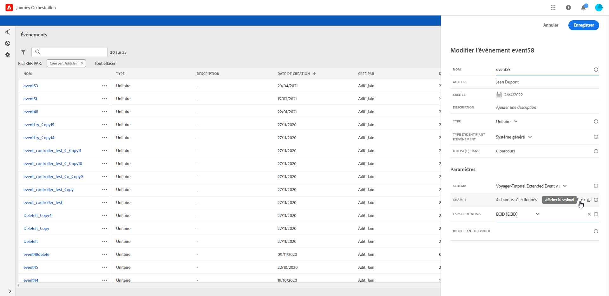
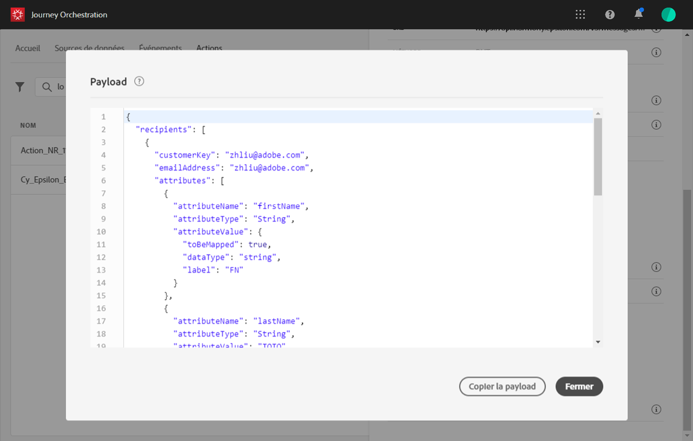

# Prévisualisation du payload {#concept_jgf_4yk_4fb}

>[!CAUTION]
>
>**Vous recherchez Adobe Journey Optimizer** ? Cliquez [ici](https://experienceleague.adobe.com/fr/docs/journey-optimizer/using/ajo-home){target="_blank"} pour consulter la documentation de Journey Optimizer.
>
>
>_Cette documentation se rapporte aux anciens contenus de Journey Orchestration qui ont été remplacés par Journey Optimizer. Pour toute question concernant votre accès à Journey Orchestration ou Journey Optimizer, contactez votre équipe en charge des comptes._

Cet aperçu vous permet de valider la définition de la payload.

>[!NOTE]
>
>Pour les événements générés par le système, lorsque vous créez un événement, enregistrez-le et rouvrez-le avant d&#39;afficher la prévisualisation de la payload. Cette étape est nécessaire pour générer un identifiant d&#39;événement dans la payload.

1. Cliquez sur l&#39;icône **[!UICONTROL Afficher la payload]** pour prévisualiser la payload attendue par le système.

   

   Vous remarquerez que les champs sélectionnés sont affichés.

   

1. Vérifiez l&#39;aperçu pour valider la définition de la payload.

1. Vous pouvez ensuite partager l&#39;aperçu de la payload avec la personne responsable de l&#39;envoi de l&#39;événement. Cette payload peut l’aider à concevoir la configuration d’un envoi d’événement vers [!DNL Journey Orchestration]. Consultez [cette page](../event/additional-steps-to-send-events-to-journey-orchestration.md).
