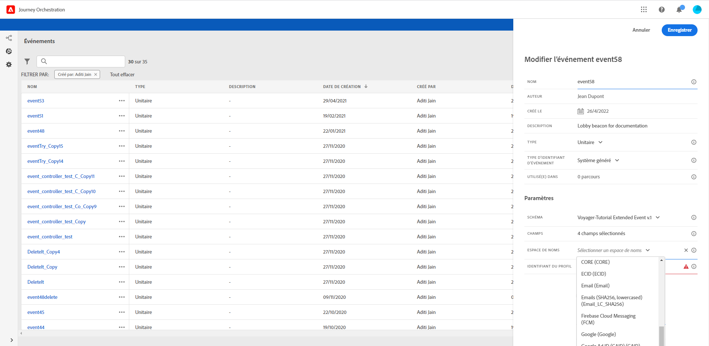

# Sélection du namespace {#concept_ckb_3qt_52b}

Un namespace vous permet de définir le type de clé utilisé pour identifier la personne associée à l’événement. Sa configuration est facultative. Elle est obligatoire si vous souhaitez récupérer, dans vos parcours, des informations supplémentaires provenant de [profil client en temps réel](https://www.adobe.io/apis/cloudplatform/dataservices/profile-identity-segmentation/profile-identity-segmentation-services.html#!api-specification/markdown/narrative/technical_overview/unified_profile_architectural_overview/unified_profile_architectural_overview.md). Il n’est pas nécessaire de définir le namespace si vous utilisez uniquement des données provenant d’un système tiers via une source de données personnalisée.

Vous pouvez utiliser l’un des namespaces prédéfinis ou en créer un à l’aide du service Identity Namespace. À ce propos, consultez cette [page](https://www.adobe.io/apis/cloudplatform/dataservices/profile-identity-segmentation/profile-identity-segmentation-services.html#!api-specification/markdown/narrative/technical_overview/identity_namespace_overview/identity_namespace_overview.md).

Si vous sélectionnez un schéma doté d’une identité principale, les champs **[!UICONTROL Clé]** et **[!UICONTROL Namespace]** sont déjà renseignés. Si aucune identité n’est définie, _identityMap > id_ est sélectionné comme clé principale. Vous devez ensuite sélectionner un namespace et la clé sera préremplie (sous le champ **[!UICONTROL Namespace]**) à l’aide de _identityMap > id_.

Lors de la sélection de champs, les champs d’identité principale sont balisés.

Sélectionnez un namespace dans la liste déroulante.

Un seul namespace est autorisé par parcours. Si vous utilisez plusieurs événements dans le même parcours, tous doivent utiliser le même namespace. Voir .
