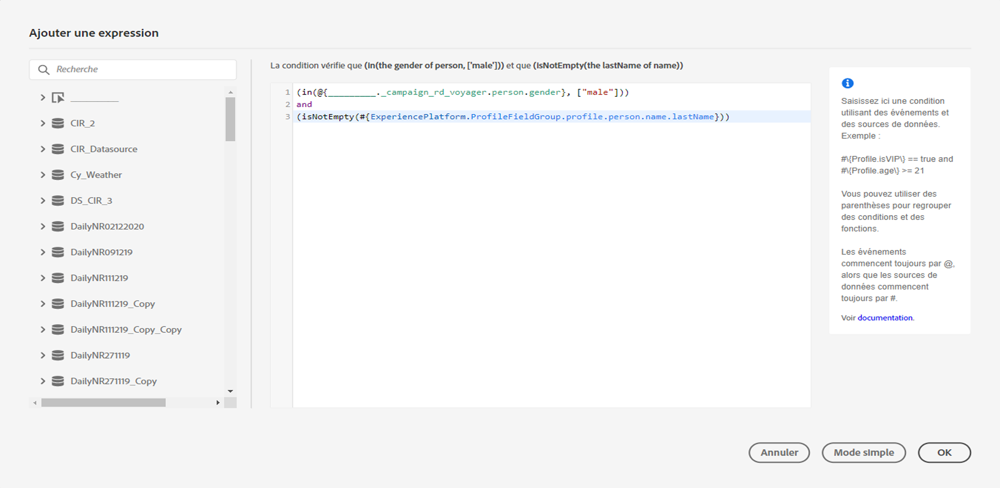
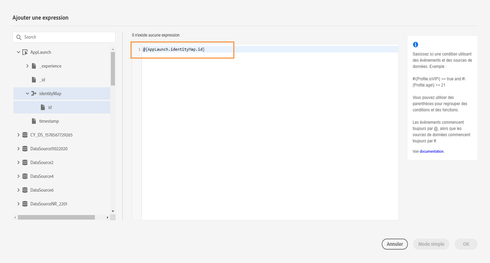

# À propos de l’éditeur d’expression avancé {#concept_uyj_trt_52b}

L’éditeur d’expression avancé permet de créer des expressions avancées dans différents écrans de l’interface, par exemple pour définir une condition de source de données.
Il est également à votre disposition si vous avez besoin de définir des paramètres d’action qui nécessitent de manipuler des données spécifiques. Vous pouvez exploiter les données issues d’événements ou d’informations supplémentaires extraites de la source de données. Dans un parcours, la liste des champs d’événement affichée est contextuelle et varie selon les événements ajoutés.

L’éditeur d’expression avancé propose un ensemble de fonctions et d’opérateurs intégrés destinées à manipuler des valeurs et à définir une expression spécifiquement adaptée à vos besoins. L’éditeur permet également de définir les valeurs du paramètre de source de données externe, de gérer les champs de mapping et les collections, notamment les événements d’expérience.

_Interface de l’éditeur d’expression avancé_

Vous pouvez utiliser l’éditeur d’expression avancé pour les opérations suivantes :

* créer des [conditions avancées](../building-journeys/condition-activity.md#about_condition) sur les sources de données et les informations relatives aux événements ;
* définir des activités [d’attente personnalisées](../building-journeys/wait-activity.md#custom) ;
* définir le mappage des paramètres d’action.

Lorsque cela est possible, vous pouvez basculer entre les deux modes à l’aide du bouton **** Mode avancé / Mode simple ****. Le mode simple est présenté [ici](../building-journeys/condition-activity.md#about_condition).

>[!NOTE]
>
>Vous pouvez définir des conditions dans l’éditeur d’expression simple ou avancé. Ces conditions renvoient toujours une valeur de type booléen.
>
>Vous pouvez définir des paramètres d’action en sélectionnant des champs ou à l’aide de l’éditeur d’expression avancé. Ces paramètres renvoient un type de données spécifique en fonction de leur expression.

## Accès à l’éditeur d’expression avancé {#section_fdz_4nj_cjb}

Il est possible d’accéder de différentes manières à l’éditeur d’expression avancé :

* Lorsque vous créez une condition de source de données, vous pouvez y accéder en cliquant sur **[!UICONTROL Mode avancé]**.

   

* Lorsque vous créez un retardateur personnalisé, l’éditeur avancé s’affiche directement.
* Lorsque vous mappez le paramètre d’action, cliquez sur le **[!UICONTROL Mode avancé]**.

## Découverte de l’interface{#section_otq_tnj_cjb}

Cet écran vous permet d’entrer manuellement votre expression.

La partie gauche de l’écran contient les champs et les fonctions disponibles :

* **[!UICONTROL Événements]** : sélectionnez l’un des champs reçus de l’événement entrant. La liste des champs d’événement affichée est contextuelle et varie selon les événements ajoutés. [En savoir plus](../event/about-events.md)
* **[!UICONTROL Segments]** : si vous avez supprimé un événement de  **[!UICONTROL qualification de]** segment, choisissez le segment à utiliser dans votre expression. [En savoir plus](../segment/using-a-segment.md)
* **[!UICONTROL Sources de données]** : effectuez votre choix parmi la liste des champs disponibles des groupes de champs de vos sources de données. [En savoir plus](../datasource/about-data-sources.md)
* **[!UICONTROL Propriétés]** du parcours : cette section regroupe les domaines techniques liés au parcours pour un profil donné. [En savoir plus](../expression/journey-properties.md)
* **[!UICONTROL Fonctions]** : effectuez votre choix dans la liste des fonctions intégrées permettant d’effectuer un filtrage complexe. Les fonctions sont classées par catégories. [En savoir plus](../expression/functions.md)

Un mécanisme de saisie semi-automatique affiche des suggestions contextuelles.

Un mécanisme de validation de syntaxe vérifie l’intégrité du code. Les erreurs s’affichent dans la partie supérieure de l’éditeur.

**Nécessité de paramètres pour la création de conditions à l’aide de l’éditeur d’expression avancé**

Si vous sélectionnez un champ d’une source de données externe qui nécessite l’appel d’un paramètre (voir [cette page](../datasource/external-data-sources.md). Le paramètre « ville », par exemple, est fréquemment utilisé dans une source de données météorologiques. Vous devez donc sélectionner l’emplacement où vous souhaitez obtenir ce paramètre. Il est également possible d’appliquer des fonctions aux paramètres pour effectuer des modifications de format ou des concaténations.

Dans les cas d’utilisation plus complexes, si vous souhaitez inclure les paramètres de la source de données dans l’expression principale, vous pouvez définir leurs valeurs à l’aide du mot-clé « params ». Voir [cette page](../expression/field-references.md).
