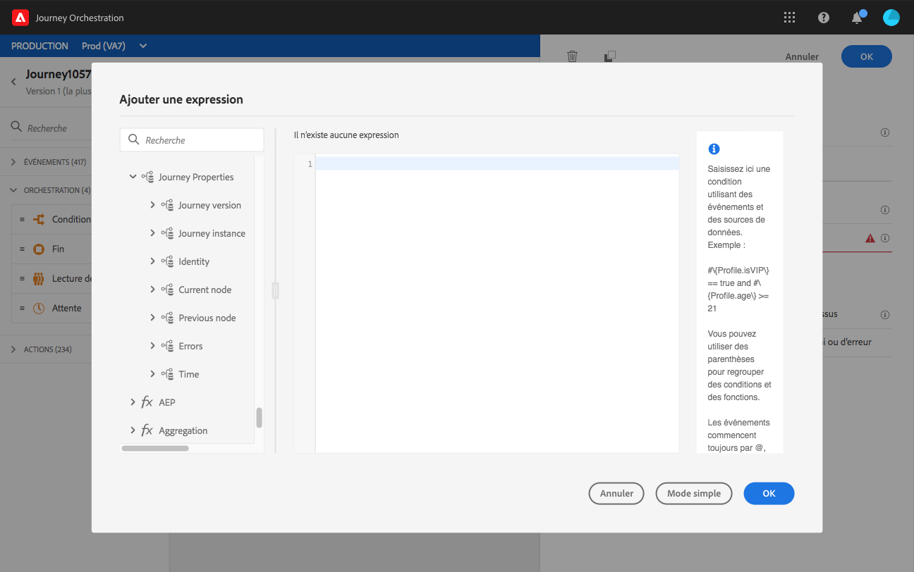

# Attributs de propriétés du parcours {#journey-properties}

Dans l’éditeur d’expression avancé, vous trouverez la catégorie **Propriétés du parcours**, sous les catégories d’événement et de source de données. Cette catégorie contient des champs techniques liés au parcours d’un profil donné. Il s’agit des informations récupérées par le système à partir des parcours actifs, telles que l’identifiant du parcours ou les erreurs spécifiques rencontrées.

>[!NOTE]
>
>Les attributs de propriétés du parcours sont également disponibles dans l’éditeur d’expression simple. Consultez cette [section](../building-journeys/condition-activity.md#about_condition)

Vous trouverez, par exemple, des informations sur :

* version du parcours : uid du parcours, uid de la version du parcours, uid de l’instance, etc.
* erreurs : extraction de données, exécution d’actions, etc.
* étape en cours, dernière étape en cours, etc.
* profils ignorés

Vous pouvez utiliser ces champs pour créer des expressions. Pendant l’exécution du parcours, les valeurs seront récupérées directement à partir de celui-ci.

Voici quelques exemples d’utilisation :

* **Enregistrer les profils ignorés** : vous pouvez envoyer tous les profils exclus d’un message par une règle de limitation à un système tiers à des fins de journalisation. Pour ce faire, vous configurez un chemin en cas de temporisation et d’erreur et ajoutez une condition pour filtrer selon un type d’erreur spécifique, par exemple : « Ignorer les gens par règle de limitation ». Vous pouvez ensuite envoyer les profils ignorés à un système tiers par le biais d’une action personnalisée.

* **Envoyer des alertes en cas d’erreurs** : vous pouvez envoyer une notification à un système tiers chaque fois qu’une erreur se produit sur un message. Pour ce faire, vous configurez un chemin en cas d’erreur, ajoutez une condition et une action personnalisée. Vous pouvez envoyer une notification sur un canal Slack, par exemple, avec la description de l’erreur rencontrée.

* **Affiner les erreurs du reporting** : au lieu d’avoir un seul chemin pour les messages d’erreur, vous pouvez définir une condition par type d’erreur. Vous pourrez ainsi affiner le reporting et consulter toutes les données de types d’erreur.

## Liste de champs {#journey-properties-fields}

| Catégorie | Nom du champ | Libellé | Description |
|---|---|---|------------|
| Version de parcours | journeyUID | Identifiant de parcours |  |
|  | journeyVersionUID | Identifiant de version du parcours |  |
|  | journeyVersionName | Nom de la version du parcours |  |
|  | journeyVersionDescription | Description de la version du parcours |  |
|  | journeyVersion | Version de parcours |  |
| Instance de parcours | instanceUID | Identifiant d’instance de parcours | Identifiant de l’instance |
|  | externalKey | Clé externe | Identifiant individuel déclenchant le parcours |
|  | organizationId | Identifiant de l’organisation | Organisation de la marque |
|  | sandboxName | Nom de l’environnement de test | Nom de l’environnement de test |
| Identité | profileId | Identifiant d’identité du profil | Identifiant du profil dans le parcours |
|  | espace de noms | Espace de noms d’identité de profil | Espace de noms du profil dans le parcours (exemple : ECID) |
| Nœud actuel | currentNodeId | Identifiant de nœud actuel | Identifiant de l’activité actuelle (nœud) |
|  | currentNodeName | Nom du nœud actuel | Nom de l’activité actuelle (nœud) |
| Nœud précédent | previousNodeId | Identifiant de nœud précédent | Identifiant de l’activité précédente (nœud) |
|  | previousNodeName | Nom du nœud précédent | Nom de l’activité précédente (nœud) |
| Erreurs | lastNodeUIDInError | Dernier identifiant de nœud en erreur | Identifiant de la dernière activité (nœud) en erreur |
|  | lastNodeNameInError | Nom du dernier nœud en erreur | Nom de la dernière activité (nœud) en erreur |
|  | lastNodeTypeInError | Dernier type de nœud en erreur | Type d’erreur de la dernière activité (nœud) en erreur. Types possibles :<ul><li>Événements : Événements, Réactions, QS (exemple : qualification de segment)</li><li>Contrôle de flux : Fin, Condition, Attente</li><li>Actions : Actions ACS, Saut, Action personnalisée</li></ul> |
|  | lastErrorCode | Dernier code d’erreur | Code d’erreur de la dernière activité (nœud) en erreur. Erreurs possibles : <ul><li>Codes d’erreur HTTP</li><li>limité</li><li>timedOut</li><li>erreur (exemple : par défaut en cas d’erreur inattendue. Ne devrait pas/extrêmement rarement se produire)</li></ul> |
|  | lastExecutedActionErrorCode | Code d’erreur de la dernière action exécutée | Code d’erreur de la dernière action en erreur |
|  | lastDataFetchErrorCode | Code d’erreur de la dernière récupération de données | Code d’erreur de la dernière récupération de données à partir des sources de données |
| Heure | lastActionExecutionElapsedTime | Temps écoulé avant l’exécution de la dernière action | Temps passé à exécuter la dernière action |
|  | lastDataFetchElapsedTime | Temps écoulé avant la dernière récupération des données | Temps passé à exécuter la dernière récupération de données à partir de sources de données |
