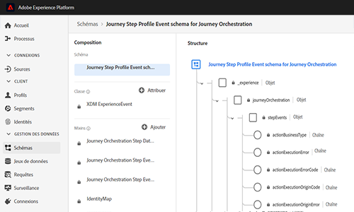

# Notes de mise à jour {#release-notes}

Cette page répertorie toutes les nouvelles fonctionnalités et améliorations de Journey Orchestration.
Vous pouvez également consulter les [mises à jour de la documentation](../release-notes/documentation-updates.md).

## Version du 2e trimestre - juin 2020 {#q2-release---june-2020}

<table>
<thead>
<tr>
<th><strong>Améliorations de l’intégration de la plateforme d’expérience Adobe</strong> </th>
</tr>
</thead>
<tbody>
<tr>
<td>

Les améliorations suivantes ont été apportées à l’intégration de la plate-forme :

<ul>
<li>
Une nouvelle activité permet d'écouter les entrées/sorties des segments de plateforme pour faire entrer ou avancer les personnes dans un voyage. <a href="../building-journeys/event-activities.md#segment-qualification">En savoir plus</a>

</li>
<li>
Les segments de plateforme peuvent désormais être créés et modifiés sans quitter l’interface d’orchestration du voyage, grâce à un nouvel onglet <strong>Segments</strong> . Disponibilité efficace : 15 juin 2020. <a href="../segment/about-segments.md">En savoir plus</a>

</li>
<li>
Dans l’éditeur d’expressions simple, les segments de plateforme sont désormais directement répertoriés dans l’arborescence de navigation afin de faciliter la configuration de conditions telles que "cette personne appartient-elle au segment A ?". <a href="../segment/using-a-segment.md">En savoir plus</a>

</li>
<li>
L'orchestration du voyage transmet désormais automatiquement, à la plateforme de données Adobe, les étapes suivies par les individus dans les voyages. Cela inclut les erreurs potentielles survenues. Ces informations peuvent être utilisées à des fins d’analyse ou de segmentation. <a href="../building-journeys/sharing-overview.md">En savoir plus</a>

</li>
<li>
L'orchestration du voyage peut maintenant être connectée à la plateforme de production et non-production Sandbox. Disponibilité efficace : 15 juin 2020. <a href="../about/access-management.md#sandboxes">En savoir plus</a>

</li>
</td>
</tr>
</tbody>
</table>

<table>
<thead>
<tr>
<th><strong>Améliorations des modes de conception et de test de parcours</strong> </th>
</tr>
</thead>
<tbody>
<tr>
<td>

Les améliorations suivantes ont été apportées au concepteur de voyage et au mode test :

<ul>
<li>
Vous pouvez désormais copier les activités collées d'un voyage vers un autre, en sélectionnant 1 ou N activités de voyage. <a href="../building-journeys/using-the-journey-designer.md#copy-paste">En savoir plus</a>

</li>
<li>
Après avoir tiré un événement pour faire un profil d'essai entrer dans un voyage, vous pouvez maintenant voir sa progression le long du parcours grâce à un flux visuel coloré. En cas d'erreur dans le parcours, les détails des erreurs s'affichent également. <a href="../building-journeys/testing-the-journey.md#firing_events">En savoir plus</a>

</li>
<li>L'état du voyage <strong>Terminé</strong> a été renommé <strong>Fermé (pas d'entrée)</strong> pour mieux refléter ce que cet état signifie.</li>
</ul>
</td>
</tr>
</tbody>
</table>

**Autres améliorations**

Pour éviter d&#39;envoyer trop d&#39;appels d&#39;API à des systèmes tiers, nous introduisons une nouvelle API publique pour configurer des règles de &quot;plafonnement&quot;. Les règles de plafonnement permettent de définir un nombre maximal d’appels à un point de terminaison API par millisecondes. [En savoir plus](../api/capping.md)

Le Contrôle d&#39;accès permet désormais une plus grande granularité dans la gestion de l’accès des utilisateurs. Disponibilité efficace : 15 juin 2020. [En savoir plus](../about/access-management.md#create-product-profile)

L&#39;orchestration du trajet est désormais disponible en APAC (centre de données australien). Disponibilité efficace : 15 juin 2020

L&#39;interface Orchestration du voyage est disponible en japonais.

## Version du 1er trimestre - Mars 2020 {#q1-release---march-2020}

**Nouveautés**

<table>
<thead>
<tr>
<th><strong>Améliorations du mode test</strong> </th>
</tr>
</thead>
<tbody>
<tr>
<td>

Les améliorations suivantes ont été apportées au mode test :

<ul>
<li>Lorsqu’un parcours utilise plusieurs événements, vous pouvez maintenant les déclencher séparément depuis une liste déroulante dans l’écran <strong>Configuration d'événement</strong> du mode test. <a href="../building-journeys/testing-the-journey.md#firing_events">En savoir plus</a>
</li>
<li>
Lorsqu’une ou plusieurs activités d’<strong>attente</strong> sont utilisées dans un parcours, vous pouvez maintenant définir la durée de chacune d’entre elles en mode test. La durée par défaut est de 10 secondes. Vous pouvez la modifier à l’aide du paramètre <strong>Temps d’attente en test</strong>, dans le coin inférieur gauche. <a href="../building-journeys/testing-the-journey.md">En savoir plus</a>

</li>
<li>En cas d’erreur lors de l’appel d’un système tiers (source de données ou action), le code d’erreur et la réponse d’erreur s’affichent maintenant dans les <strong>journaux de test</strong>. <a href="../building-journeys/testing-the-journey.md#viewing_logs">En savoir plus</a>
</li>
</ul>
</td>
</tr>
</tbody>
</table>

<table>
<thead>
<tr>
<th><strong>Gestion centralisée des fuseaux horaires</strong> </th>
</tr>
</thead>
<tbody>
<tr> 
<td>

La gestion des fuseaux horaires est maintenant centralisée dans le panneau des propriétés du parcours. Deux paramètres ont été ajoutés aux propriétés du parcours :

<ul>
<li>La liste déroulante <strong>Fuseau horaire</strong> vous permet de sélectionner un fuseau horaire spécifique. Par défaut, le fuseau horaire du navigateur est utilisé. </li>
<li>La case à cocher <strong>Fuseau horaire du profil</strong> vous permet d’utiliser le fuseau horaire du profil Experience Platform de la personne qui entre dans le parcours, le cas échéant. Si ce fuseau horaire n’est pas disponible, le fuseau horaire défini dans la liste déroulante est utilisé. Cette fonctionnalité n’est pas compatible avec les parcours utilisant des événements qui n’ont pas de namespace.</li>
</ul>

Pour plus d’informations, reportez-vous aux sections <a href="../building-journeys/changing-properties.md#timezone">Modification des propriétés</a> et <a href="../building-journeys/timezone-management.md">Gestion des fuseaux horaires</a>.

</td>
</tr>
</tbody>
</table>

<table>
<thead>
<tr>
<th><strong>Améliorations du concepteur de parcours</strong> </th>
</tr>
</thead>
<tbody>
<tr> 
<td>

La <strong>palette</strong> des parcours, dans la partie gauche du concepteur de parcours, a été améliorée :

<ul>
<li>Une nouvelle icône, en regard de la barre <strong>Recherche</strong>, permet de masquer ou d’afficher les éléments indisponibles dans la palette, par exemple les événements qui utilisent un namespace différent de ceux utilisés dans votre parcours. Par défaut, les éléments non disponibles sont masqués.</li>
<li>Lors de l’utilisation du champ <strong>Recherche</strong>, le nombre de résultats s’affiche maintenant pour chaque catégorie d’activité de la zone de travail.</li>
<li>La navigation entre les différentes catégories d’activité a été améliorée.</li>
</ul>

Dans le concepteur de parcours, vous pouvez maintenant vérifier que vous accédez à la dernière version d’un parcours. Cette information s’affiche en regard du numéro de version.

Dans la <strong>zone de travail</strong> des parcours, un message d’avertissement s’affiche maintenant lorsque deux activités sont déconnectées.

Pour plus d'informations, consultez la <a href="../building-journeys/using-the-journey-designer.md">documentation détaillée</a>.

</td>
</tr>
</tbody>
</table>

<table>
<thead>
<tr>
<th><strong>Aide contextuelle</strong> </th>
</tr>
</thead>
<tbody>
<tr>
<td>

Une aide contextuelle est maintenant disponible dans les différents écrans des listes Journey Orchestration (parcours, événements, actions et sources de données). Vous pouvez ainsi afficher une description rapide de la fonctionnalité actuelle et accéder aux articles et vidéos connexes.

Pour afficher l’aide contextuelle, cliquez sur l’icône  dans le coin supérieur droit de l’écran. 

</td>
</tr>
</tbody>
</table>

**Autres améliorations**

* Outre les États-Unis, Journey Orchestration est maintenant disponible dans les pays de la zone **EMEA**. L’application et la documentation sont disponibles en français et en allemand.

* Le portail Experience League est maintenant intégré dans le produit. Cette intégration simplifie l’accès au contenu associé et vous permet de tirer le meilleur parti d’Experience Cloud. Vous pouvez accéder directement à la documentation de Journey Orchestration en bas de l’onglet Aide. En outre, cliquez sur Aide > Commentaires pour signaler des problèmes ou partager vos idées avec Adobe.

* Le raccourci clavier **C**, qui vous permet de créer un élément, est maintenant disponible dans tous les écrans de liste : parcours, sources de données, actions et événements. [En savoir plus](../about/user-interface.md#section_ksq_zr1_ffb)

* Vous pouvez maintenant **supprimer** les parcours arrêtés. Les rapports associés à ces parcours supprimés ne seront pas disponibles.

* Lorsque vous parcourez les **champs Data Platform** (format XDM), le nom d’affichage s’affiche en plus du nom du champ. Ces informations sont récupérées de la définition du schéma dans le modèle de données d’expérience. Lorsqu’il est disponible, l’autre nom d’affichage s’affiche. Cette description conviviale, particulièrement utile dans le cas des champs eVar, vous permet d’identifier vos champs plus facilement. [En savoir plus](../about/user-interface.md#friendly-names-display)

## Version GA - Décembre 2019 {#ga-release---december-2019}

Journey Orchestration est maintenant disponible en version GA (disponibilité générale).

Créez des cas d’utilisation d’orchestration en temps réel à l’aide de données contextuelles stockées dans des événements ou des sources de données.

Journey Orchestration permet une orchestration en temps réel et s’appuie sur les données contextuelles issues d’événements, les informations provenant d’Adobe Experience Platform ou les données issues de services d’API tiers. L’application détermine, dans les flux à plusieurs étapes appelés parcours, les meilleures actions spécifiques au consommateur, en fonction de son profil et de ses comportements. Elles consistent à conjuguer une synchronisation optimale et un type d’action, comme l’envoi d’une notification push au consommateur à l’aide des fonctionnalités de messages transactionnels d’Adobe Campaign Standard (nécessite Adobe Campaign Standard), ou d’une notification d’un système tiers. Ces décisions sont prises en fonction de scores Sensei et de règles.

[En savoir plus](../action/working-with-adobe-campaign.md) sur Journey Orchestration.

Ressources supplémentaires :

* [Tutoriels](https://docs.adobe.com/content/help/en/platform-learn/tutorials/journey-orchestration/introduction.html)
* [Communauté](https://www.adobe.com/go/journeyorchestrationcommunity_fr)
