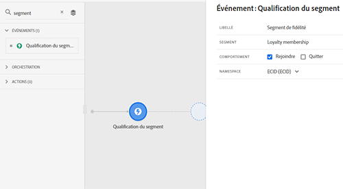
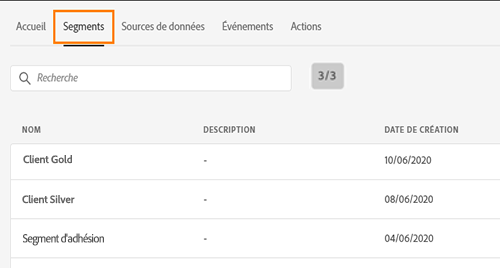
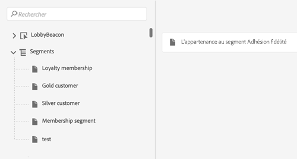
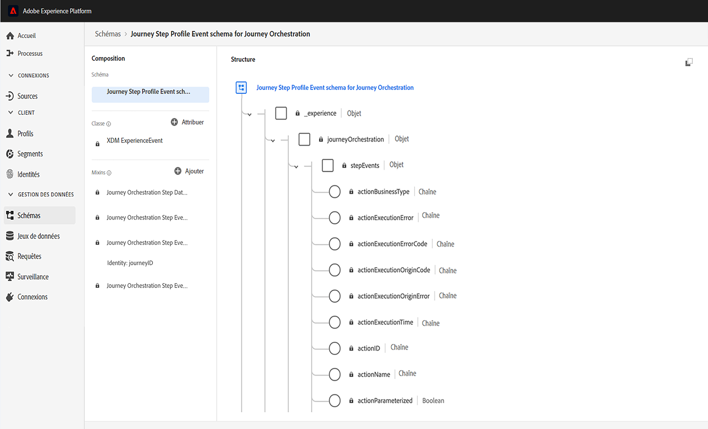
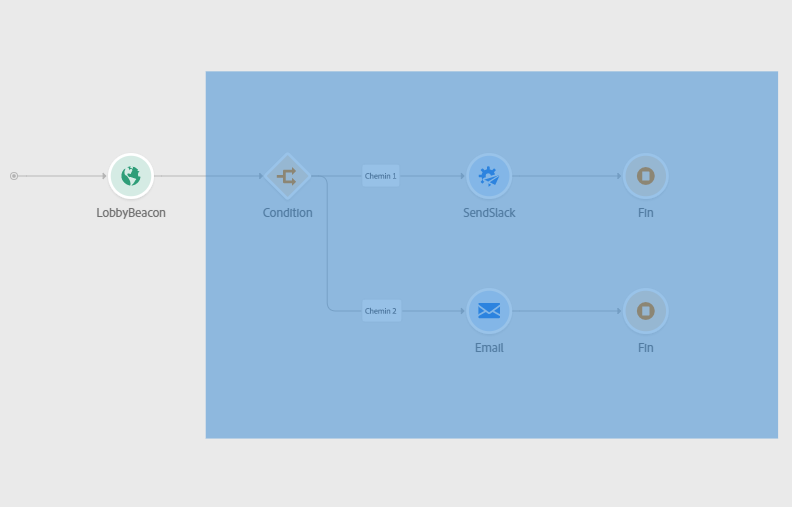
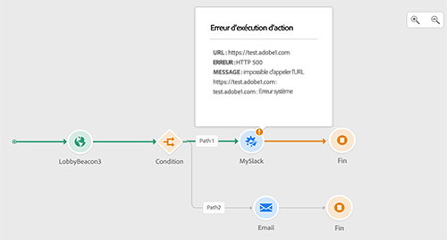
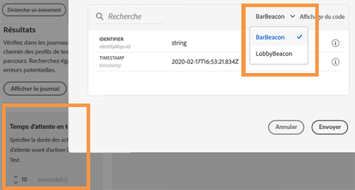
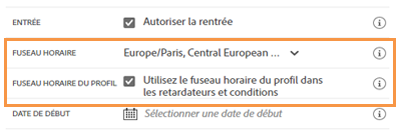
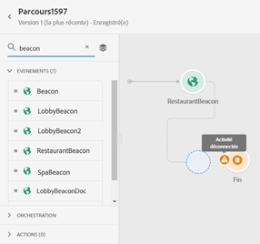
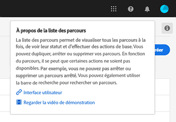

# Notes de mise à jour {#release-notes}

Cette page répertorie toutes les nouvelles fonctionnalités et améliorations de Journey Orchestration.
Vous pouvez également consulter les dernières [mises à jour de la documentation](../release-notes/documentation-updates.md).

## Version de janvier 2021 {#january-release}

Lors de la sélection d’un schéma dans la configuration de l’événement, seuls les champs obligatoires pour que l’événement soit correctement reçu par Journey Orchestration sont sélectionnés. [En savoir plus](../event/defining-the-payload-fields.md)

Les attributs de propriétés du parcours sont désormais disponibles dans l’éditeur d’expression simple. [En savoir plus](../expression/journey-properties.md)

Deux nouveaux attributs de propriétés du parcours ont été ajoutés (sandboxName et organizationId). [En savoir plus](../expression/journey-properties.md)

Pour s’aligner sur les contrats de niveau de service Adobe Campaign Standard, une règle de limitation de 13 appels par seconde est désormais automatiquement définie pour les actions Adobe Campaign Standard dès que l’intégration Adobe Campaign Standard est configurée. [En savoir plus](../action/working-with-adobe-campaign.md)

La durée du délai d’expiration d’un événement est désormais spécifiée plus clairement sur le chemin du délai d’expiration. [En savoir plus](../building-journeys/event-activities.md#listening-to-events-during-a-specific-time)

Les fonctions [getListItem](../functions/functiongetlistitem.md) et [split](../functions/functionsplit.md) ont été ajoutées à la liste des fonctions disponibles dans l’éditeur d’expression avancé. Cet ajout apporte davantage de possibilités de cas d’utilisation pour les calculs sur les chaînes.

## Version de novembre 2020 {#november-release}

<table>
<thead>
<tr>
<th><strong>Passage d’un parcours à un autre</strong> </th>
</tr>
</thead>
<tbody>
<tr>
<td>

Une nouvelle activité d’action vous permet d’inviter des individus à passer d’un parcours à un autre. L’activité <strong>Saut</strong> vous permet d’effectuer les opérations suivantes :

<ul>
<li>simplifier la conception de parcours très complexes en les divisant en plusieurs autres ; </li>
<li>créer des parcours basés sur des schémas de parcours communs et réutilisables.</li>
</ul>

Pour plus d’informations, consultez la <a href="../building-journeys/jump.md">documentation détaillée</a> et regardez le <a href="https://experienceleague.adobe.com/docs/journey-orchestration-learn/tutorials/building-a-journey/jumping-to-another-journey.html?lang=fr">tutoriel vidéo</a>.

</td>
</tr>
</tbody>
</table>

<table>
<thead>
<tr>
<th><strong>Utilisation des propriétés de parcours dans l’éditeur d’expression</strong> </th>
</tr>
</thead>
<tbody>
<tr>
<td>

Dans l’éditeur d’expression avancé, nous avons ajouté une nouvelle catégorie à la liste des champs et des fonctions. Il s’agit des informations récupérées par le système à partir de parcours actifs, telles que l’identifiant du parcours ou les erreurs spécifiques rencontrées. Vous aurez ainsi plus de possibilités lors de la création de vos parcours. Par exemple, vous pourrez alerter les systèmes tiers en cas d’erreurs rencontrées dans une condition ou une action.

Pour plus d’informations, consultez la <a href="../expression/journey-properties.md">documentation détaillée</a>.

</td>
</tr>
</tbody>
</table>

<table>
<thead>
<tr>
<th><strong>Événements basés sur des règles   (bêta)</strong> </th>
</tr>
</thead>
<tbody>
<tr>
<td>

Une nouvelle méthode est maintenant disponible pour configurer vos événements plus facilement, sans utiliser d’identifiant d’événement eventID : des événements basés sur des règles évaluent si l’événement doit être déclenché selon une condition. Vous pouvez toujours utiliser la méthode existante, maintenant appelée « généré par le système ». Cette fonctionnalité, qui a été testée auprès d’un nombre limité de clients via le programme Alpha, est maintenant disponible en version bêta pour tous les clients.

Pour plus d’informations, reportez-vous à la <a href="../event/about-events.md">documentation détaillée</a>.

</td>
</tr>
</tbody>
</table>

### Autres améliorations 

Des limites ont été ajoutées lors de la création de nouvelles versions d’un parcours. Ces limites évitent des changements trop radicaux dans le parcours pour maintenir une certaine cohérence entre les versions. [En savoir plus](../about/limitations.md#journey-versions-limitations)

L’activité **Qualification de segment** ne peut plus être utilisée dans un parcours qui inclut des activités de messages Campaign Standard. Cette restriction protège l’intégrité des instances Adobe Campaign Standard. En effet, l’utilisation de la qualification de segment peut conduire à des pics quotidiens d’envoi de messages qui surchargent les messages transactionnels de Campaign Standard. [En savoir plus](../about/limitations.md#segment-qualification)

## Version d’octobre 2020{#october-release}

<table>
<thead>
<tr>
<th><strong>Délai d’expiration d’un événement</strong> </th>
</tr>
</thead>
<tbody>
<tr>
<td>

Vous pouvez maintenant configurer un délai d’expiration d’un événement pour que le parcours ne l’écoute que pendant une certaine période. Pour ce faire, vous n’avez plus besoin d’ajouter une activité Attente parallèlement au chemin de l’événement.

Pour plus d’informations, reportez-vous à la <a href="../building-journeys/event-activities.md#listening-to-events-during-a-specific-time">documentation détaillée</a>.

</td>
</tr>
</tbody>
</table>

### Autres améliorations 

* Lorsque vous publiez une nouvelle version d’un parcours, la version précédente se termine automatiquement et passe au statut Fermé. [En savoir plus](../building-journeys/journey-versions.md)

## Version de septembre 2020 {#september-release}

### Mises à jour de la version GA{#september-ga-update}

<table>
<thead>
<tr>
<th><strong>Améliorations de l’activité de condition</strong> </th>
</tr>
</thead>
<tbody>
<tr>
<td>

Lorsque vous ajoutez des conditions à votre parcours, vous pouvez maintenant définir un libellé. Si vous utilisez plusieurs conditions dans un parcours, vous pouvez ainsi les identifier plus facilement.

Pour plus d’informations, consultez la <a href="../building-journeys/condition-activity.md#about_condition">documentation détaillée</a>.

</td>
</tr>
</tbody>
</table>

### Mises à jour de la version Alpha{#september-alpha-update}

Pour découvrir l’étendue de la version Alpha, reportez-vous à cette [section](../alpha/alpha-overview.md).

<table>
<thead>
<tr>
<th><strong>Amélioration de l’activité Lecture de segment</strong> </th>
</tr>
</thead>
<tbody>
<tr>
<td>

Les améliorations suivantes ont été apportées à l’activité <strong>Lecture de segment</strong> :

<ul>
<li>
Les parcours basés sur des segments affichent maintenant, au-dessus de la zone de travail, un rappel du type de planification du parcours Vous pouvez cliquer sur ce rappel pour accéder au menu de configuration des planifications.

</li>
<li>
La granularité des journaux du mode test a été améliorée pour afficher l’état d’avancement de l’export des segments.

</li>
</ul>

Pour plus d’informations sur l’activité <strong>Lecture de segment</strong>, consultez la <a href="../alpha/alpha-segment-trigger.md">documentation détaillée</a>.

</td>
</tr>
</tbody>
</table>

## Version d’août 2020 {#august-release}

### Mises à jour de la version GA{#august-ga-update}

Le payload des événements de qualification de segment contient maintenant les informations contextuelles suivantes, que vous pouvez utiliser dans les conditions et actions : le comportement (entrée, sortie), l’horodatage de la qualification et l’identifiant du segment. [En savoir plus](../building-journeys/segment-qualification-events.md)

### Mises à jour de la version Alpha{#august-alpha-update}

Pour découvrir l’étendue de la version Alpha, reportez-vous à cette [section](../alpha/alpha-overview.md).

<table>
<thead>
<tr>
<th><strong>Activité Déclencheur de segment</strong> </th>
</tr>
</thead>
<tbody>
<tr>
<td>

Les améliorations suivantes ont été apportées à l’activité Déclencheur de segment :

<ul>
<li>
Le nom de l’activité a été remplacé par « Lecture de segment ». 

</li>
<li>
La configuration du planificateur de parcours a été supprimée des propriétés de l’activité. Elle est maintenant accessible directement à partir des propriétés du parcours, dans une section dédiée qui s’affichera si une activité de Lecture de segment a été déposée dans la zone de travail. 

</li>
<li>
Vous pouvez maintenant tester le parcours sur un profil unitaire et suivre sa progression dans le parcours à l’aide du flux visuel.

</li>
</ul>

Pour plus d’informations, consultez la <a href="../alpha/alpha-segment-trigger.md">documentation détaillée</a>.

</td>
</tr>
</tbody>
</table>

<table>
<thead>
<tr>
<th><strong>Événements basés sur des règles</strong> </th>
</tr>
</thead>
<tbody>
<tr>
<td>

Les améliorations suivantes ont été apportées aux événements basés sur des règles :

<ul>
<li>
Vous pouvez maintenant utiliser toutes les données d’événement comportemental Adobe Analytics que vous capturez déjà et diffusez en continu dans Platform afin de déclencher des parcours et d’automatiser les expériences de vos clients. <a href="../event/about-analytics.md">En savoir plus</a>

</li>
<li>
Lors du déclenchement d’un événement basé sur des règles en mode test, vous pouvez désormais afficher directement la condition d’identifiant d’événement. En outre, une info-bulle a été ajoutée en regard de chaque champ qui fait partie de l’évaluation des règles. <a href="../building-journeys/testing-the-journey.md#test-rule-based">En savoir plus</a>

</li>
<li>
L’écran de définition des événements basés sur des règles a été réorganisé pour améliorer l’expérience. <a href="../event/about-creating.md">En savoir plus</a>

</li>
</ul>
</td>
</tr>
</tbody>
</table>

## Version Alpha - Juillet 2020 {#alpha-release---july-2020}

Le programme Alpha offre des fonctionnalités qui sont actuellement testées auprès d’un nombre limité de clients. Cela nous permet d’améliorer notre produit en fonction des commentaires reçus. Ces fonctionnalités ne sont pas disponibles pour tous les clients Journey Orchestration.

Ces fonctionnalités sont décrites dans une [section](../alpha/alpha-overview.md) dédiée.

<table>
<thead>
<tr>
<th><strong>Interface utilisateur améliorée</strong> </th>
</tr>
</thead>
<tbody>
<tr>
<td>

La navigation dans les menus Journey Orchestration a été améliorée afin de fournir une interface en cohérence avec Adobe Experience Platform :

<ul>
<li>
Menus déplacés du haut vers le côté gauche de l’interface 

</li>
<li>
Regroupement des fonctionnalités d’administration en un seul tableau de bord

</li>
</ul>

Pour plus d’informations, consultez la <a href="../alpha/alpha-interface.md">documentation détaillée</a>.

</td>
</tr>
</tbody>
</table>

<table>
<thead>
<tr>
<th><strong>Activité Déclencheur de segment</strong> </th>
</tr>
</thead>
<tbody>
<tr>
<td>

L’activité Déclencheur de segment vous permet de faire entrer dans un parcours tous les individus appartenant à un segment Adobe Experience Platform. L’entrée dans un parcours peut être effectuée une fois, ou régulièrement. <a href="../alpha/alpha-segment-trigger.md">En savoir plus</a>

</td>
</tr>
</tbody>
</table>

<table>
<thead>
<tr>
<th><strong>Événements basés sur des règles</strong> </th>
</tr>
</thead>
<tbody>
<tr>
<td>

Nous avons simplifié la configuration des événements d’expérience. Nous proposons une nouvelle méthode qui ne nécessite pas l’utilisation d’un identifiant d’événement. Lorsque vous configurez votre événement dans Journey Orchestration, vous pouvez désormais définir un événement basé sur des règles. <a href="../event/about-events.md">En savoir plus</a>

</td>
</tr>
</tbody>
</table>

## Version du 2e trimestre - Juin 2020 {#q2-release---june-2020}

<table>
<thead>
<tr>
<th><strong>Améliorations de l’intégration d’Adobe Experience Platform</strong> </th>
</tr>
</thead>
<tbody>
<tr>
<td>

Les améliorations suivantes ont été apportées à l’intégration d’Adobe Experience Platform :

<ul>
<li>
Une nouvelle activité permet d’écouter les entrées/sorties des segments d’Adobe Experience Platform pour faire entrer ou avancer les personnes dans un parcours. <a href="../building-journeys/segment-qualification-events.md">En savoir plus</a>

</li>
<li>
Il est désormais possible de créer et modifier les segments Adobe Experience Platform sans quitter l’interface de Journey Orchestration, grâce au nouvel onglet <strong>Segments</strong>. <a href="../segment/about-segments.md">En savoir plus</a>

</li>
<li>
Dans l’éditeur d’expression simple, les segments Adobe Experience Platform sont maintenant directement répertoriés dans l’arborescence de navigation pour faciliter la configuration de conditions telles que « cette personne appartient-elle au segment A ? ». <a href="../segment/using-a-segment.md">En savoir plus</a>

</li>
<li>
Journey Orchestration transmet maintenant automatiquement à Adobe Experience Platform les étapes exécutées dans les parcours. Les erreurs potentielles rencontrées sont indiquées. Ces informations peuvent être utilisées à des fins de reporting et de dépannage en exécutant des requêtes sur les événements d’étape du parcours pour un parcours particulier ou pour tous les parcours. <a href="../building-journeys/sharing-overview.md">En savoir plus</a>

</li>
<li>
Il est maintenant possible de connecter Journey Orchestration aux sandbox Adobe Experience Platform pour la production et hors production. Notez que les sandbox sont une fonctionnalité en version bêta. <a href="../about/access-management.md#sandboxes">En savoir plus</a>

</li>
</ul>
</td>
</tr>
</tbody>
</table>

<table>
<thead>
<tr>
<th><strong>Améliorations apportées au concepteur de parcours et au mode test</strong> </th>
</tr>
</thead>
<tbody>
<tr>
<td>

Les améliorations suivantes ont été apportées au concepteur de parcours et au mode test :

<ul>
<li>
Vous pouvez maintenant copier/coller les activités d’un parcours vers un autre, en sélectionnant 1 ou N activités de parcours. <a href="../building-journeys/using-the-journey-designer.md#copy-paste">En savoir plus</a>

</li>
<li>
Après avoir déclenché un événement pour qu’un profil de test entre dans un parcours, vous pouvez maintenant voir sa progression tout au long du parcours grâce à un flux visuel coloré. En cas d’erreur dans le parcours, les détails des erreurs s’affichent également. <a href="../building-journeys/testing-the-journey.md#firing_events">En savoir plus</a>

</li>
<li>L’état de parcours <strong>Terminé</strong> a été renommé <strong>Fermé (aucune entrée)</strong> pour mieux refléter le sens de cet état.</li>
</ul>
</td>
</tr>
</tbody>
</table>

**Autres améliorations**

Pour éviter d’envoyer un trop grand nombre d’appels d’API à des systèmes tiers, nous introduisons une nouvelle API publique pour configurer les règles de « limitation ». Les règles de limitation permettent de définir un nombre maximal d’appels à un point d’entrée d’API par millisecondes. [En savoir plus](../api/capping.md)

Le contrôle d’accès permet maintenant une plus grande granularité dans la gestion des accès des utilisateurs. Disponibilité effective : 30 juin 2020. [En savoir plus](../about/access-management.md#create-product-profile)

Journey Orchestration est maintenant disponible dans la zone APAC (centre de données australien). Disponibilité effective : 30 juin 2020

L’interface de Journey Orchestration est disponible en japonais.

## Version du 1er trimestre - Mars 2020 {#q1-release---march-2020}

<table>
<thead>
<tr>
<th><strong>Améliorations du mode test</strong> </th>
</tr>
</thead>
<tbody>
<tr>
<td>

Les améliorations suivantes ont été apportées au mode test :

<ul>
<li>Lorsqu’un parcours utilise plusieurs événements, vous pouvez maintenant les déclencher séparément depuis une liste déroulante dans l’écran <strong>Configuration d’événement</strong> du mode test. <a href="../building-journeys/testing-the-journey.md#firing_events">En savoir plus</a>
</li>
<li>
Lorsqu’une ou plusieurs activités d’<strong>attente</strong> sont utilisées dans un parcours, vous pouvez maintenant définir la durée de chacune d’entre elles en mode test. La durée par défaut est de 10 secondes. Vous pouvez la modifier à l’aide du paramètre <strong>Temps d’attente en test</strong>, dans le coin inférieur gauche. <a href="../building-journeys/testing-the-journey.md">En savoir plus</a>

</li>
<li>En cas d’erreur lors de l’appel d’un système tiers (source de données ou action), le code d’erreur et la réponse d’erreur s’affichent maintenant dans les <strong>journaux de test</strong>. <a href="../building-journeys/testing-the-journey.md#viewing_logs">En savoir plus</a>
</li>
</ul>
</td>
</tr>
</tbody>
</table>

<table>
<thead>
<tr>
<th><strong>Gestion centralisée des fuseaux horaires</strong> </th>
</tr>
</thead>
<tbody>
<tr> 
<td>

La gestion des fuseaux horaires est maintenant centralisée dans le panneau des propriétés du parcours. Deux paramètres ont été ajoutés aux propriétés du parcours :

<ul>
<li>La liste déroulante <strong>Fuseau horaire</strong> vous permet de sélectionner un fuseau horaire spécifique. Par défaut, le fuseau horaire du navigateur est utilisé. </li>
<li>La case à cocher <strong>Fuseau horaire du profil</strong> vous permet d’utiliser le fuseau horaire du profil Adobe Experience Platform de la personne qui rejoint le parcours, le cas échéant. Si ce fuseau horaire n’est pas disponible, le fuseau horaire défini dans la liste déroulante est utilisé. Cette fonctionnalité n’est pas compatible avec les parcours utilisant des événements qui n’ont pas d’espace de noms.</li>
</ul>

Pour plus d’informations, reportez-vous aux sections <a href="../building-journeys/changing-properties.md#timezone">Modification des propriétés</a> et <a href="../building-journeys/timezone-management.md">Gestion des fuseaux horaires</a>.

</td>
</tr>
</tbody>
</table>

<table>
<thead>
<tr>
<th><strong>Améliorations du concepteur de parcours</strong> </th>
</tr>
</thead>
<tbody>
<tr> 
<td>

La <strong>palette</strong> des parcours, dans la partie gauche du concepteur de parcours, a été améliorée :

<ul>
<li>Une nouvelle icône, en regard de la barre <strong>Recherche</strong>, permet de masquer ou d’afficher les éléments indisponibles dans la palette, par exemple les événements qui utilisent un espace de noms différent de ceux utilisés dans votre parcours. Par défaut, les éléments non disponibles sont masqués.</li>
<li>Lors de l’utilisation du champ <strong>Recherche</strong>, le nombre de résultats s’affiche maintenant pour chaque catégorie d’activité de la zone de travail.</li>
<li>La navigation entre les différentes catégories d’activité a été améliorée.</li>
</ul>

Dans le concepteur de parcours, vous pouvez maintenant vérifier que vous accédez à la dernière version d’un parcours. Cette information s’affiche en regard du numéro de version.

Dans la <strong>zone de travail</strong> des parcours, un message d’avertissement s’affiche maintenant lorsque deux activités sont déconnectées.

Pour plus d’informations, consultez la <a href="../building-journeys/using-the-journey-designer.md">documentation détaillée</a>.

</td>
</tr>
</tbody>
</table>

<table>
<thead>
<tr>
<th><strong>Aide contextuelle</strong> </th>
</tr>
</thead>
<tbody>
<tr>
<td>

Une aide contextuelle est maintenant disponible dans les différents écrans des listes Journey Orchestration (parcours, événements, actions et sources de données). Vous pouvez ainsi afficher une description rapide de la fonctionnalité actuelle et accéder aux articles et vidéos connexes.

Pour afficher l’aide contextuelle, cliquez sur l’icône  dans le coin supérieur droit de l’écran. 

</td>
</tr>
</tbody>
</table>

**Autres améliorations**

* Outre les États-Unis, Journey Orchestration est maintenant disponible dans les pays de la zone **EMEA**. L’application et la documentation sont disponibles en français et en allemand.

* Le portail Experience League est maintenant intégré dans le produit. Cette intégration simplifie l’accès au contenu associé et vous permet de tirer le meilleur parti d’Experience Cloud. Vous pouvez accéder directement à la documentation de Journey Orchestration en bas de l’onglet Aide. En outre, cliquez sur Aide > Commentaires pour signaler des problèmes ou partager vos idées avec Adobe.

* Le raccourci clavier **C**, qui vous permet de créer un élément, est maintenant disponible dans tous les écrans de liste : parcours, sources de données, actions et événements. [En savoir plus](../about/user-interface.md#section_ksq_zr1_ffb)

* Vous pouvez maintenant **supprimer** les parcours arrêtés. Les rapports associés à ces parcours supprimés ne seront pas disponibles.

* Lorsque vous parcourez les **champs Adobe Experience Platform** (format XDM), le nom d’affichage s’affiche en plus du nom du champ. Ces informations sont récupérées de la définition du schéma dans le modèle de données d’expérience. Lorsqu’il est disponible, l’autre nom d’affichage s’affiche. Cette description conviviale, particulièrement utile dans le cas des champs eVar, vous permet d’identifier vos champs plus facilement. [En savoir plus](../about/user-interface.md#friendly-names-display)

## Version GA - Décembre 2019 {#ga-release---december-2019}

Journey Orchestration est maintenant disponible en version GA (disponibilité générale).

Créez des cas d’utilisation d’orchestration en temps réel à l’aide de données contextuelles stockées dans des événements ou des sources de données.

Journey Orchestration permet une orchestration en temps réel et s’appuie sur les données contextuelles issues d’événements, les informations provenant d’Adobe Experience Platform ou les données issues de services d’API tiers. L’application détermine, dans les flux à plusieurs étapes appelés parcours, les meilleures actions spécifiques au consommateur, en fonction de son profil et de ses comportements. Elles consistent à conjuguer une synchronisation optimale et un type d’action, comme l’envoi d’une notification push au consommateur à l’aide des fonctionnalités de messages transactionnels d’Adobe Campaign Standard (nécessite Adobe Campaign Standard), ou d’une notification d’un système tiers. Ces décisions sont prises en fonction de scores Sensei et de règles.

[En savoir plus](../action/working-with-adobe-campaign.md) sur Journey Orchestration.

Ressources supplémentaires :

* [Tutoriels](https://docs.adobe.com/content/help/fr-FR/journey-orchestration-learn/tutorials/understanding-journey-orchestration.html)
* [Communauté](https://www.adobe.com/go/journeyorchestrationcommunity_fr)
