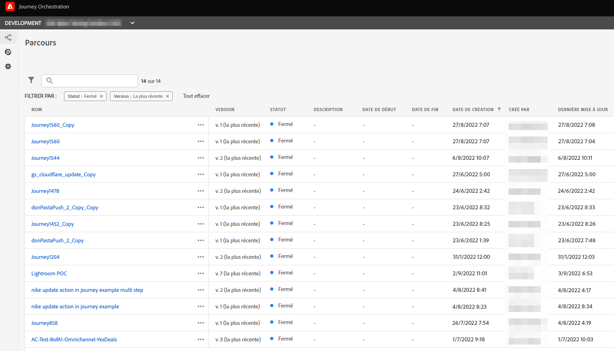
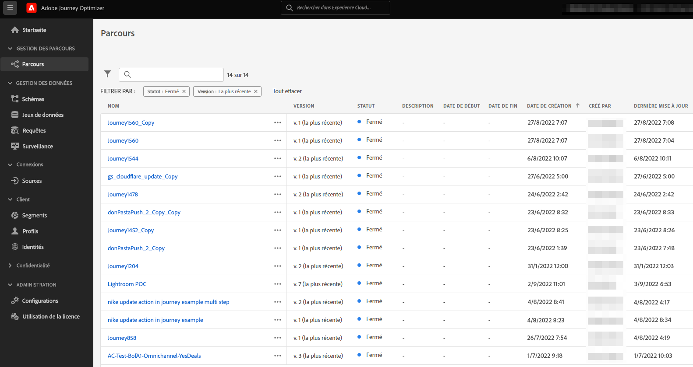
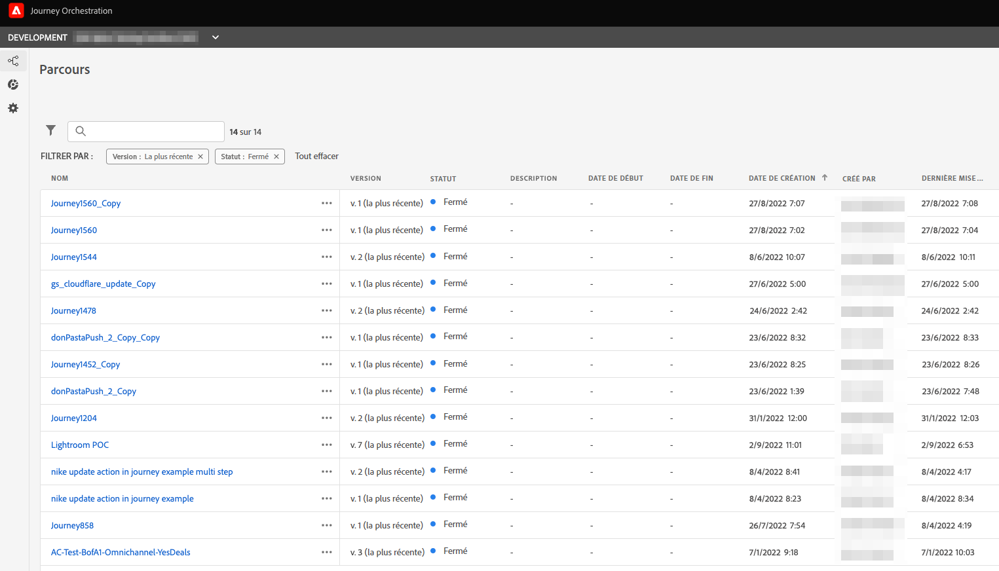

# Mettre à niveau votre environnement Journey Orchestration vers Adobe Journey Optimizer{#ugrade-ajo}

## Qu&#39;est-ce qu’Adobe Journey Optimizer ?

Adobe Journey Optimizer est une application agile et évolutive qui s’appuie sur Adobe Experience Platform pour orchestrer et diffuser des parcours client personnalisés, connectés et opportuns sur n’importe quelle application, appareil, écran ou canal.

## Présentation de Journey Orchestration

Journey Orchestration est un service basé sur Adobe Experience Platform qui vous permet de personnaliser les parcours individuels de chaque client en fonction de son comportement et de ses préférences passés. Journey Orchestration est le précurseur de l’application Journey Optimizer.

## Pourquoi devrais-je migrer vers Adobe Journey Optimizer ?

**Accès à une interface simplifiée** grâce aux fonctionnalités d’Experience Platform, vous permettant accéder rapidement aux parcours, aux jeux de données, aux profils, aux alertes, etc. Plus besoin de faire d’aller-retour entre Adobe Experience Platform et Journey Orchestration pour accéder aux schémas ou aux jeux de données, tout est directement disponible depuis Adobe Journey Optimizer. Pour plus d’informations, consultez cette [page](https://experienceleague.adobe.com/docs/journey-optimizer/using/get-started/user-interface.html?lang=fr).

<table>
<tr>
<th>Avant</th>
<th>Après</th>
</tr>
<tr>
<td>
Accès à la section Parcours, segments et administration (sources de données, événements et actions) dans Journey Orchestration. Les segments et les jeux de données sont accessibles dans Adobe Experience Platform. 
</td>
<td>
Accès à Parcours, Segments, Administration, Segments et jeux de données, <strong>tout cela dans Adobe Journey Optimizer</strong>. Les <strong>fonctionnalités Adobe Experience Platform supplémentaires</strong> sont également accessibles ici.
</td>
</tr>
</table>

**Nouvelle interface de création de rapports** et accès aux nouvelles fonctionnalités de création de rapports :

<table>
<tr>
<th>Avant</th>
<th>Après</th>
</tr>
<tr>
<td></td>
<td>
La <strong>Vue globale</strong> vous permet de mesurer l’efficacité de vos parcours et diffusions sur une période sélectionnée. Pour d’autres mesures en temps réel, vous pouvez accéder à la <strong>Vue en direct</strong>. Pour chaque canal de diffusion utilisé dans vos parcours (e-mail, SMS, notification push), une <strong>section dédiée</strong> est disponible dans le rapport pour afficher les mesures. Cela s’applique uniquement si vous utilisez des <strong>fonctionnalités de messagerie Adobe Journey Optimizer</strong> prêtes à l’emploi. Pour plus d’informations, veuillez contacter votre équipe de compte.
</td>
</tr>
</table>

Toute évolution visant à améliorer l’expérience de création de rapports ou à l’enrichir à la suite de nouvelles versions de fonctionnalités n’est disponible que dans la nouvelle interface de création de rapports. Commencez à l’utiliser pour obtenir une expérience Adobe Journey Optimizer plus complète.

Profitez des autres **fonctionnalités Adobe Journey Optimizer** actuelles ainsi que des nouvelles, telles que Contrôle d’accès au niveau du champ et Contrôle d’accès au niveau de l’objet. Veuillez contacter votre équipe de compte pour obtenir plus d’informations.

## Comment mettre à niveau mon environnement Journey Orchestration ?

1. Contactez l’équipe de votre compte pour mettre à jour votre contrat avec Adobe.

1. Attendez que notre équipe d’ingénierie termine le changement.

1. Mettez à jour vos autorisations à l’aide des profils de produit Journey Optimizer. Voir cette [page](https://experienceleague.adobe.com/docs/journey-optimizer/using/administration/ootb-product-profiles.html?lang=fr).

1. Vous avez maintenant accès à Adobe Journey Optimizer !

## Questions fréquentes

### Dois-je prévoir quoi que ce soit pour passer de Journey Orchestration à Adobe Journey Optimizer ?

Non, il n’y a pas de migration, pas de travail nécessaire de votre part, pas de temps d’arrêt et pas d’investissement supplémentaire. Vous n’avez qu’à mettre à jour votre accord avec Adobe et nous faisons le reste. Veuillez contacter votre représentant de compte pour obtenir des instructions sur la manière d’initier ce processus.

### Vais-je vais perdre quelque chose après le changement ?

Non, vous conserverez tous vos objets Journey Orchestration et Adobe Experience Platform existants : schémas, jeux de données, parcours, événements, sources de données, actions. Rien ne sera perdu, tous les parcours actifs continueront à fonctionner sans interruption.

<table>
<tr>
<th>Avant</th>
<th>Après</th>
</tr>
<tr>
<td></td>
<td></td>
</tr>
</table>

### Je vois toujours Journey Orchestration dans le sélecteur d’applications, est-ce normal ?

Oui, c’est normal. Il se peut que l’élément de Journey Orchestration s’affiche encore quelques jours après la mise à niveau. Veuillez utiliser le Journey Optimizer.

### Que se passe-t-il si j’utilise Journey Orchestration avec Adobe Campaign Standard aujourd’hui ?

En passant à Adobe Journey Optimizer, vous pourrez toujours utiliser l’intégration entre les parcours et Adobe Campaign Standard en concevant votre parcours client dans Adobe Journey Optimizer et en laissant Adobe Campaign Standard envoyer la diffusion.

Cependant, en raison du fonctionnement de la pile de rapports Adobe Journey Optimizer, la création de rapports ne combinera pas les données des parcours et de Campaign Standard. Les informations sur les parcours seront disponibles dans les rapports Adobe Journey Optimizer et les informations de diffusion dans Adobe Campaign Standard. Une configuration d’Experience Platform peut être effectuée pour ramener les données Adobe Campaign Standard dans Adobe Experience Platform, afin qu’elles soient disponibles pour Customer Journey Analytics ([en savoir plus](https://business.adobe.com/products/experience-platform/customer-journey-analytics.html)) ou d’autres outils de création de rapports tiers tels que Tableau ou PowerBI.

Les rapports Adobe Journey Optimizer fonctionnent mieux lorsque vous utilisez les fonctionnalités de messagerie prêtes à l’emploi d’Adobe Journey Optimizer (disponibles dans les offres Adobe Journey Optimizer dédiées). Pour plus d&#39;informations sur la création de messages dans la zone de travail de parcours, référez-vous à cette [page](https://experienceleague.adobe.com/docs/journey-optimizer/using/messages/messages-in-journeys.html?lang=fr).

Pour plus d’informations, veuillez contacter votre équipe de compte.
