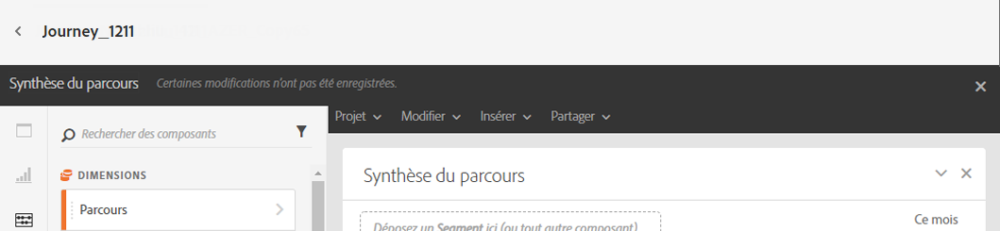
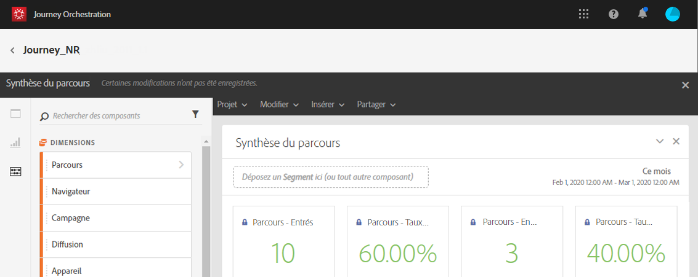
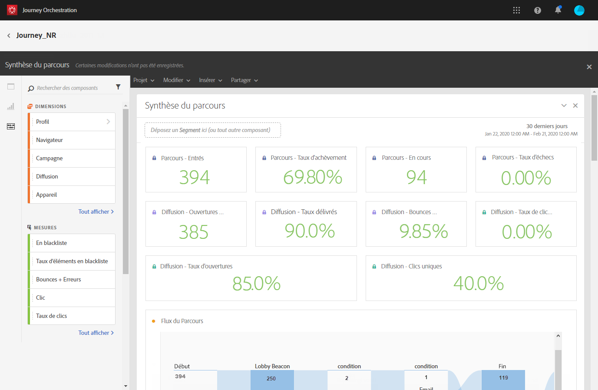
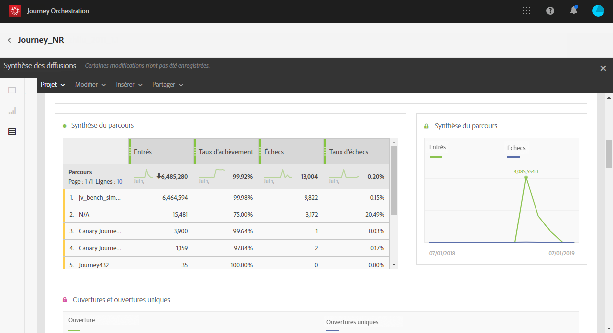

# À propos des rapports de parcours {#concept_rfj_wpt_52b}

>[!NOTE]
>
>Les données de parcours et les segments ne seront renseignés que si vous disposez d’Adobe Campaign Standard.

Cette section explique comment accéder aux rapports et les utiliser pour mesurer l’efficacité des parcours.

## Interface du reporting {#reporting-interface}

La barre d&#39;outils supérieure vous permet de modifier, d&#39;enregistrer ou d&#39;imprimer votre rapport, par exemple.

Utilisez l&#39;onglet **[!UICONTROL Projet]** pour :

* **[!UICONTROL Ouvrir]** : ouvre un rapport ou un modèle créé précédemment.
* **[!UICONTROL Enregistrer sous]** : duplique les modèles pour les rendre modifiables.
* **[!UICONTROL Actualiser le projet]** : met à jour votre rapport en fonction des nouvelles données et des changements de filtre.
* **[!UICONTROL Télécharger CSV]** : exporte vos rapports sous forme de fichiers CSV.
* **[!UICONTROL Imprimer]** : imprime votre rapport.

L’onglet **[!UICONTROL Modifier]** permet les opérations suivantes :

* **[!UICONTROL Annuler]** : annule la dernière action effectuée sur votre tableau de bord.
* **[!UICONTROL Rétablir]** : annule la dernière action **[!UICONTROL Annuler]** effectuée sur votre tableau de bord.
* **[!UICONTROL Effacer tout]** : supprime tous les panneaux sur votre tableau de bord.

Le tableau **[!UICONTROL Insérer]** vous permet de personnaliser vos rapports en ajoutant des graphiques et des tableaux à votre tableau de bord :

* **[!UICONTROL Nouveau panneau vierge]** : ajoute un nouveau panneau vierge à votre tableau de bord.
* **[!UICONTROL Nouvelle structure libre]** : ajoute une nouvelle structure libre à votre tableau de bord.
* **[!UICONTROL Nouvelle ligne]** : ajoute un nouveau graphique linéaire à votre tableau de bord.
* **[!UICONTROL Nouvelle barre]** : ajoute un nouveau graphique à barre à votre tableau de bord.

Les onglets de gauche vous permettent de créer votre rapport et de filtrer les données selon les besoins.

Ces onglets vous donnent accès aux éléments suivants :

* **[!UICONTROL Panneaux]** : ajoutez un panneau vide ou une forme libre à votre rapport pour commencer à filtrer les données. Voir à ce propos la section [Ajouter des panneaux](../reporting/creating-your-journey-reports.md#adding-panels).
* **[!UICONTROL Visualisations]** : déposez une sélection d’éléments de visualisation pour donner à votre rapport une dimension graphique. Voir à ce propos la section [Ajouter des visualisations](../reporting/creating-your-journey-reports.md#adding-visualizations).
* **[!UICONTROL Composants]** : permettent de personnaliser les rapports grâce à différentes dimensions, mesures, segments et périodes. Voir à ce propos la section [Ajouter des panneaux](../reporting/creating-your-journey-reports.md#adding-components).

## Modèle de synthèse du parcours {#ootb-template}

Les rapports sont répartis en deux catégories : un modèle d’usine et des rapports personnalisés.
Le modèle d’usine, **[!UICONTROL Synthèse du parcours]**, donne une vue précise des données de suivi les plus importantes.

Chaque tableau est représenté par des nombres et des graphiques de synthèse. Les paramètres de visualisation des détails vous permettent de modifier leur affichage.

Les IPC suivants sont disponibles en haut du rapport :

* **[!UICONTROL Parcours - Entrés]** : nombre total de personnes ayant atteint l’événement d’entrée du parcours.
* **[!UICONTROL Parcours - Taux d’achèvement]** : nombre total de personnes ayant atteint la fin du parcours (ou dans le cas d’une personne ne correspondant à aucune condition) par rapport au nombre total de personnes entrées dans le parcours.
* **[!UICONTROL Parcours - Actuel]** : nombre total de personnes actuellement dans le parcours.
* **[!UICONTROL Parcours - Taux d’échec]** : nombre total de parcours qui n’ont pas été exécutés avec succès par rapport au nombre de parcours exécutés.
* **[!UICONTROL Délivrabilité - Messages envoyés]** : nombre total de messages envoyés.
* **[!UICONTROL Taux de délivrabilité]** : nombre total de messages délivrés avec succès par rapport aux messages envoyés.
* **[!UICONTROL Délivrabilité - Taux de bounce]** : nombre total de messages qui ont fait l’objet d’un bounce par rapport aux messages envoyés.
* **[!UICONTROL Délivrabilité - Taux de désabonnement]** : nombre total de désabonnements par destinataire par rapport au nombre de messages délivrés.
* **[!UICONTROL Délivrabilité - Taux d’ouvertures]** : nombre total de messages ouverts par rapport au nombre de messages délivrés.
* **[!UICONTROL Délivrabilité - Taux de clics]** : nombre total de clics dans une diffusion par rapport au nombre de messages délivrés.

La visualisation du flux du parcours permet de voir le chemin de vos profils ciblés pas à pas tout au long du parcours. Cette fonction n’est disponible que lors du ciblage d’un parcours. Il est généré automatiquement et ne peut pas être modifié.

La **[!UICONTROL synthèse du parcours]** contient les données disponibles le concernant, notamment :

* **[!UICONTROL Entrés]** : nombre total de personnes ayant atteint l’événement d’entrée du parcours.
* **[!UICONTROL Taux d’achèvement]** : nombre total de personnes ayant atteint la fin du parcours par rapport au nombre total de personnes entrées dans le parcours.
* **[!UICONTROL Actuel]** : nombre total de personnes actuellement dans le parcours.
* **[!UICONTROL Échec]** : nombre total de parcours qui n’ont pas été exécutés avec succès.
* **[!UICONTROL Taux d’échec]** : nombre total de parcours qui n’ont pas été exécutés avec succès par rapport au nombre de parcours exécutés.

Le tableau **[!UICONTROL Meilleurs événements]** affiche les événements avec le plus de succès et le tableau **[!UICONTROL Meilleures actions]**, les actions avec le plus de succès de vos parcours.

Le tableau **[!UICONTROL Délivrabilité - Synthèse des envois]** contient les données disponibles pour les diffusions de votre parcours, telles que :

* **[!UICONTROL Traités/envoyés]** : nombre total de messages envoyés.
* **[!UICONTROL Taux de délivrabilité]** : nombre total de messages délivrés avec succès par rapport aux messages envoyés.
* **[!UICONTROL Délivrés]** : nombre de messages envoyés avec succès par rapport au nombre total de messages envoyés.
* **[!UICONTROL Taux Bounces + Erreurs]** : nombre total de messages qui ont fait l’objet d’un bounce par rapport aux messages envoyés.
* **[!UICONTROL Bounces + erreurs]** : nombre total d’erreurs cumulées lors des diffusions et du traitement automatique des retours par rapport au nombre total de messages envoyés.

Le tableau **[!UICONTROL Délivrabilité - Synthèse du suivi]** contient les données disponibles pour le suivi du succès des diffusions de votre parcours, telles que :

* **[!UICONTROL Taux d’ouvertures]** : pourcentage de messages ouverts.
* **[!UICONTROL Ouvertures]** : nombre d’ouvertures d’un message dans une diffusion.
* **[!UICONTROL Taux de clics]**: nombre total de clics dans une diffusion par rapport au nombre de messages délivrés.
* **[!UICONTROL Clics]** : nombre de clics sur un contenu dans une diffusion.
* **[!UICONTROL Taux de désabonnement]** : pourcentage de désabonnement par destinataire par rapport au nombre de messages délivrés.
* **[!UICONTROL Désabonnement]** : nombre total de désabonnements par destinataire par rapport au nombre de messages délivrés.
