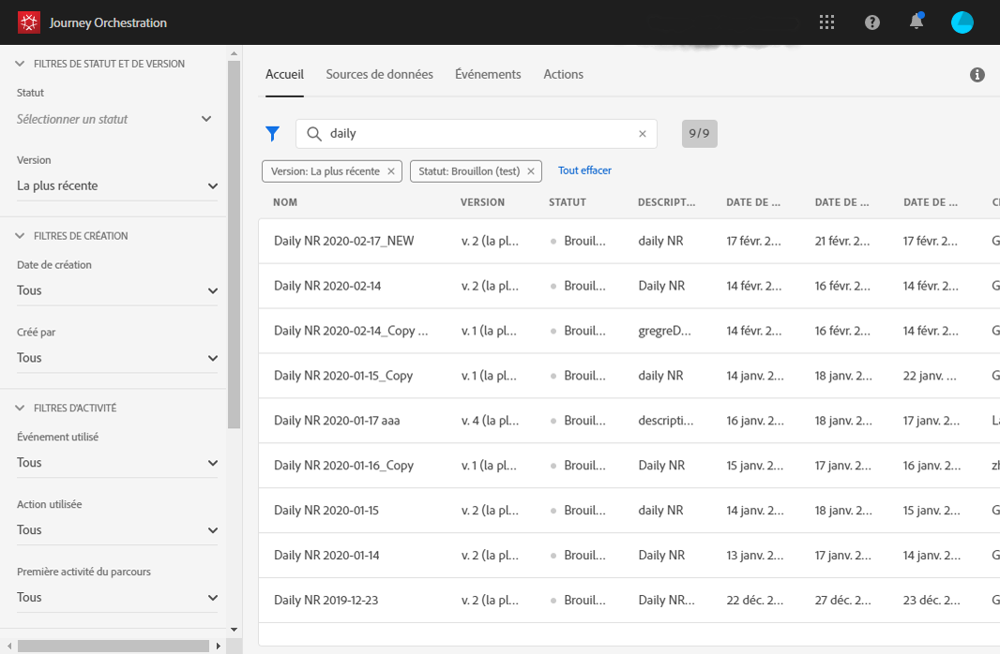
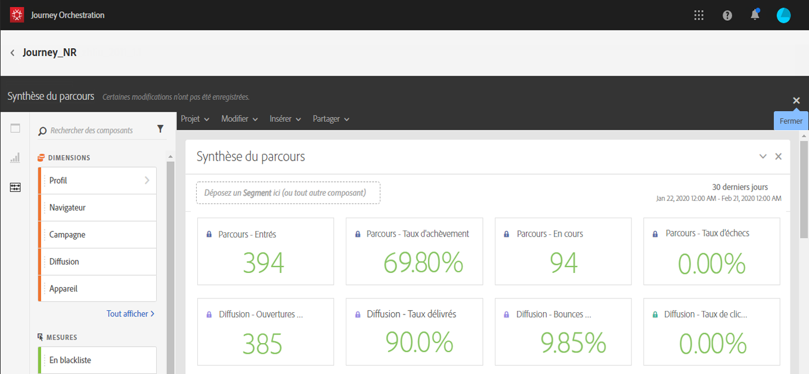

# Création de rapports de parcours {#concept_rfj_wpt_52b}

## Création et accès aux rapports {#accessing-reports}

>[!NOTE]
>
>Après la suppression d’un parcours, les rapports associés ne seront plus disponibles.

Cette section explique comment créer ou utiliser des rapports d’usine. Combinez des panneaux, des composants et des visualisations pour mieux suivre le succès de vos parcours.

Pour accéder aux rapports de vos parcours et effectuer le suivi du succès de vos diffusions :

1. Dans le menu supérieur, cliquez sur l’onglet **[!UICONTROL Accueil]**.

1. Sélectionnez le parcours pour lequel vous souhaitez créer un rapport.

   Vous pouvez également accéder aux rapports en cliquant sur **Rapport** tout en pointant sur le parcours de votre choix dans la liste.

   

1. Cliquez sur l’icône **[!UICONTROL Rapport]** en haut à droite de l’écran.

   

1. Le rapport **[!UICONTROL Synthèse du parcours]** d’usine s’affiche à l’écran. Pour accéder aux rapports personnalisés, cliquez sur le bouton **[!UICONTROL Fermer]**.

   

1. Cliquez sur **[!UICONTROL Créer un projet]** pour créer un rapport entièrement nouveau.

   

1. Dans l’onglet **[!UICONTROL Panneaux]**, faites glisser autant de panneaux ou de tableaux à structure libre que nécessaire. Voir à ce sujet cette [section](#adding-panels).

   

1. Vous pouvez ensuite commencer à filtrer vos données en faisant glisser des dimensions et des mesures depuis l’onglet **[!UICONTROL Composants]** vers votre tableau à structure libre. Voir à ce sujet cette [section](#adding-components).

   

1. Pour avoir une vue plus précise de vos données, vous pouvez ajouter des visualisations à partir de l’onglet **[!UICONTROL Visualisations]**. Voir à ce sujet cette [section](#adding-visualizations).

## Ajouter des panneaux{#adding-panels}

### Ajouter un panneau vide {#adding-a-blank-panel}

Pour commencer votre rapport, vous pouvez ajouter un ensemble de panneaux à un rapport d’usine ou personnalisé. Chaque panneau contient différents jeux de données et est composé de visualisations et de tableaux Structure libre.

Ce panneau vous permet de créer vos rapports selon vos besoins. Vous pouvez ajouter autant de panneaux que vous voulez dans vos rapports afin de filtrer vos données avec différentes périodes.

1. Cliquez sur l’icône **[!UICONTROL Panneaux.]** Vous pouvez également ajouter un panneau en cliquant sur l’onglet **[!UICONTROL Insertion]** et en sélectionnant **[!UICONTROL Nouveau panneau vierge]**.

   

1. Placez le **[!UICONTROL Panneau vierge]** sur votre tableau de bord.

   

Vous pouvez ajouter à présent un tableau Structure libre à votre panneau pour commencer à cibler les données.

### Ajouter un tableau Structure libre       {#adding-a-freeform-table}

Les tableaux Structure libre vous permettent de créer un tableau pour analyser vos données à l’aide des différentes valeurs métriques et des dimensions disponibles dans le tableau **[!UICONTROL Composant]**.

Les tableaux et les visualisations sont redimensionnables et peuvent être déplacés pour améliorer la personnalisation de votre rapport.

1. Cliquez sur l’icône **[!UICONTROL Panneaux]**.

   

1. Placez l’élément **[!UICONTROL Structure libre]** sur votre tableau de bord.

   Vous pouvez également ajouter un tableau en cliquant sur l’onglet **[!UICONTROL Insérer]** et en sélectionnant **[!UICONTROL Nouvelle Forme Libre]** ou en cliquant sur **[!UICONTROL Ajouter un panneau structure libre]** dans un panneau vide.

   

1. Positionnez des éléments de l’onglet **[!UICONTROL Composants]** dans les colonnes et les rangées pour créer votre tableau.

   

1. Cliquez sur l’icône **[!UICONTROL Paramètres]** pour modifier l’affichage des données dans vos colonnes.

   

   L’option **[!UICONTROL Paramètres de colonne]** est composée des éléments suivants :

   * **[!UICONTROL Nombre]** : permet d’afficher ou de masquer les nombres de synthèse dans la colonne.
   * **[!UICONTROL Pourcentage]** : permet d’afficher ou de masquer le pourcentage dans la colonne.
   * **[!UICONTROL Interpréter zéro comme n’étant pas une valeur]** : permet d’afficher ou de masquer une valeur lorsqu’elle est égale à zéro.
   * **[!UICONTROL Arrière-plan]** : permet d’afficher ou de masquer la barre de progression horizontale dans les cellules.
   * **[!UICONTROL Inclure les nouvelles tentatives]** : permet d’inclure les nouvelles tentatives dans le résultat. Cette option est uniquement disponible pour les éléments **[!UICONTROL Envoyés]** et **[!UICONTROL Bounces + erreurs]**.

1. Sélectionnez une ou plusieurs rangées et cliquez sur l’icône **[!UICONTROL Visualiser.]** Une visualisation représentant les rangées sélectionnées est ajoutée.

   

Vous pouvez ajouter à présent autant de composants que nécessaire ainsi que des visualisations pour offrir une représentation graphique à vos données.

## Ajouter des composants{#adding-components}

Les composants vous permettent de personnaliser vos rapports grâce à différentes dimensions, valeurs métriques et périodes.

1. Cliquez sur l’onglet **[!UICONTROL Composants]** pour accéder à la liste des composants.

   

1. Chaque catégorie présentée dans l’onglet **[!UICONTROL Composants]** affiche les cinq éléments les plus utilisés. Cliquez sur le nom d’une catégorie pour accéder à la liste complète de ses composants.

   Le tableau des composants se divise en trois parties :

   * **[!UICONTROL Dimensions]** : obtenez des détails issus du log de diffusion, tels que le navigateur du destinataire, son domaine, ou la réussite d’une diffusion.
   * **[!UICONTROL Mesures]** : obtenez des détails sur le statut d’un message. Par exemple, s’il a été délivré et si l’utilisateur l’a ouvert.
   * **[!UICONTROL Temps]** : configurez une période de temps pour votre tableau.

1. Déposez des composants dans un panneau pour commencer à filtrer vos données.

Vous pouvez déposer autant de composants que nécessaire et les comparer les uns aux autres.

## Ajouter des visualisations{#adding-visualizations}

L’onglet **[!UICONTROL Visualisations]** vous permet de positionner des éléments de visualisation, tels que des zones, des diagrammes circulaires ou des graphiques. Les visualisations vous offrent une représentation graphique de vos données.

1. Dans l’onglet **[!UICONTROL Visualisations]**, déposez un élément de visualisation dans un panneau.

   

1. Après l’ajout d’une visualisation à votre panneau, vos rapports détectent automatiquement les données de votre tableau à structure libre. Sélectionnez les paramètres de votre visualisation.
1. S’il existe plusieurs tableaux Structure libre, sélectionnez la source de données à ajouter à votre graphique dans la fenêtre **[!UICONTROL Paramètres de source de données.]** Cette fenêtre peut également être ouverte en cliquant sur le point de couleur à côté de votre titre de visualisation.

   

1. Cliquez sur le bouton des paramètres de **[!UICONTROL Visualisation]** pour modifier directement le type de graphique ou les données qui y sont affichées :

   * **[!UICONTROL Pourcentages]** : affiche les valeurs sous forme de pourcentage.
   * **[!UICONTROL Ancrer l’axe Y à zéro]** : force l’axe Y à zéro, même si des valeurs sont supérieures à zéro.
   * **[!UICONTROL Légende visible]** : permet de masquer la légende.
   * **[!UICONTROL Normalisation]** : force la correspondance des valeurs.
   * **[!UICONTROL Afficher l’axe double]** : ajoute un axe à votre graphique.
   * **[!UICONTROL Limiter les éléments maximum]** : limite le nombre de graphiques affichés.
   * **[!UICONTROL Seuil]** : permet de configurer un seuil pour votre graphique. Il apparaît sous forme de ligne pointillée noire.

   

Cette visualisation vous permet d’avoir une vue plus claire de vos données dans les rapports.