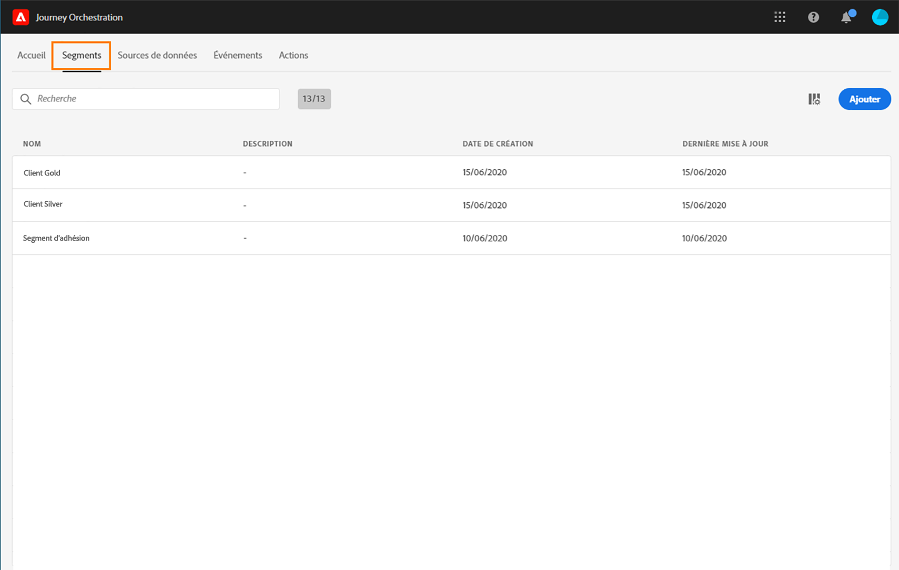
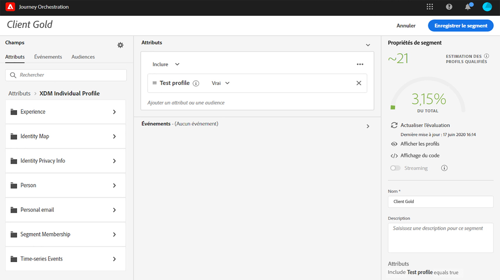

# Création d’un segment {#creating-a-segment}

You can either create a segment using the [Adobe Experience Platform Segmentation Service](https://docs.adobe.com/content/help/fr-FR/experience-platform/segmentation/home.html) or you can access and create them directly in [!DNL Journey Orchestration].

1. Dans le menu supérieur, cliquez sur l’onglet **[!UICONTROL Segments]**. La liste des segments d’Adobe Experience Platform s’affiche. Vous pouvez rechercher un segment spécifique dans la liste.

1. Cliquez sur le bouton **[!UICONTROL Ajouter]** pour créer un segment. L’écran de définition de segment vous permet de configurer tous les champs à paramétrer. La configuration est identique à celle du service de segmentation. Reportez-vous au [Guide de l’utilisateur du Créateur de segments](https://docs.adobe.com/content/help/fr-FR/experience-platform/segmentation/ui/overview.html).

Vous pouvez maintenant utiliser votre segment pour créer des conditions ou ajouter un événement de **[!UICONTROL qualification de segment]**. Voir la section [Utilisation de segments dans des conditions](../segment/using-a-segment.md) et des [Activités d’événement](../building-journeys/segment-qualification-events.md).