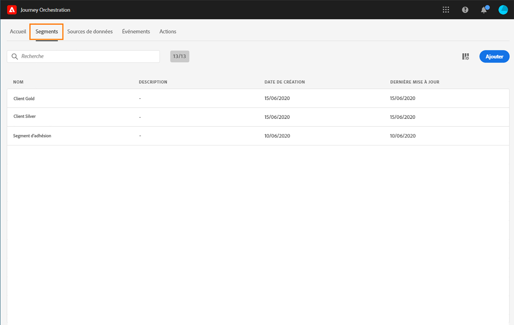
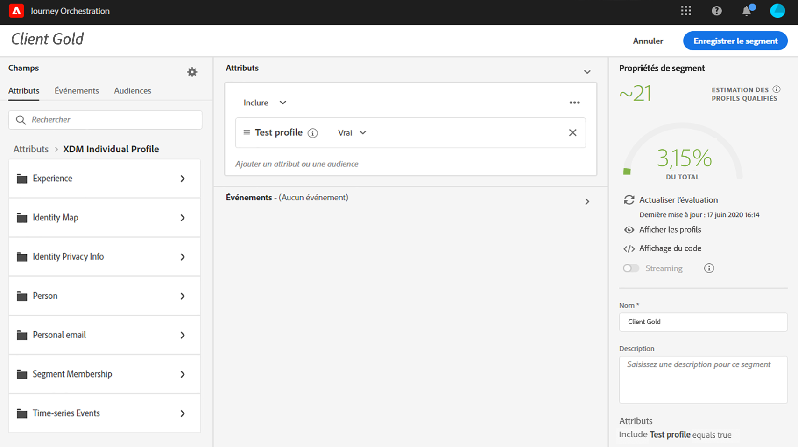

# Création d’un segment {#creating-a-segment}

>[!CAUTION]
>
>**Vous recherchez Adobe Journey Optimizer** ? Cliquez [ici](https://experienceleague.adobe.com/fr/docs/journey-optimizer/using/ajo-home){target="_blank"} pour consulter la documentation de Journey Optimizer.
>
>
>_Cette documentation se rapporte aux anciens contenus de Journey Orchestration qui ont été remplacés par Journey Optimizer. Pour toute question concernant votre accès à Journey Orchestration ou Journey Optimizer, contactez votre équipe en charge des comptes._

Vous pouvez, au choix, créer un segment à l’aide du [service de segmentation Adobe Experience Platform](https://experienceleague.adobe.com/docs/experience-platform/segmentation/home.html?lang=fr), ou y accéder et le créer directement dans [!DNL Journey Orchestration].

1. Dans le menu supérieur, cliquez sur l’onglet **[!UICONTROL Segments]**. La liste des segments Adobe Experience Platform s’affiche. Vous pouvez rechercher un segment spécifique dans la liste.

   

1. Cliquez sur **[!UICONTROL Ajouter]** pour définir un nouveau segment. L’écran de définition de segment vous permet de configurer tous les champs à paramétrer. La configuration est identique à celle du service de segmentation. Reportez-vous au [Guide de l’utilisateur du Créateur de segments](https://experienceleague.adobe.com/docs/experience-platform/segmentation/ui/overview.html?lang=fr).

   

Vous pouvez maintenant utiliser votre segment pour créer des conditions ou ajouter un événement de **[!UICONTROL qualification de segment]**. Pour plus d&#39;informations, consultez la section [Utilisation de segments dans des conditions](../segment/using-a-segment.md) et des [Activités d’événement](../building-journeys/segment-qualification-events.md).
