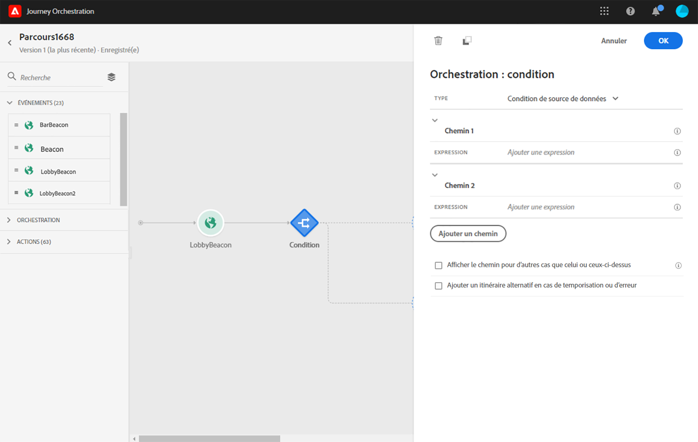

# Utilisation de segments dans des conditions {#using-a-segment}

Cette section explique comment utiliser un segment dans une condition de parcours. Pour savoir comment utiliser un événement de **[!UICONTROL qualification de segment]** dans votre parcours, reportez-vous à cette [section](../building-journeys/segment-qualification-events.md).

Pour utiliser un segment dans une condition de parcours, procédez comme suit :

1. Ouvrez un parcours, déposez une activité **[!UICONTROL Condition]** et choisissez la **condition de source de données**.
   

1. Cliquez sur **[!UICONTROL Ajouter un chemin]** pour chaque chemin supplémentaire nécessaire. Pour chaque chemin, cliquez sur le champ **[!UICONTROL Expression]**.

   

1. Sur le côté gauche, développez le nœud **[!UICONTROL Segments]**. Faites glisser et déposez le segment à utiliser pour votre condition. Par défaut, la condition sur le segment est &#39;true&#39;.

   

   >[!NOTE]
   >
   >Seuls les individus présentant les statuts de participation **Réalisé** et **Existant** sont considérés comme membres du segment. Pour plus d&#39;informations sur l&#39;évaluation d&#39;un segment, consultez la [documentation du service de segmentation](https://experienceleague.adobe.com/docs/experience-platform/segmentation/tutorials/evaluate-a-segment.html?lang=fr#interpret-segment-results).

Pour plus d’informations sur les conditions de parcours et sur l’utilisation de l’éditeur d’expression simple, consultez la section [Activité de condition](../building-journeys/condition-activity.md#about_condition).
