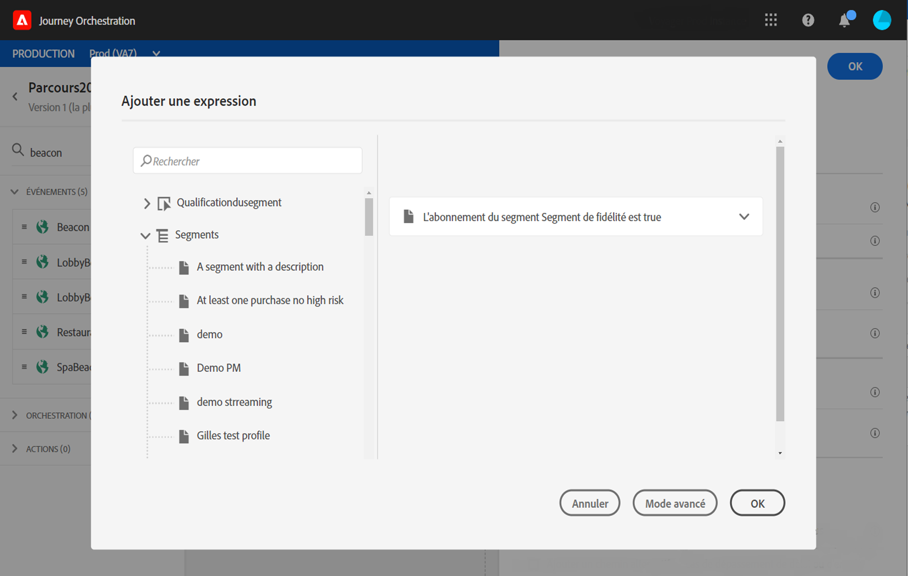

# Utilisation de segments dans des conditions {#using-a-segment}

Cette section explique comment utiliser un segment dans une condition de parcours.
Pour savoir comment utiliser un événement de **qualification de segment** dans votre parcours, reportez-vous à la section [Activités d’événement](../building-journeys/event-activities.md#segment-qualification).

Pour utiliser un segment dans une condition de parcours, procédez comme suit :

1. Ouvrez un parcours, déposez une activité **Condition** et choisissez la **condition de source de données**.
   
1. Cliquez sur **Ajouter un chemin** pour chaque chemin supplémentaire nécessaire. Pour chaque chemin, cliquez sur le champ **Expression**.
   
1. Sur le côté gauche, développez le nœud **Segments**. Faites glisser et déposez le segment à utiliser pour votre condition. Par défaut, la condition sur le segment est &#39;true&#39;.
   

Pour plus d’informations sur les conditions du parcours et sur l’utilisation de l’éditeur d’expression simple, consultez la section [Activités de condition](../building-journeys/condition-activity.md#about_condition).
