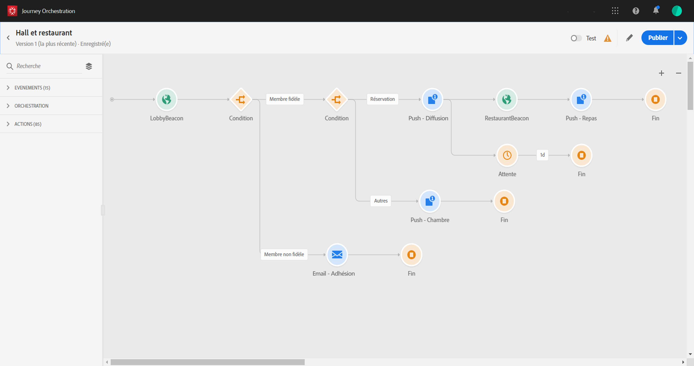

# A propos du cas d’utilisation avancé{#concept_vzy_ncy_w2b}

## Intérêt {#purpose}

Prenons l&#39;exemple d&#39;une marque d&#39;hôtel nommée Marlton. Dans leurs hôtels, ils ont positionné des dispositifs de balises à proximité de tous les espaces stratégiques : hall, étages, restaurant, salle de fitness, piscine, etc.

>[!NOTE]
>
>Dans ce cas d’utilisation, nous utilisons Adobe Campaign Standard pour envoyer des messages.

Dans ce cas d’utilisation, nous verrons comment envoyer des messages personnalisés en temps réel aux clients lorsqu’ils se rapprochent d’une balise spécifique.

Tout d&#39;abord, nous voulons envoyer un message dès qu&#39;une personne entre dans un hôtel Marlton. Nous voulons envoyer un message uniquement si la personne n&#39;a reçu aucune communication de notre part au cours des dernières 24 heures.

Nous vérifions ensuite deux conditions :

* Si cette personne n’est pas un membre fidèle, nous lui envoyons un courriel pour rejoindre l’offre d’adhésion de fidélité.
* Si cette personne est déjà membre fidèle, nous vérifions s&#39;il a une réservation de chambre :
   * S&#39;il ne le fait pas, nous lui envoyons une notification Push avec les tarifs des chambres.
   * S&#39;il le fait, nous lui envoyons une notification Push de bienvenue. Et s&#39;il entre au restaurant dans les 6 heures suivantes, nous lui envoyons une notification Push avec une réduction sur un repas.

Dans ce cas d’utilisation, nous devrons créer deux événements (voir ) :

* Événement de balise de hall qui sera envoyé au système lorsqu&#39;un client entre dans l&#39;hôtel.
* Événement de balise de restaurant qui sera envoyé lorsqu’un client entre dans le restaurant.

Nous devrons configurer une connexion à deux sources de données (voir ) :

* La source de données de la plateforme d’expérience intégrée, pour récupérer les informations de nos deux conditions (adhésion de fidélité et date de dernier contact) ainsi que les informations de personnalisation du message.
* Le système de réservation d&#39;hôtel, pour récupérer les informations d&#39;état de réservation.

## Conditions requises {#prerequisites}

Pour notre cas d’utilisation, nous avons conçu trois modèles de messagerie transactionnelle Adobe Campaign Standard. Nous utilisons des modèles de messagerie transactionnelle d’événements. Refer to this [page](https://docs.adobe.com/content/help/en/campaign-standard/using/communication-channels/transactional-messaging/about-transactional-messaging.html).

Adobe Campaign Standard est configuré pour envoyer des courriers électroniques et des notifications Push.

L’ID Experience Cloud est utilisé comme clé pour identifier le client dans le système de réservation d’hôtel.

Les événements sont envoyés à partir du téléphone mobile du client lorsqu’ils sont détectés près d’une balise. Vous devez concevoir une application mobile pour envoyer des événements du téléphone mobile du client au kit SDK mobile.

Le champ Membre de fidélité est un champ personnalisé qui a été ajouté dans XDM pour l’ID d’organisation spécifique.
