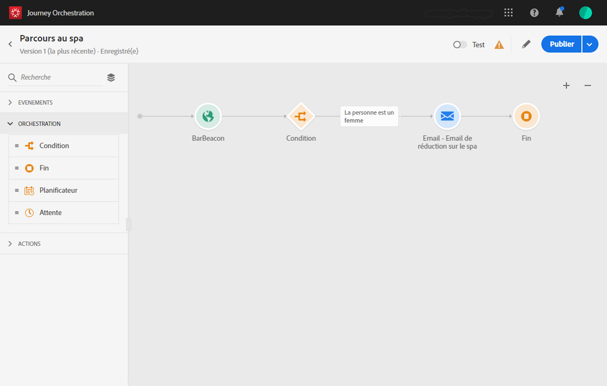

# À propos du cas d’utilisation simple{#concept_grh_vby_w2b}

## Objectif {#purpose}

Prenons l’exemple d’une marque hôtelière appelée Marlton. Dans ces hôtels, des dispositifs de balises ont été positionnés à proximité de tous les espaces stratégiques : hall, étages, restaurant, salle de fitness, piscine, etc.

Dans ce cas d’utilisation, nous allons voir comment envoyer en temps réel un message personnalisé à une personne qui se déplace à proximité d’une balise proche du spa.

Nous ne voulons envoyer un message que si cette personne est une femme. Le message doit être reçu en quelques secondes.

## Conditions requises   {#prerequisites}

Pour notre cas d’utilisation, nous avons conçu un modèle de message transactionnel email dans Adobe Campaign Standard. Nous utilisons un modèle de message transactionnel basé sur un événement. À ce propos, consultez cette [page](https://docs.adobe.com/content/help/fr-FR/campaign-standard/using/communication-channels/transactional-messaging/about-transactional-messaging.html).

Adobe Campaign Standard est configuré pour envoyer des emails.

Lorsque des clients sont détectés à proximité d’une balise, les événements sont envoyés à partir de leur téléphone mobile. Vous devez concevoir une application mobile pour envoyer des événements du téléphone mobile du client vers le kit de développement Mobile SDK.