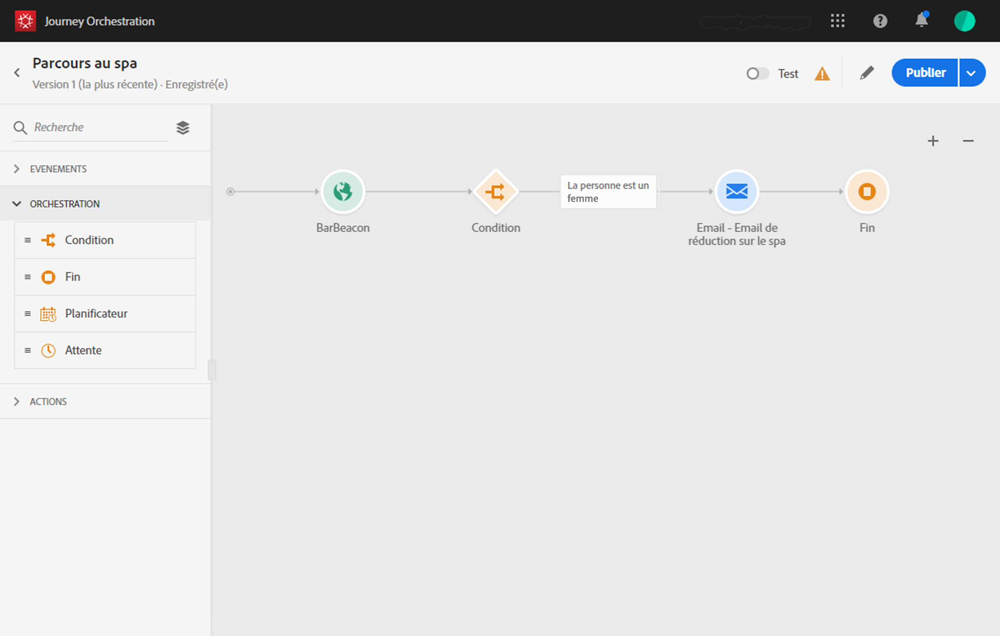

# À propos du cas d’utilisation simple{#concept_grh_vby_w2b}

>[!CAUTION]
>
>**Vous recherchez Adobe Journey Optimizer** ? Cliquez [ici](https://experienceleague.adobe.com/fr/docs/journey-optimizer/using/ajo-home){target="_blank"} pour consulter la documentation de Journey Optimizer.
>
>
>_Cette documentation se rapporte aux anciens contenus de Journey Orchestration qui ont été remplacés par Journey Optimizer. Pour toute question concernant votre accès à Journey Orchestration ou Journey Optimizer, contactez votre équipe en charge des comptes._

## Rôle {#purpose}

Prenons l’exemple d’une marque hôtelière appelée Marlton. Dans ces hôtels, des appareils de balises ont été positionnés à proximité de tous les espaces stratégiques : hall, étages, restaurant, salle de fitness, piscine, etc.

Dans ce cas d’utilisation, nous allons voir comment envoyer en temps réel un message personnalisé à une personne qui se déplace à proximité d’une balise proche du spa.

Nous ne voulons envoyer un message que si cette personne est une femme. Le message doit être reçu en quelques secondes.

## Prérequis {#prerequisites}

Pour notre cas pratique, nous avons conçu un modèle de message transactionnel e-mail dans Adobe Campaign Standard. Nous utilisons un modèle de message transactionnel basé sur un événement. Voir cette [page](https://experienceleague.adobe.com/docs/campaign-standard/using/communication-channels/transactional-messaging/getting-started-with-transactional-msg.html?lang=fr).

Adobe Campaign Standard est configuré pour envoyer des e-mails.

Lorsque des clients sont détectés à proximité d’une balise, les événements sont envoyés à partir de leur téléphone mobile. Vous devez concevoir une application mobile pour envoyer des événements du téléphone mobile du client vers le kit de développement Mobile SDK.
