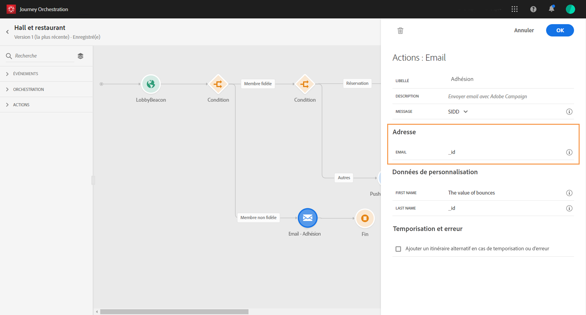
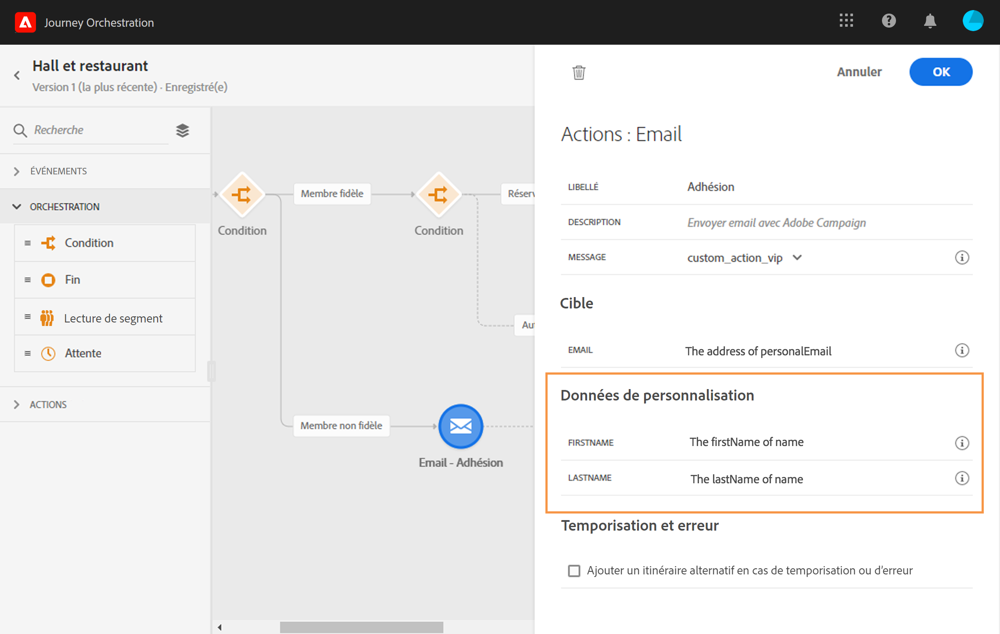

# Création du parcours {#concept_owm_kdy_w2b}

L’**utilisateur chargé de la conception de parcours** peut maintenant créer le parcours. Notre parcours comprend les activités suivantes :

* deux activités **[!UICONTROL Événement]** : « LobbyBeacon » et « RestaurantBeacon » ;
* deux activités **[!UICONTROL Condition]** ;
* trois activités **[!UICONTROL Push]** et une activité **[!UICONTROL Email]** (avec Adobe Campaign Standard) ;
* une activité **[!UICONTROL Attente]** ;
* quatre activités **[!UICONTROL Fin]**.

>[!NOTE]
>
>Les activités **[!UICONTROL Push]** et **[!UICONTROL Email]** ne sont disponibles dans la palette que si vous disposez d’Adobe Campaign Standard.

Pour plus d’informations sur la création d’un parcours, consultez la section [](../building-journeys/journey.md).

## Premières étapes{#section_ntb_ws1_ffb}

1. Dans le menu supérieur, cliquez sur l’onglet **[!UICONTROL Accueil]** et **[!UICONTROL Créer]** pour créer un parcours.

   

1. Modifiez les propriétés du parcours dans le volet de configuration qui s’affiche dans la partie droite. Ajoutez un nom et définissez-le pour qu’il dure un mois, du 1er au 31 décembre.

   

1. Commencez à concevoir le parcours en faisant glisser l’événement « LobbyBeacon » de la palette vers le canevas. Vous pouvez également double-cliquer sur l’événement dans la palette pour l’ajouter au canevas.

   

1. Ajoutons maintenant une condition pour vérifier que la personne n’a pas été contactée au cours des dernières 24 heures et qu’elle est bien un membre du programme de fidélité. Placez une activité Condition dans le parcours.

   

1. Sélectionnez le type **[!UICONTROL Condition de source de données]**, puis cliquez dans le champ **[!UICONTROL Expression]**. Il est également possible de définir un libellé de condition qui apparaîtra sur la flèche, dans le canevas. Dans notre exemple, nous remplaçons « Condition 1 » par « Loyalty member » (membre du programme de fidélité).

   

1. Cliquez sur **[!UICONTROL Mode avancé]** et définissez la condition suivante en fonction des champs « timestamp » et « directMarketing.sends.value » issus de la source de données Experience Platform. La syntaxe de l’expression est la suivante :

   ```
   count(#{ExperiencePlatformDataSource.MarltonExperience.experienceevent.all(
       currentDataPackField.directMarketing.sends.value > 0 and
       currentDataPackField.timestamp > nowWithDelta(-1, "days")).timestamp}) == 0
   and
       #{ExperiencePlatformDataSource.MarltonProfiles.Profile._customer.marlton.loyaltyMember}
   ```

   

1. Cliquez sur le bouton **[!UICONTROL Ajouter un chemin]** et créez un second chemin pour les clients qui n’ont pas été contactés au cours des dernières 24 heures et qui ne sont pas membres du programme de fidélité. Appelez le chemin « Not loyalty member » (n’est pas membre du programme de fidélité). La syntaxe de l’expression est la suivante :

   ```
   count(#{ExperiencePlatformDataSource.MarltonExperience.experienceevent.all(
       currentDataPackField.directMarketing.sends.value > 0 and
       currentDataPackField.timestamp > nowWithDelta(-1, "days").timestamp}) == 0
   and not
       #{ExperiencePlatformDataSource.MarltonProfiles.Profile._customer.marlton.loyaltyMember}
   ```

   >[!NOTE]
   >
   >Dans la deuxième partie de l’expression,« Profile » est facultatif.

1. Nous devons sélectionner un namespace. Il est présélectionné en fonction des propriétés du schéma. Vous pouvez le conserver. Pour plus d’informations sur les namespaces, consultez la section [](../event/selecting-the-namespace.md).

Dans notre cas pratique, nous ne voulons réagir qu’à ces deux conditions. Nous n’allons donc pas cocher la case **[!UICONTROL Afficher le chemin pour d’autres cas que celui ou ceux ci-dessus]**.

Après la condition, deux chemins sont créés :

* _Clients qui n’ont pas été contactés au cours des dernières 24 heures et qui sont des membres du programme de fidélité._
* _Clients qui n’ont pas été contactés au cours des dernières 24 heures et qui ne sont pas des membres du programme de fidélité._


## Premier chemin : le client est un membre du programme de fidélité {#section_otb_ws1_ffb}

1. Dans le premier chemin, ajoutons une condition pour vérifier s’il a une réservation. Placez une activité Condition dans le parcours.

   

1. Choisissez le type **[!UICONTROL Condition de source de données]** et définissez cette condition en fonction des informations d’état de réservation récupérées du système de réservation :

   ```
   #{MarltonReservation.MarltonFieldGroup.reservation} == true
   ```

   

1. Si vous sélectionnez un champ d’une source de données externe, la partie droite de l’écran affiche la liste des paramètres définis lors de la configuration de la source de données externe (voir [](../usecase/configuring-the-data-sources.md)). Cliquez sur le nom du paramètre et définissez la valeur de la clé du système de réservation, l’Experience Cloud ID, dans notre exemple :

   ```
   @{LobbyBeacon.endUserIDs._experience.mcid.id}
   ```

   

1. Puisque nous voulons également réagir aux clients qui n’ont pas effectué de réservation, nous devons cocher la case **[!UICONTROL Afficher le chemin pour d’autres cas que celui ou ceux ci-dessus]**.

   

   Deux chemins sont créés :

   * _Clients ayant réservé une chambre_
   * _Clients n’ayant pas réservé de chambre._
   

1. Dans le premier chemin (chambre réservée), déposez une activité **[!UICONTROL Push]**, puis sélectionnez votre application mobile et votre modèle « Welcome ».

   

1. Définissez les champs **[!UICONTROL Cible]** nécessaires au système pour envoyer la notification push.

   * **[!UICONTROL Plateforme push]** : sélectionnez la plateforme : **[!UICONTROL Apple Push Notification Server]** (Apple) ou **[!UICONTROL Firebase Cloud Messaging]** (Android).
   * **[!UICONTROL Jeton d’enregistrement]** : ajoutez l’expression suivante (en fonction de l’événement configuré) à l’aide du mode avancé :

      ```
      @{LobbyBeacon._experience.campaign.message.profileSnapshot.pushNotificationTokens.first().token}
      ``
      
1. Définissez les champs de personnalisation de la notification push. Dans notre exemple, il s’agit du prénom et du nom.

1. Ajoutez un événement « RestaurantBeacon ».

   

1. Ajoutez une nouvelle activité **[!UICONTROL Push]**, sélectionnez le modèle « Meal discount » et définissez les champs **[!UICONTROL Adresse]** et **[!UICONTROL Personnalisation]**. Ajoutez une activité **[!UICONTROL Fin]**.

   

1. Nous ne souhaitons envoyer une notification push de remise sur un repas que si la personne arrive au restaurant dans les 6 heures qui suivent la notification push de bienvenue. Pour ce faire, nous devons utiliser une activité Attente. Placez le curseur sur l’activité Push de bienvenue et cliquez sur le symbole « + ». Dans le nouveau chemin, ajoutez une activité Attente et définissez une durée de 6 heures. La première activité éligible sera choisie. Si l’événement du restaurant est reçu moins de 6 heures après la notification push de bienvenue, l’activité Push est envoyée. Si aucun événement de restaurant n’est reçu dans les 6 heures suivantes, l’attente est activée. Placez une activité **[!UICONTROL Fin]** après l’activité d’attente.

   

1. Dans le deuxième chemin qui suit la condition de réservation (pas de réservation de chambre), ajoutez une activité **[!UICONTROL Push]** et sélectionnez le modèle « Room rates ». Ajoutez une activité **[!UICONTROL Fin]**.

   

## Deuxième chemin : le client n’est pas un membre du programme de fidélité{#section_ptb_ws1_ffb}

1. Dans le deuxième chemin qui suit la première condition (le client n’est pas un membre du programme de fidélité), ajoutez une activité **[!UICONTROL Email]** et sélectionnez le modèle « Loyalty membership ».

   

1. Dans le champ **[!UICONTROL Adresse]**, sélectionnez l’adresse email dans la source de données.

   

1. Définissez les champs de personnalisation du prénom et du nom à partir de la source de données.

   

1. Ajoutez une activité **[!UICONTROL Fin]**.

Cliquez sur le bouton **[!UICONTROL Test]** et testez votre parcours. En cas d’erreur, désactivez le mode test, modifiez votre parcours et lancez un nouveau test. Reportez-vous à la section [](../building-journeys/testing-the-journey.md) pour plus d’informations sur le mode test.


Si le test est concluant, vous pouvez publier votre parcours à partir du menu déroulant supérieur droit.


