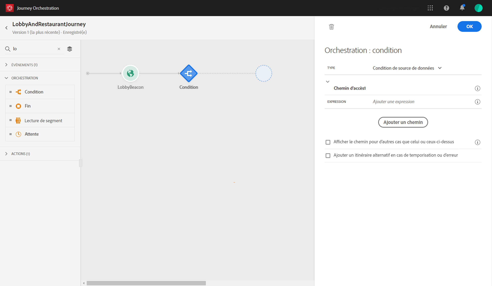
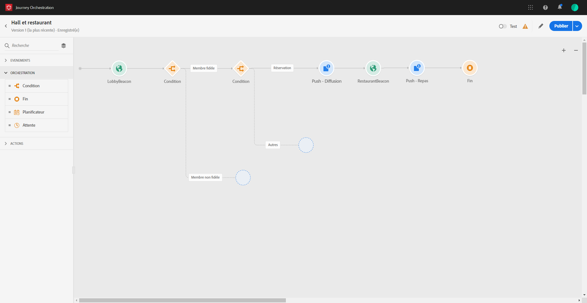

# Construire le voyage {#concept_owm_kdy_w2b}

L’utilisateur **** professionnel peut désormais construire le parcours. Notre voyage comprendra les activités suivantes :

* deux activités **[!UICONTROL d’événement]**: &quot;LobbyBeacon&quot; et &quot;RestaurantBeacon&quot;
* deux activités **[!UICONTROL de condition]**
* trois activités **[!UICONTROL Push]**et une activité**[!UICONTROL  Email]** (à l’aide d’Adobe Campaign Standard)
* une activité **[!UICONTROL d’attente]**
* quatre activités **[!UICONTROL de fin]**

>[!NOTE]
>
>Les activités **[!UICONTROL Push]**et**[!UICONTROL  Email]** ne sont disponibles dans la palette que si vous disposez d’Adobe Campaign Standard.

Pour plus d&#39;informations sur la manière de construire un voyage, consultez [](../building-journeys/journey.md).

## Premières étapes{#section_ntb_ws1_ffb}

1. Dans le menu supérieur, cliquez sur l’onglet **[!UICONTROL Accueil]**et**[!UICONTROL  Créer]** pour créer un nouveau voyage.

   

1. Modifiez les propriétés du voyage dans le volet de configuration qui s’affiche sur le côté droit. Ajoutez un nom et définissez-le pour qu’il dure un mois, du 1er au 31 décembre.

   

1. Commencez à concevoir votre voyage en faisant glisser l’événement &quot;LobbyBeacon&quot; de la palette vers la trame. Vous pouvez également cliquer deux fois sur l’événement dans la palette pour l’ajouter à la trame.

   

1. Ajoutons maintenant une condition pour vérifier que la personne n&#39;a pas été contactée au cours des dernières 24 heures et pour vérifier s&#39;il est un membre fidèle. Faites glisser une activité de condition dans votre voyage.

   

1. Sélectionnez le type Condition **[!UICONTROL de source de]**données, puis cliquez sur dans le champ**[!UICONTROL  Expression]** . Vous pouvez également définir une étiquette de condition qui apparaîtra sur la flèche, dans la trame. Dans notre exemple, nous remplacons &quot;Condition 1&quot; par &quot;Membre fidélité&quot;.

   

1. Cliquez sur Mode ****avancé et définissez la condition suivante en fonction des champs &quot;horodatage&quot; et &quot;directMarketing.send.value&quot; issus de la source de données de la plateforme d’expérience. La syntaxe de l’expression est la suivante :

   ```
   count(#{ExperiencePlatformDataSource.MarltonExperience.experienceevent.all(
       currentDataPackField.directMarketing.sends.value > 0 and
       currentDataPackField.timestamp > nowWithDelta(-1, "days")).timestamp}) == 0
   and
       #{ExperiencePlatformDataSource.MarltonProfiles.Profile._customer.marlton.loyaltyMember}
   ```

   

1. Cliquez sur le bouton **[!UICONTROL Ajouter un chemin]**et créez un second chemin pour les clients qui n’ont pas été contactés au cours des dernières 24 heures et qui ne sont pas membres fidèles. Nommez le chemin &quot;Membre non loyauté&quot;. La syntaxe de l’expression est la suivante :

   ```
   count(#{ExperiencePlatformDataSource.MarltonExperience.experienceevent.all(
       currentDataPackField.directMarketing.sends.value > 0 and
       currentDataPackField.timestamp > nowWithDelta(-1, "days").timestamp}) == 0
   and not
       #{ExperiencePlatformDataSource.MarltonProfiles.Profile._customer.marlton.loyaltyMember}
   ```

   >[!NOTE]
   >
   >Dans la deuxième partie de l’expression, &quot;Profil&quot; est facultatif.

1. Nous devons sélectionner un espace de noms. Un espace de noms est présélectionné en fonction des propriétés du schéma. Vous pouvez garder l&#39;un présélectionné. Pour plus d’informations sur les espaces de noms, voir [](../event/selecting-the-namespace.md).

Dans notre cas d&#39;utilisation, nous voulons seulement réagir à ces deux conditions, donc nous ne cochons pas la case **[!UICONTROL Afficher le chemin pour d&#39;autres cas que celui ci-dessus]**.

Deux chemins sont créés après votre condition :

* _Clients qui n’ont pas été contactés au cours des dernières 24 heures et qui sont des membres fidèles._
* _Clients qui n’ont pas été contactés au cours des dernières 24 heures et qui ne sont pas des membres fidèles._


## Premier chemin : le client est un membre fidèle {#section_otb_ws1_ffb}

1. Dans le premier chemin, ajoutons une condition pour vérifier s&#39;il a une réservation. Faites glisser une activité de condition dans votre voyage.

   

1. Choisissez le type de condition **[!UICONTROL de la source de]**données et définissez la condition en fonction des informations d’état de réservation récupérées du système de réservation :

   ```
   #{MarltonReservation.MarltonFieldGroup.reservation} == true
   ```

   

1. Lorsque vous sélectionnez un champ à partir d’une source de données externe, la partie droite de l’écran affiche la liste des paramètres définis lors de la configuration de la source de données externe (voir [](../usecase/configuring-the-data-sources.md)). Cliquez sur le nom du paramètre et définissez la valeur de la clé du système de réservation, l’ID Experience Cloud, dans l’exemple suivant :

   ```
   @{LobbyBeacon.endUserIDs._experience.mcid.id}
   ```

   

1. Puisque nous voulons également réagir aux clients qui n&#39;ont pas de réservation, nous devons cocher la case **[!UICONTROL Afficher le chemin pour d&#39;autres cas que celui ci-dessus]**.

   

   Deux chemins sont créés :

   * _Clients ayant réservé une chambre_
   * _Clients n&#39;ayant pas réservé de chambre._
   

1. Dans le premier chemin (chambre réservée), déposez une activité **[!UICONTROL Push]**, sélectionnez votre application mobile et votre modèle &quot;Bienvenue&quot;.

   

1. Définissez les champs **[!UICONTROL Target]**requis par le système pour envoyer la notification Push.

   * **[!UICONTROL Plateforme]**Push : sélectionnez la plateforme : Serveur**[!UICONTROL  de notifications Push]** Apple (Apple) ou **[!UICONTROL Firebase Cloud Messaging]**(Android).
   * **[!UICONTROL Jeton]**d’enregistrement : ajoutez l’expression suivante (en fonction de l’événement configuré) à l’aide du mode avancé :

      ```
      @{LobbyBeacon._experience.campaign.message.profileSnapshot.pushNotificationTokens.first().token}
      ``
      
1. Définissez les champs de personnalisation de la notification Push. Dans notre exemple : prénom et nom.

1. Ajoutez un événement &quot;RestaurantBeacon&quot;.

   

1. Ajoutez une nouvelle activité **[!UICONTROL Push]**, sélectionnez le modèle &quot;Remise de repas&quot; et définissez les champs**[!UICONTROL  Adresse]** et **[!UICONTROL Personnalisation]**. Add an**[!UICONTROL  End]** activity.

   

1. Nous voulons envoyer une notification Push de réduction de repas uniquement si la personne entre dans le restaurant dans les 6 heures qui suivent la notification Push de bienvenue. Pour ce faire, nous devons utiliser une activité d&#39;attente. Placez votre curseur sur l’activité de poussée de bienvenue et cliquez sur le symbole &quot;+&quot;. Dans le nouveau chemin, ajoutez une activité d’attente et définissez une durée de 6 heures. La première activité éligible sera choisie. Si l’événement de restaurant est reçu moins de 6 heures après la notification Push de bienvenue, l’activité Push est envoyée. Si aucun événement de restaurant n’est reçu dans les 6 heures suivantes, l’attente est choisie. Placez une activité **[!UICONTROL Fin]**après l’activité d’attente.

   

1. Dans le deuxième chemin qui suit la condition de réservation (pas de réservation de chambre), ajoutez une activité **[!UICONTROL Push]**et sélectionnez votre modèle &quot;Tarifs de chambre&quot;. Add an**[!UICONTROL  End]** activity.

   

## Deuxième chemin : le client n&#39;est pas un membre fidèle{#section_ptb_ws1_ffb}

1. Dans le deuxième chemin qui suit la première condition (le client n’est pas un membre fidèle), ajoutez une activité de **[!UICONTROL courrier électronique]**et sélectionnez votre modèle &quot;adhésion Fidélité&quot;.

   

1. Dans le champ **[!UICONTROL Adresse]**, sélectionnez l’adresse électronique dans la source de données.

   

1. Définissez les champs de personnalisation du prénom et du nom à partir de la source de données.

   

1. Add an **[!UICONTROL End]**activity.

Cliquez sur le bouton **[!UICONTROL Tester]**et testez votre parcours. En cas d’erreur, désactivez le mode test, modifiez votre voyage et testez-le à nouveau. For more information on the test mode, refer to[](../building-journeys/testing-the-journey.md).


Lorsque le test est concluant, vous pouvez publier votre voyage à partir du menu déroulant supérieur droit.


