# Envoi d&#39;un message à l&#39;aide de Campaign v7/v8 {#campaign-classic-use-case}

Ce cas pratique présente toutes les étapes nécessaires pour envoyer un e-mail à l&#39;aide de l&#39;intégration à Adobe Campaign Classic v7 et Adobe Campaign v8.

Nous allons tout d&#39;abord créer un modèle d&#39;e-mail transactionnel dans Campaign. Ensuite, dans Journey Orchestration, nous allons créer l’événement, l’action et concevoir le parcours.

Pour en savoir plus sur l&#39;intégration de Campaign, consultez les pages suivantes :

* [Création d&#39;une action Campaign](../action/acc-action.md)
* [Utilisation de l&#39;action dans un parcours](../building-journeys/using-adobe-campaign-classic.md).

**Adobe Campaign**

Votre instance Campaign doit être configurée pour cette intégration. La fonctionnalité de messagerie transactionnelle doit être configurée.

1. Connectez-vous à votre instance de pilotage Campaign.

1. Sous **Administration** > **Plate-forme** > **Énumérations**, sélectionnez l&#39;énumération **Type d&#39;événement** (eventType). Créez un type d&#39;événement (« journey-event », dans notre exemple). Vous devrez utiliser le nom interne du type d&#39;événement lors de l&#39;écriture ultérieure du fichier JSON.

   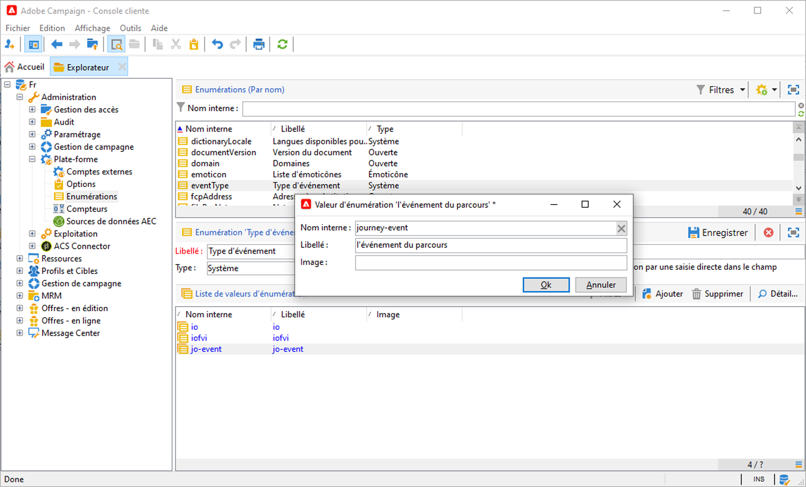

1. Déconnectez-vous et reconnectez-vous à l&#39;instance pour que la création prenne effet.

1. Sous **Message Center** > **Modèles de messages transactionnels**, créez un modèle d&#39;e-mail basé sur le type d&#39;événement précédemment créé.

   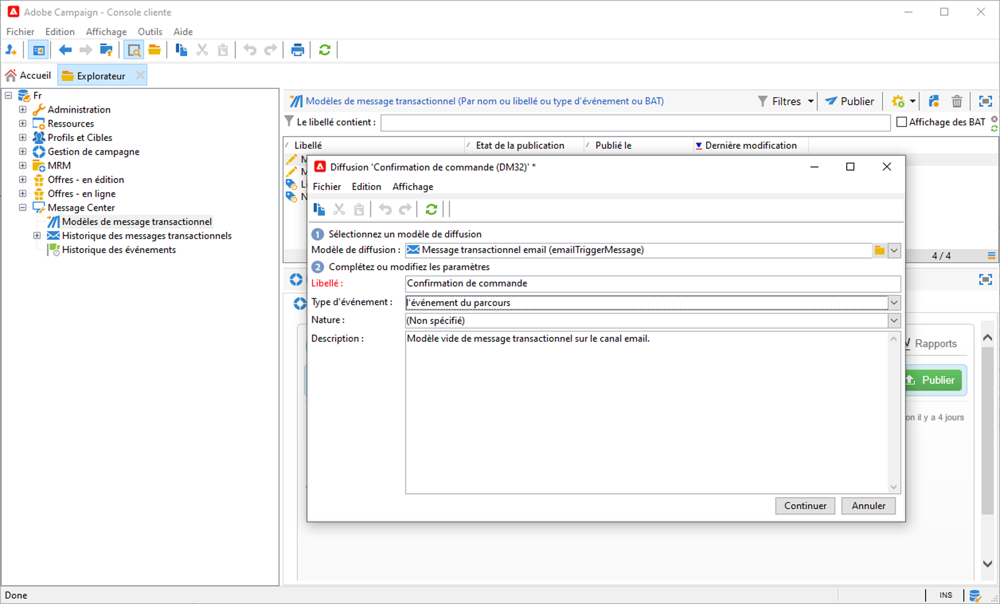

1. Concevez votre modèle. Dans cet exemple, nous utilisons la personnalisation sur le prénom et le numéro de commande du profil. Le prénom se trouve dans la source de données Adobe Experience Platform et le numéro de commande est un champ de notre événement Journey Orchestration. Veillez à utiliser les noms de champ corrects dans Campaign.

   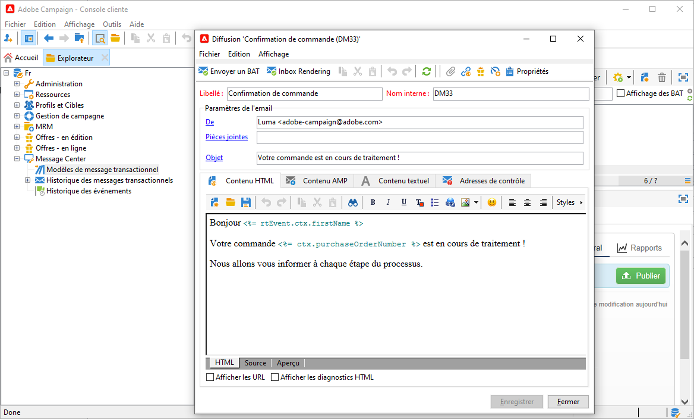

1. Publiez votre modèle transactionnel.

   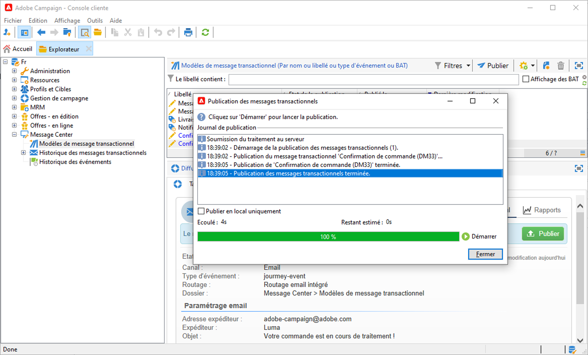

1. Vous devez maintenant écrire la payload JSON correspondant au modèle.

```
{
     "channel": "email",
     "eventType": "journey-event",
     "email": "Email address",
     "ctx": {
          "firstName": "First name", "purchaseOrderNumber": "Purchase order number"
     }
}
```

* Pour le canal, vous devez saisir le type &quot;e-mail&quot;.
* Pour eventType, utilisez le nom interne du type d&#39;événement créé précédemment.
* L&#39;adresse e-mail est une variable. Vous pouvez donc saisir n&#39;importe quel libellé.
* Sous ctx, les champs de personnalisation sont également des variables.

**Journey Orchestration**

1. Tout d&#39;abord, vous devez créer un événement. Veillez à inclure le champ « purchaseOrderNumber ».

   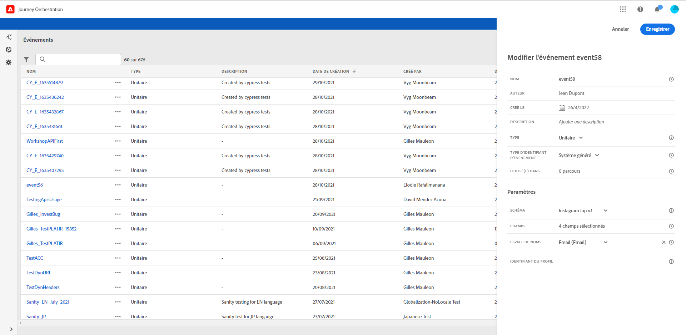

1. Vous devez ensuite créer, dans Journey Orchestration, une action correspondant à votre modèle Campaign. Dans le menu déroulant **Type d&#39;action**, sélectionnez **Adobe Campaign Classic**.

   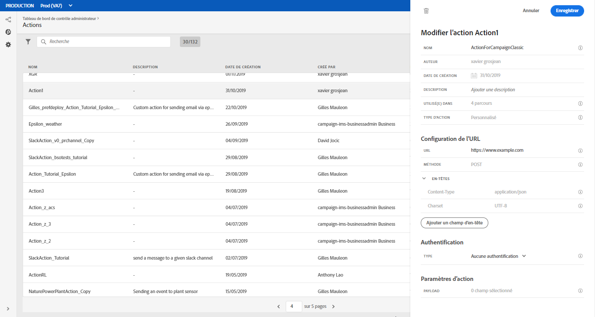

1. Cliquez sur le **champ Payload** et collez le code JSON créé précédemment.

   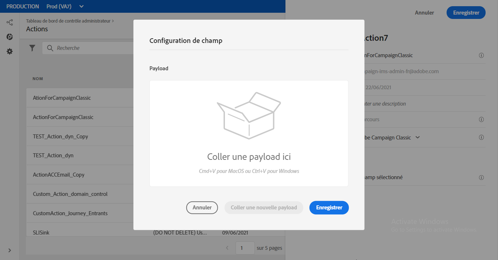

1. Pour l&#39;adresse e-mail et les deux champs de personnalisation, remplacez **Constante** par **Variable**.

   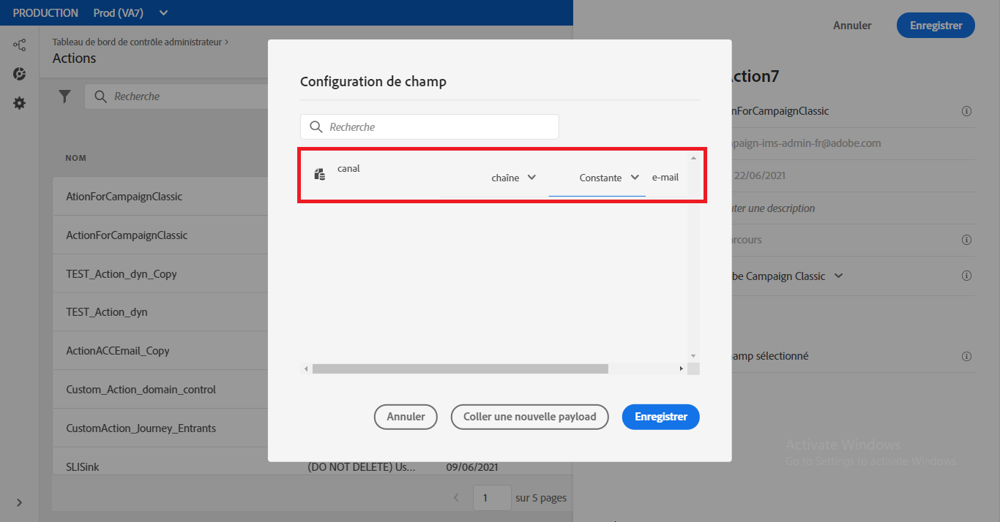

1. Créez maintenant un parcours et commencez par l&#39;événement précédemment créé.

   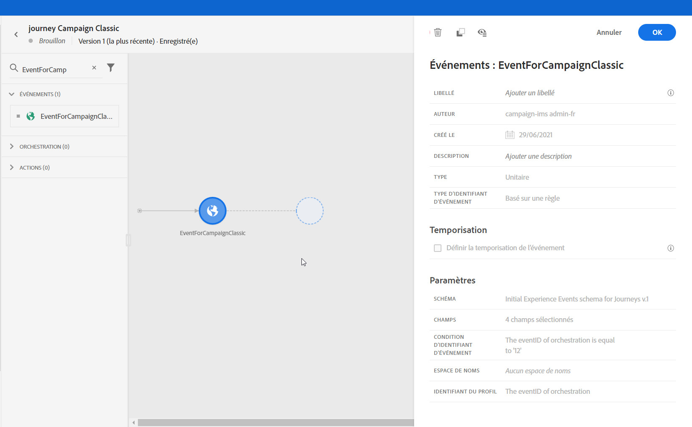

1. Ajoutez l’action et mappez chaque champ au champ correct dans Journey Orchestration.

   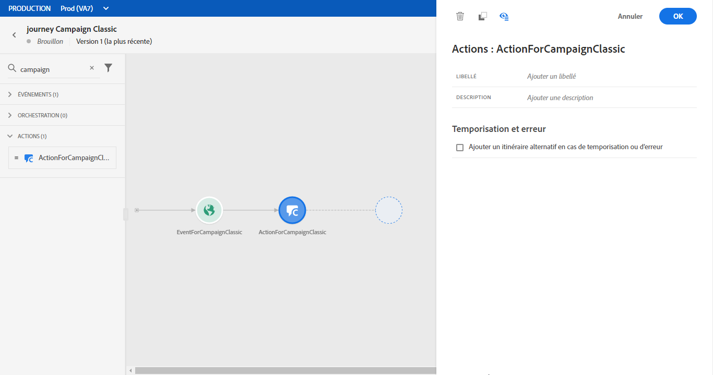

1. Ajoutez une activité **Fin** et testez votre parcours.

   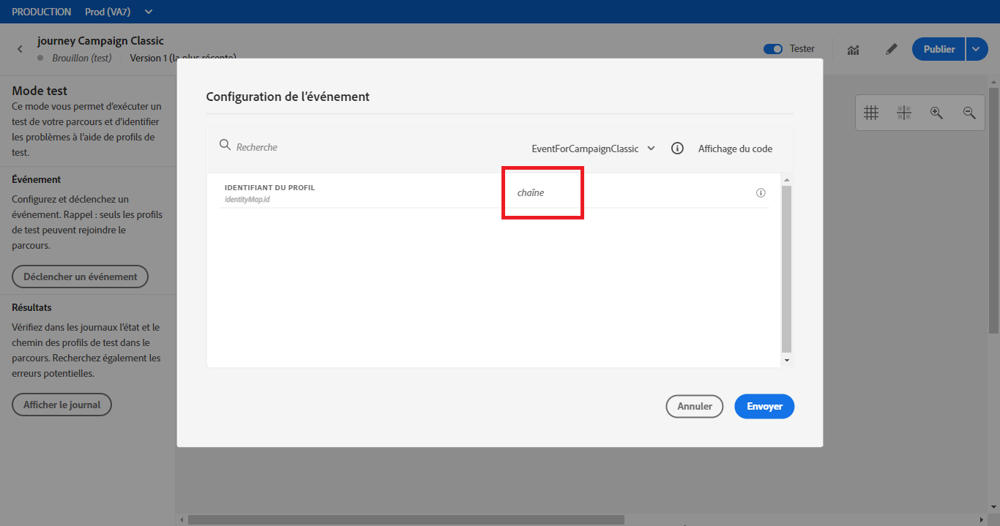

1. Vous pouvez maintenant publier votre parcours.
