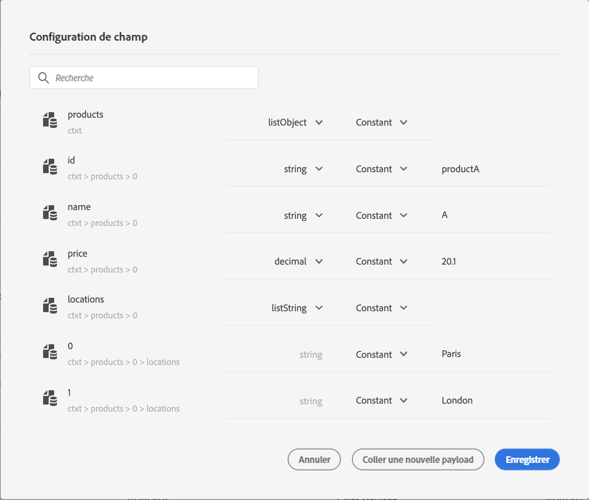
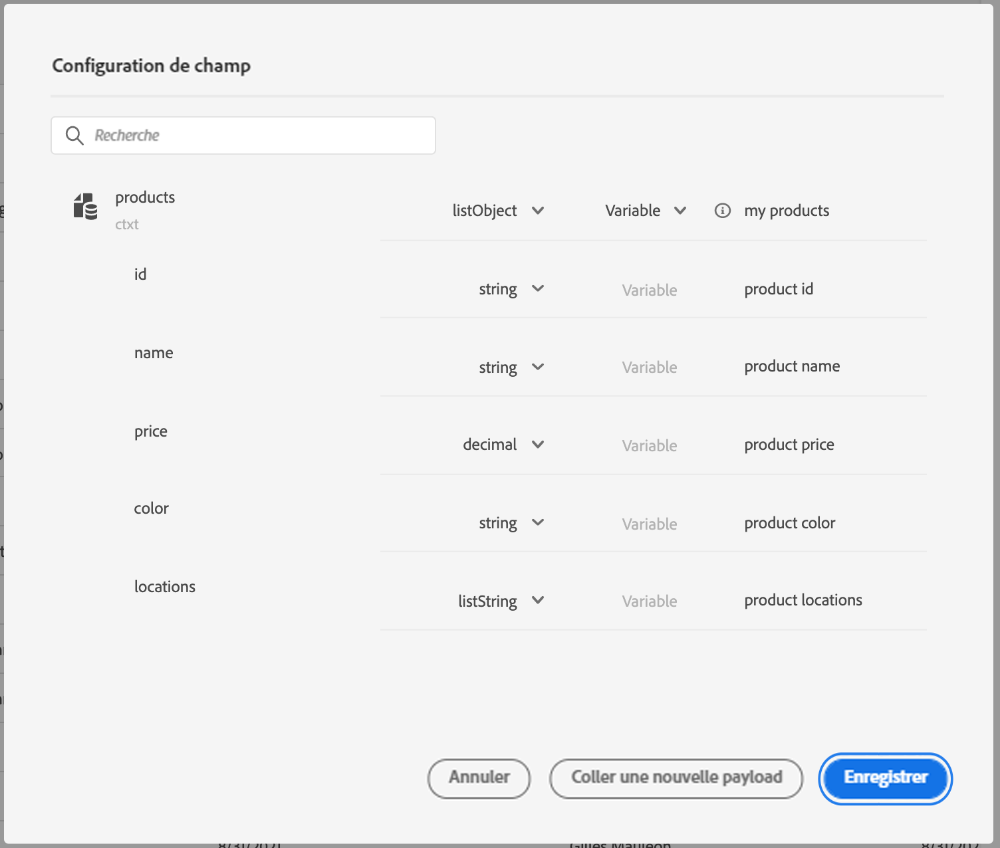
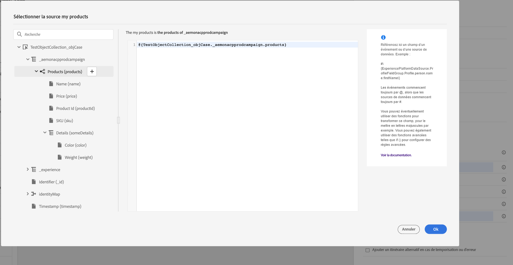
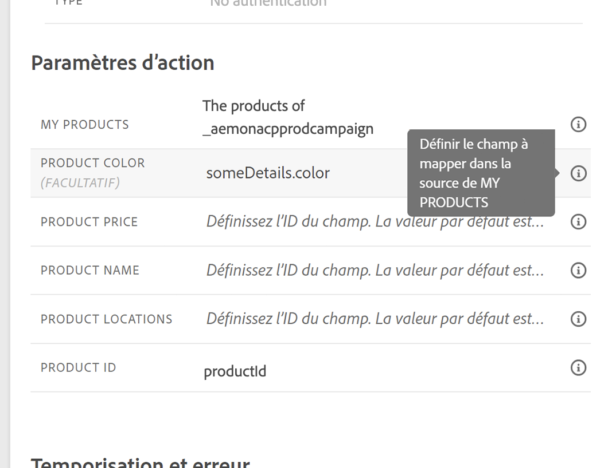
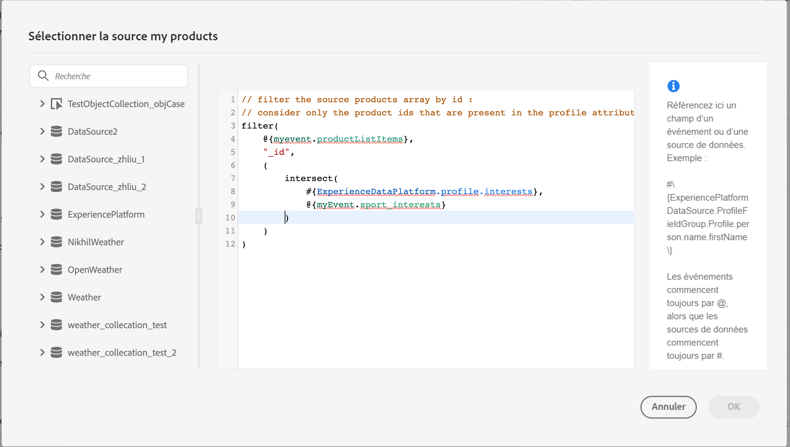
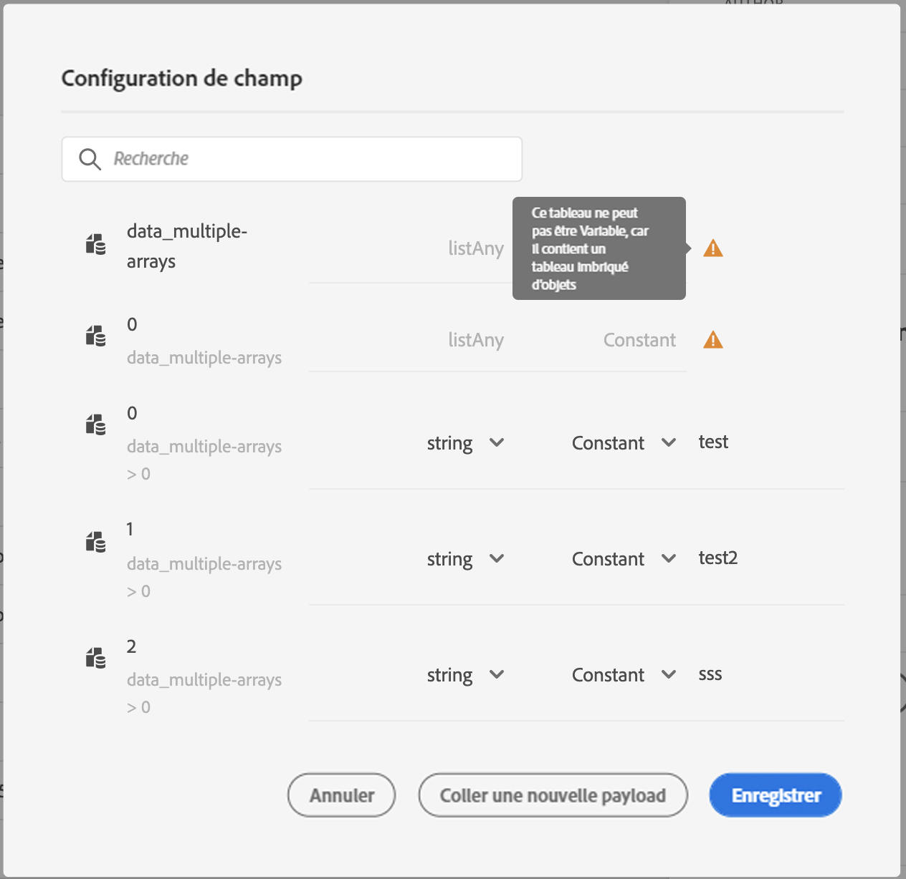

# Transmission dynamique des collections à l’aide d’actions personnalisées{#passing-collection}

Vous pouvez transmettre une collection dans des paramètres d’action personnalisés qui seront renseignés dynamiquement au moment de l’exécution. Deux types de collections sont pris en charge :

* collections simples : des tableaux de types de données simples, par exemple avec une listString :

   ```
   {
    "deviceTypes": [
        "android",
        "ios"
    ]
   }
   ```

* collections d’objets : un tableau d’objets JSON, par exemple :

   ```
   {
   "products":[
      {
         "id":"productA",
         "name":"A",
         "price":20.1
      },
      {
         "id":"productB",
         "name":"B",
         "price":10.0
      },
      {
         "id":"productC",
         "name":"C",
         "price":5.99
      }
    ]
   }
   ```

## Limites {#limitations}

* Les tableaux d’objets contenant des sous-objets ne sont pas pris en charge. Par exemple :

   ```
   {
   "products":[
     {
        "id":"productA",
        "name":"A",
        "details": {
        "color":"blue"
        },
        "price":20.0
     }
    ]
   }
   ```

* Les tableaux d’objets imbriqués dans un tableau d’objets ne sont pas pris en charge pour le moment. Par exemple :

   ```
   {
   "products":[
     {
        "id":"productA",
        "name":"A",
        "price":20,
        "locations": [{"name": "Paris"}, {"name": "London"}]
     },
    ]
   }
   ```
* Pour tester les collections à l’aide du mode test, vous devez utiliser le mode d’affichage du code. Le mode d’affichage du code n’est pas pris en charge pour les événements professionnels en ce moment. Vous ne pouvez envoyer qu’une collection avec un seul élément.

## Procédure générale {#general-procedure}

Dans cette section, nous utiliserons l’exemple de charge utile JSON suivant. Il s’agit d’un tableau d’objets avec un champ qui est une collection simple.

```
{
  "ctxt": {
    "products": [
      {
        "id": "productA",
        "name": "A",
        "price": 20.1,
        "color":"blue",
        "locations": [
          "Paris",
          "London"
        ]
      },
      {
        "id": "productB",
        "name": "B",
        "price": 10.99
      }
    ]
  }
}
```

Vous pouvez voir que &quot;products&quot; est un tableau de deux objets. Vous devez avoir au moins un objet.

1. Créez votre action personnalisée. Voir [cette page](../action/about-custom-action-configuration.md).

1. Dans la section **[!UICONTROL Paramètres d’action]**, collez l’exemple JSON. La structure affichée est statique : lorsque vous collez la payload, tous les champs sont définis comme des constantes.

   

1. Si nécessaire, ajustez les types de champ. Les types de champ suivants sont pris en charge pour les collections : listString, listInteger, listDecimal, listBoolean, listDateTime, listDateTimeOnly, listDateOnly, listObject

   >[!NOTE]
   >
   >Le type de champ est automatiquement déduit en fonction de l’exemple de payload.

1. Si vous souhaitez transmettre des objets dynamiquement, vous devez les définir en tant que variables. Dans cet exemple, nous définissons &quot;products&quot; comme variable. Tous les champs d’objet inclus dans l’objet sont automatiquement définis sur des variables.

   >[!NOTE]
   >
   >Le premier objet de l’exemple de payload est utilisé pour définir les champs.

1. Pour chaque champ, définissez le libellé qui sera affiché dans la zone de travail du parcours.

   

1. Créez votre parcours et ajoutez l’action personnalisée que vous avez créée. Voir [cette page](../building-journeys/using-custom-actions.md).

1. Dans la section **[!UICONTROL Paramètres d’action]** , définissez le paramètre de tableau (&quot;products&quot; dans notre exemple) à l’aide de l’éditeur d’expression avancé.

   

1. Pour chacun des champs d’objet suivants, saisissez le nom de champ correspondant à partir du schéma XDM source. Si les noms sont identiques, cela n’est pas nécessaire. Dans notre exemple, il nous suffit de définir &quot;ID de produit&quot; et &quot;couleur&quot;.

   

Pour le champ de tableau, vous pouvez également utiliser l’éditeur d’expression avancé pour effectuer une manipulation de données. Dans l’exemple suivant, nous utilisons les fonctions [filter](../functions/functionfilter.md) et [intersect](../functions/functionintersect.md) :



## Cas particuliers{#examples}

Pour les types et les tableaux hétérogènes, le tableau est défini avec le type listAny . Vous pouvez uniquement mapper des éléments individuels, mais ne pouvez pas modifier le tableau en variable.



Exemple de type hétérogène :

```
{
    "data_mixed-types": [
        "test",
        "test2",
        null,
        0
    ]
}
```

Exemple de tableau de tableaux :

```
{
    "data_multiple-arrays": [
        [
            "test",
            "test1",
            "test2"
        ]
    ]
}
```

**Rubriques connexes**

[Utilisation d’actions personnalisées](../building-journeys/using-custom-actions.md)
