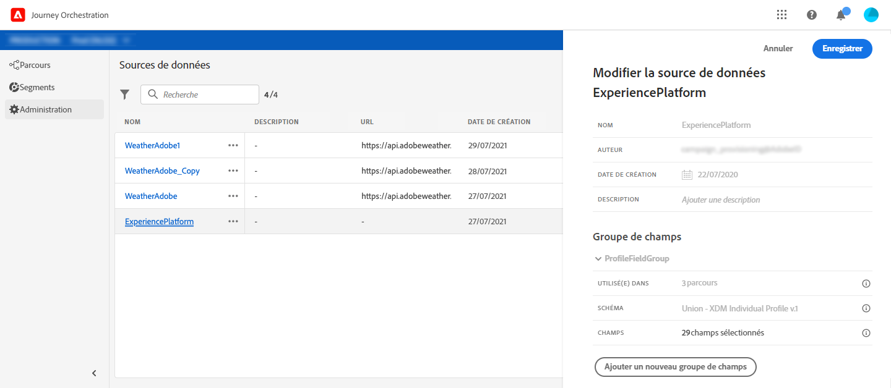

# Configuration de la source de données{#concept_ax3_bcy_w2b}

>[!CAUTION]
>
>**Vous recherchez Adobe Journey Optimizer** ? Cliquez [ici](https://experienceleague.adobe.com/fr/docs/journey-optimizer/using/ajo-home){target="_blank"} pour consulter la documentation de Journey Optimizer.
>
>
>_Cette documentation se rapporte aux anciens contenus de Journey Orchestration qui ont été remplacés par Journey Optimizer. Pour toute question concernant votre accès à Journey Orchestration ou Journey Optimizer, contactez votre équipe en charge des comptes._

Dans notre cas d’utilisation, nous voulons utiliser des données de personnalisation pour nos messages. Nous devons aussi vérifier si la personne est une femme. Ces informations sont stockées dans la base de données des profils clients en temps réel. Un **utilisateur technique** doit vérifier que ces champs sont définis dans la source de données Adobe Experience Platform intégrée.

Pour plus d’informations sur la configuration des sources de données, consultez [cette page](../datasource/about-data-sources.md).

1. Dans le volet de menus, sélectionnez **[!UICONTROL Admin]**. Dans la section **[!UICONTROL Sources de données]**, cliquez sur **[!UICONTROL Gérer]**.
1. Sélectionnez la source de données Adobe Experience Platform intégrée.

   

1. Dans les groupes de champs, vérifiez que les champs suivants sont sélectionnés :

   * _person > name > firstName_
   * _person > name > lastName_
   * _person > gender_
   * _personalEmail > address_

1. Cliquez sur **[!UICONTROL Enregistrer]**.

La source de données est maintenant configurée et prête à être utilisée dans votre parcours.
