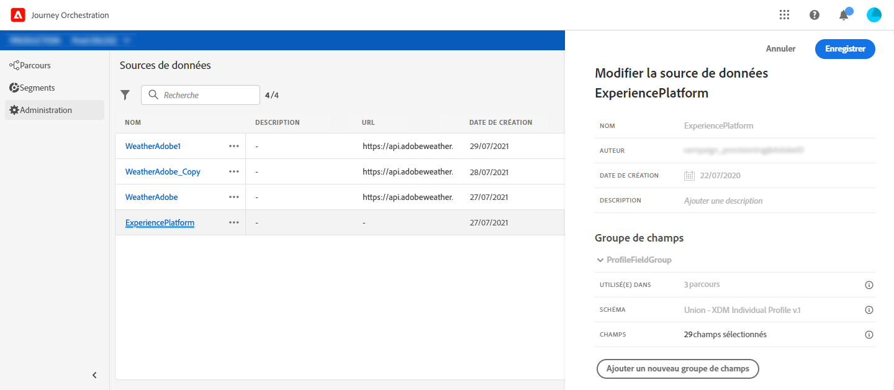

# Configuration de la source de données{#concept_ax3_bcy_w2b}

Dans notre cas d&#39;utilisation, nous voulons utiliser des données de personnalisation pour nos messages. Nous devons aussi vérifier si la personne est une femme. Ces informations sont stockées dans la base de données Profil du client en temps réel. L’utilisateur **** technique doit vérifier que ces champs sont définis dans la source de données intégrée de la plateforme d’expérience.

Pour plus d’informations sur la configuration de la source de données, voir .

1. Dans le menu supérieur, cliquez sur l’onglet Sources **[!UICONTROL de]**données et sélectionnez la source de données de plateforme d’expérience intégrée.

   

1. Dans les groupes de champs, vérifiez que les champs suivants sont sélectionnés :

   * _personne > nom > firstName_
   * _personne > nom > nom_famille_
   * _personne > sexe_
   * _PersonalEmail > address_

1. Cliquez sur **[!UICONTROL Enregistrer]**.

La source de données est maintenant configurée et prête à être utilisée dans votre voyage.
