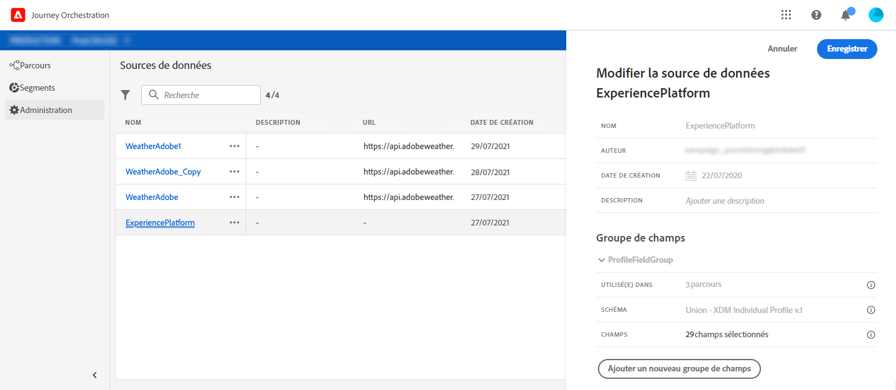
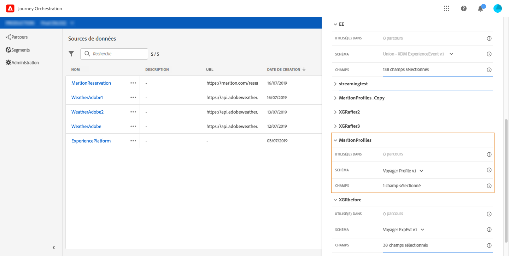
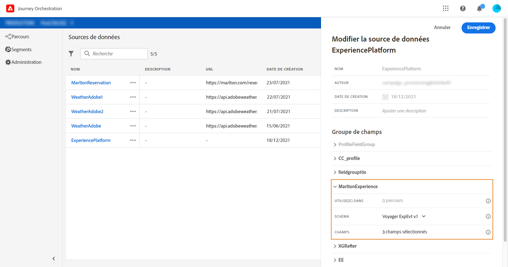
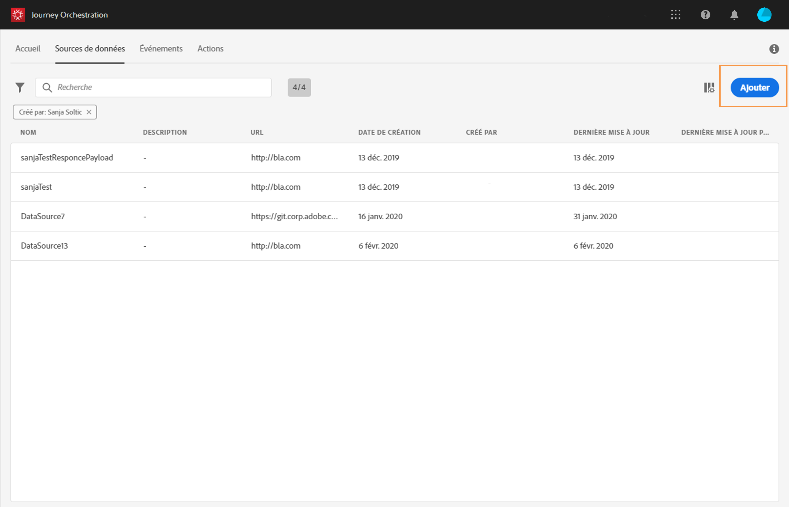
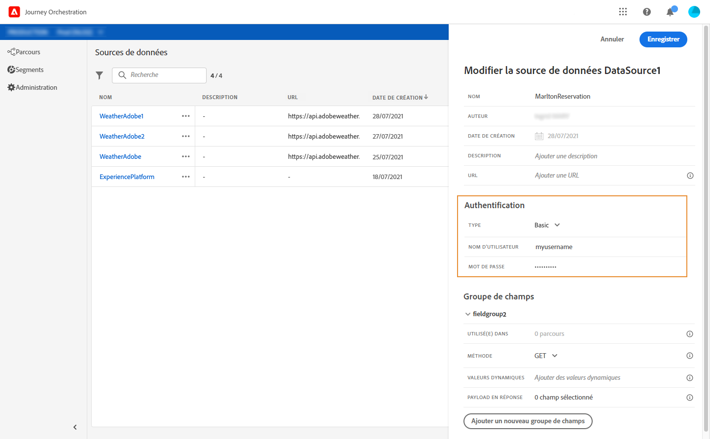

# Configuration des sources de données {#concept_vml_hdy_w2b}

Dans notre cas pratique, nous voulons utiliser des données de personnalisation pour nos messages. Nous devons aussi vérifier si la personne est un membre du programme de fidélité et si elle n’a pas été contactée au cours des dernières 24 heures. Ces informations sont stockées dans la base de données Real-time Customer Profile. Un **utilisateur technique** doit configurer la source de données Experience Platform pour récupérer ces champs.

Pour plus d’informations sur la configuration des sources de données, reportez-vous à la section [](../datasource/about-data-sources.md).

1. Dans le menu supérieur, cliquez sur l’onglet **[!UICONTROL Sources de données]** et sélectionnez la source de données Experience Platform intégrée.

   

1. Dans les champs de groupe préconfigurés, vérifiez que les champs suivants sont sélectionnés :

   * _person > name > firstName_
   * _person > name > lastName_
   * _personalEmail > address_

1. Cliquez sur **[!UICONTROL Ajouter un nouveau groupe de champs]**, sélectionnez un schéma **[!UICONTROL Profiles]** et ajoutez le champ **Loyalty member** pour notre condition. Le champ personnalisé **Loyalty member** a été ajouté dans XDM : &quot;_customer > marlton > loyaltyMember&quot;

   

1. Cliquez sur **[!UICONTROL Ajouter un nouveau groupe de champs]**, sélectionnez un schéma **[!UICONTROL ExperienceEvent]** et choisissez les champs nécessaires à notre condition sur le nombre de messages envoyés au cours d’une période donnée : _timestamp_ pour la date et _directMarketing > sends > value_ pour le nombre de messages envoyés.

   

1. Cliquez sur **[!UICONTROL Enregistrer]**.

Nous devons aussi vérifier si la personne a une réservation dans le système de réservation d’hôtel. Un **utilisateur technique** doit configurer une deuxième source de données pour récupérer ce champ.

1. Dans la liste des sources de données, cliquez sur **[!UICONTROL Ajouter]** pour ajouter une nouvelle source de données externe afin de définir la connexion à votre système de réservation d’hôtel.

   

1. Saisissez le nom de la source de données ainsi que l’URL du service externe, par exemple : _https://marlton.com/reservation_

   >[!CAUTION]
   >
   >Nous vous recommandons vivement d’utiliser le protocole HTTPS pour des raisons de sécurité.

1. Configurez l’authentification en fonction de la configuration du service externe : **[!UICONTROL Aucune authentification]**, **[!UICONTROL Simple]**, **[!UICONTROL Personnalisé]** ou **[!UICONTROL Clé API]**. Dans notre exemple, nous choisissons le type « Simple » et spécifions le nom d’utilisateur et le mot de passe pour l’appel d’API.

   

1. Cliquez sur **[!UICONTROL Ajouter un nouveau groupe de champs]** pour définir les informations à récupérer et les paramètres de l’API. Dans notre exemple, il n’existe qu’un seul paramètre (l’identifiant). Nous devons donc créer un groupe de champs contenant les informations suivantes :

   * **[!UICONTROL Méthode]** : sélectionnez la méthode POST ou GET. Dans notre exemple, nous choisissons la méthode GET.
   * **[!UICONTROL Durée de mise en cache]** : cette durée varie en fonction de la fréquence des appels d’API. Dans le cas présent, le système de réservation est mis à jour toutes les 10 minutes.
   * **[!UICONTROL Payload en réponse]** : cliquez dans le champ **[!UICONTROL Payload]** et collez un exemple de payload. Vérifiez que les types de champs sont corrects. À chaque appel de l’API, le système récupère tous les champs contenus dans l’exemple de payload. Dans notre exemple, la payload ne contient que l’état de réservation :

   ```
   {
       "reservation" : true
   }
   ```

   * **[!UICONTROL Valeurs dynamiques]** : entrez le paramètre correspondant à la clé utilisée pour identifier chaque client, « id » dans cet exemple. La valeur de ce paramètre sera définie pendant le parcours.
   

1. Cliquez sur **[!UICONTROL Enregistrer]**.

   Les sources de données sont maintenant configurées et prêtes à être utilisées dans le parcours.
