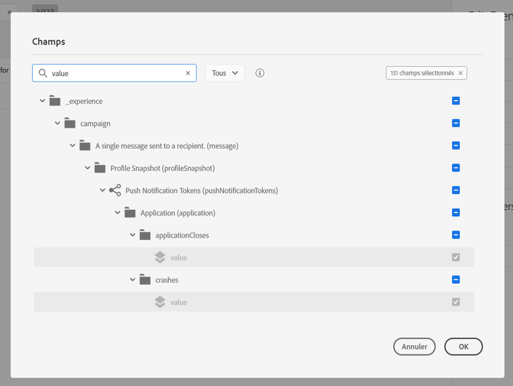
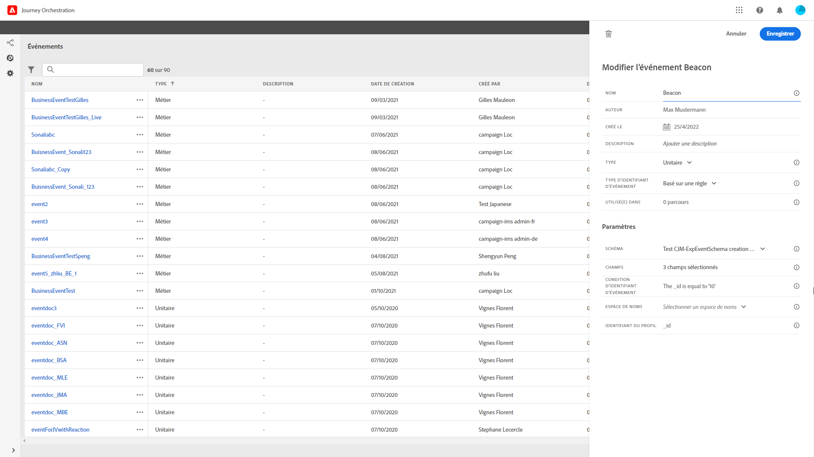

# Configuration des événements {#concept_sbp_5cy_w2b}

Dans notre scénario, nous devons recevoir un événement chaque fois qu’une personne entre à l’hôtel Marlton et au restaurant. Un **utilisateur technique** doit configurer les deux événements que, selon nous, le système doit écouter dans notre parcours.

Pour plus d’informations sur la configuration des événements, voir .

1. Dans le menu supérieur, cliquez sur l’onglet **[!UICONTROL Événements]** et sur **[!UICONTROL Ajouter]** pour créer un événement.

   

1. Nous saisissons le nom « LobbyBeacon », sans espaces ni caractères spéciaux.

   

<!--li>Select the **[!UICONTROL Mobile - Streaming Ingestion APIs]** event type. Events are sent from the customers' mobile phone through the Mobile SDK.. Le système à l’origine de l’envoi de l’événement ne doit pas générer d’identifiant, mais plutôt utiliser celui indiqué dans l’aperçu de la payload. Dans notre cas d’utilisation, cet identifiant est utilisé pour déterminer l’emplacement de la balise. Chaque fois qu’une personne se rapproche de la balise du hall d’entrée de l’hôtel, un événement contenant cet identifiant d’événement spécifique est envoyé. Le même principe s’applique aux événements relatifs à la balise du restaurant. Le système sait ainsi quelle balise a déclenché l’envoi de l’événement.

   

   >[!NOTE]
   >
   >La liste des champs varie d’un schéma à l’autre. En fonction de la définition du schéma, certains champs peuvent être obligatoires et présélectionnés.

1. Nous devons sélectionner un namespace. Il est présélectionné en fonction des propriétés du schéma. Vous pouvez le conserver. Pour plus d’informations sur les namespaces, consultez la section .

   

1. Une clé est présélectionnée en fonction des propriétés du schéma et du namespace sélectionné. Vous pouvez la conserver.

   

1. Cliquez sur **[!UICONTROL Enregistrer]**.

1. Cliquez sur l’icône **[!UICONTROL Afficher la payload]** pour avoir un aperçu de la payload attendue par le système et la partager avec la personne responsable de l’envoi de l’événement. Cette payload doit être configurée dans le postback de la console d’administration Mobile Services.

   

De la même manière, créez l’événement « RestaurantBeacon ». Ces deux événements de balise sont créés et utilisables dans le parcours. Vous devez maintenant configurer l’application mobile afin qu’elle puisse envoyer la payload attendue au point d’entrée des API d’ingestion en flux continu. Voir .
