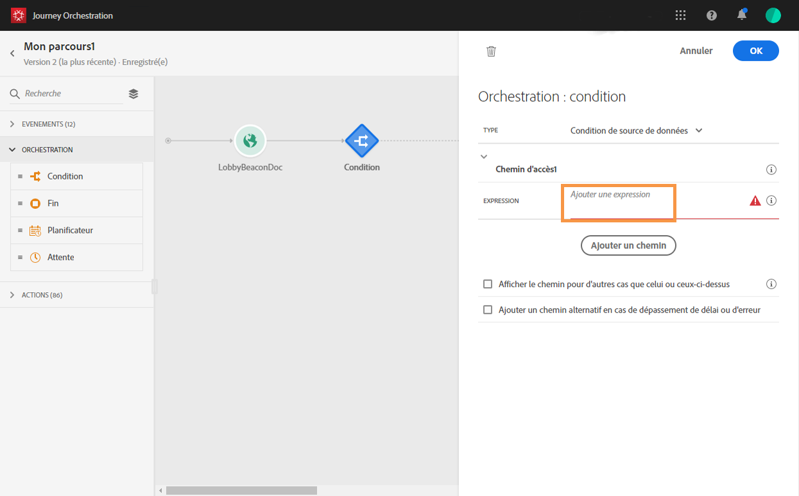

# Tirer parti des scores de fatigue {#concept_dsh_1ry_wfb}

Ce cas d&#39;utilisation vous montre comment tirer parti des scores de fatigue pour éviter de solliciter trop vos clients dans vos voyages.

>[!CAUTION]
>
>La fonctionnalité de score de fatigue prédictive est uniquement disponible pour les clients qui utilisent la fonctionnalité Service de données Adobe Campaign Standard.

## Configuration de l’événement {#section_ptb_ws1_ffb}

Suivez les étapes décrites dans [](../event/about-events.md).

## Configuration de la source de données {#section_o3n_4yy_wfb}

Effectuez les étapes suivantes pour sélectionner les champs de score de fatigue dans la source de données intégrée :

1. Dans le menu supérieur, cliquez sur l’onglet Sources **[!UICONTROL de]**données et sélectionnez la source de données de plateforme d’expérience intégrée.

   

1. Vérifiez que les champs requis pour votre cas d’utilisation sont sélectionnés.
1. Cliquez sur **[!UICONTROL Ajouter un nouveau groupe]**de champs, sélectionnez le modèle**[!UICONTROL  Profils]** et ajoutez les champs **[!UICONTROL fatigueNiveau]**et**[!UICONTROL  fatigueScore (sous voyageAI > emailScore > fatigue).]**__

   

1. Cliquez sur **[!UICONTROL Enregistrer]**.

## Construire le voyage {#section_uzm_pyy_wfb}

Pour créer, valider et publier le voyage, suivez les étapes décrites dans [](../building-journeys/journey.md).

Dans notre cas d&#39;utilisation, nous utilisons le champ **[!UICONTROL fatigueLevel]**. Vous pouvez également utiliser le champ**[!UICONTROL  fatigueScore]** .

Effectuez les étapes suivantes pour tirer parti du niveau de fatigue de votre voyage :

1. Ajoutez un événement et une condition à votre voyage.

   

1. Sélectionnez le type Condition **[!UICONTROL de source de]**données, puis cliquez sur dans le champ**[!UICONTROL  Expression]** .

   

1. A l’aide de l’éditeur d’expression simple, recherchez le champ **[!UICONTROL fatigueLevel]**(_ExperiencePlatformDataSource > JourneyAIScores > Profile > cheminAI > emailScore > fatigue_), déposez-le vers la droite et créez la condition suivante : &quot;fatigueLevel est égal à &quot;Low&quot;. Cliquez sur**[!UICONTROL  Ok]**.

   

   L’expression avancée est :

   ```
   #{ExperiencePlatformDataSource.JourneyAIScores.Profile.journeyAI.emailScore.fatigue.fatigueLevel} == "low"
   ```

1. Dans la condition, créez deux autres chemins pour les niveaux de fatigue moyens et élevés.

   

1. Vous pouvez maintenant ajouter différentes actions pour chaque niveau de fatigue.

   
