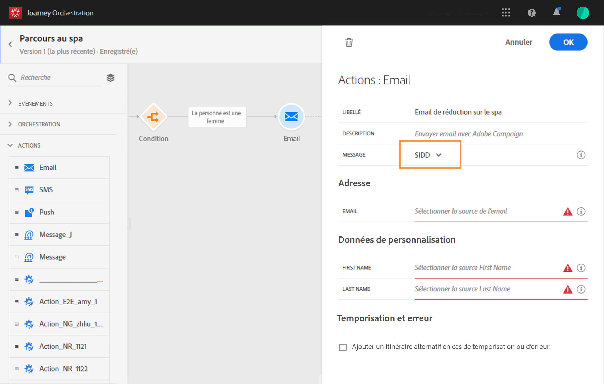

# Création du parcours{#concept_eyw_mcy_w2b}

Un **utilisateur chargé de la conception de parcours** peut maintenant créer le parcours. Notre parcours n’inclura qu’un seul chemin avec les activités suivantes :

* L’**[!UICONTROL événement]** « SpaBeacon » : lorsqu’une personne se rapproche de la balise spa, le système reçoit un événement et le parcours de cette personne est lancé.
* Une activité **[!UICONTROL Condition]** pour vérifier que la personne est une femme.
* Une activité **[!UICONTROL Email]** (à l’aide d’Adobe Campaign Standard).
* Une activité **[!UICONTROL Fin]**.

>[!NOTE]
>
>Les activités **[!UICONTROL Push]** et **[!UICONTROL Email]** ne sont disponibles dans la palette que si vous disposez d’Adobe Campaign Standard.

Pour plus d’informations sur la création d’un parcours, consultez [cette page](../building-journeys/journey.md).

1. Dans le menu supérieur, cliquez sur l’onglet **[!UICONTROL Accueil]** et **[!UICONTROL Créer]** pour créer un parcours.

   

1. Modifiez les propriétés du parcours dans le volet de configuration affiché dans la partie droite de l’écran. Nous l’appelons « Spa journey » et définissons sa durée sur un mois, du 1er au 31 décembre.

   

1. Commencez à concevoir le parcours en faisant glisser l’événement « SpaBeacon » de la palette vers la zone de travail. Vous pouvez également double-cliquer sur l’événement dans la palette pour l’ajouter à la zone de travail.

   

1. Ajoutons maintenant une condition pour vérifier que la personne est une femme. Placez une activité Condition dans le parcours.

   

1. Sélectionnez le type **[!UICONTROL Condition de source de données]**, puis cliquez dans le champ **[!UICONTROL Expression]**. Il est également possible de définir un libellé de condition qui apparaîtra sur la flèche, dans la zone de travail.

   

1. À l’aide de l’éditeur d’expression simple, recherchez le champ « gender » (_person > gender_) et déposez-le dans la partie droite pour créer la condition suivante : « gender est égale à female ».

   

1. Déposez une activité **[!UICONTROL Email]** et sélectionnez votre modèle de messagerie transactionnelle « Spa discount ». Ce modèle a été conçu à l’aide d’Adobe Campaign. Consultez à ce sujet cette [page](https://docs.adobe.com/content/help/fr-FR/campaign-standard/using/communication-channels/transactional-messaging/about-transactional-messaging.html).

   

1. Cliquez dans le champ **[!UICONTROL Email]** et sélectionnez l’adresse email dans la source de données.

   

1. De la même manière, définissez les champs de personnalisation du prénom et du nom à partir de la source de données.

   

1. Déposez une activité **[!UICONTROL Fin]**.

   

1. Cliquez sur le bouton bascule **[!UICONTROL Test]** et vérifiez votre parcours à l’aide des profils de test. En cas d’erreur, désactivez le mode test, modifiez votre parcours et lancez un nouveau test. Consultez [cette page](../building-journeys/testing-the-journey.md) pour plus d’informations sur le mode test.

   

1. Si le test est concluant, vous pouvez publier votre parcours à partir du menu déroulant supérieur droit.

   

La prochaine fois qu’une femme se rapprochera de la balise spa, elle recevra immédiatement un email personnalisé « Spa discount ».
